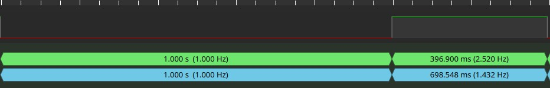
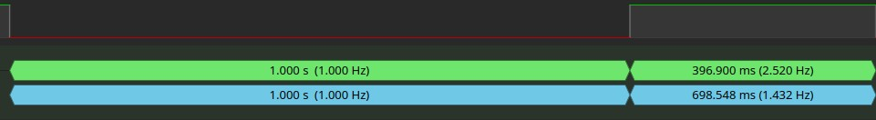
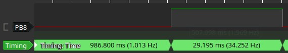

+++
title = 'F1 vs F4: FPU vs NoFPU — Gleitkomma-Leistung im Vergleich'
date = 2026-05-07T00:00:00+02:00
description = 'Zweiter Post der Serie „F1 vs F4": Floating-Point-Benchmark zwischen Nucleo-F103RB (Cortex-M3, kein FPU) und Nucleo-F411RE (Cortex-M4F, mit FPU). 20.000 Gleitkomma-Iterationen — was passiert, wenn man die FPU ein- und ausschaltet?'
tags = ['stm32', 'f1-vs-f4', 'fpu', 'cortex-m4f', 'cortex-m3', 'performance', 'float', 'embedded', 'c']
+++

Der [erste Beitrag]() der Serie „F1 vs F4" hat drei GPIO-Toggle-Methoden auf dem Nucleo-F103RB und Nucleo-F411RE verglichen. Das Ergebnis war bereits deutlich: Bei `-O2` erreichte das -Toggle auf dem F411 25,34&nbsp;MHz gegenüber 10,29&nbsp;MHz auf dem F103 — ein Faktor von 2,5×.

Doch GPIO-Toggle ist eine rein ganzzahlige, registerorientierte Operation. ? Spielt dort keine Rolle. F? Der Kern bringt zwar Cortex-M4F-Erweiterungen wie DSP-Instruktionen, FPU und einen moderneren Instruktionspfad mit, aber die FPU lag bei den GPIO-Messungen brach — sie beschleunigt nur Gleitkommaarithmetik.

Genau die wird jetzt getestet. Beide Boards, gleicher `float`-Benchmark — und auf dem F411 zusätzlich mit ein- und ausgeschalteter FPU.

<!--more-->

## Testaufbau

| Board | Mikrocontroller | Kern | Systemtakt | Taktquelle | FPU |
|-------|----------------|------|------------|------------|-----|
| Nucleo-F103RB | STM32F103RB | Cortex-M3 | 72 MHz |  aus 8 MHz  | Nein |
| Nucleo-F411RE | STM32F411RE | Cortex-M4F | 72 MHz | PLL aus 8 MHz HSE | EIN / AUS |
| Nucleo-F411RE | STM32F411RE | Cortex-M4F | 100 MHz | PLL aus 8 MHz HSE | EIN |

Beide Boards nutzen eine 8-MHz-HSE-Referenz als Eingang für die PLL. Auf den Nucleo-64-Boards kann diese Referenz je nach Boardkonfiguration über den ST-LINK/MCO als HSE-Bypass bereitgestellt werden. Der F103 erzeugt daraus 72&nbsp;MHz, der F411 72&nbsp;MHz oder 100&nbsp;MHz. Die konkrete PLL-Konfiguration ist im CubeMX-Projekt dokumentiert.

Der F411 wird in **drei Konfigurationen** getestet:

1. **72 MHz, Software-Float** — um den reinen Architekturvorteil des Cortex-M4F ohne Hardware-FPU zu sehen
2. **72 MHz, Hardware-Float** — um den Effekt der FPU bei gleichem Takt zu isolieren
3. **100 MHz, Hardware-Float** — um die Taktskalierung mit FPU zu prüfen

Der F103 besitzt keine FPU und läuft nur bei seinen maximalen 72&nbsp;MHz.

Für den F411 wurden zwei Floating-Point-Builds verwendet:

- **Software-Float:** `-mfloat-abi=soft`
- **Hardware-Float:** `-mfpu=fpv4-sp-d16 -mfloat-abi=hard`

Die genaue Toolchain-Konfiguration ist wichtig: Nur wenn der Hardware-Float-Build tatsächlich mit FPU-Instruktionen erzeugt wird, misst der Test die Leistung der Cortex-M4F-FPU. Der Software-Float-Build erzwingt dagegen Bibliotheksaufrufe für Gleitkommaoperationen und simuliert damit das Verhalten eines Kerns ohne FPU.

Gemessen wird auf beiden Boards an **Pin PB8**, der auf den verwendeten Nucleo-64-Boards über den Morpho-Header zugänglich ist. Compiler ist `arm-none-eabi-gcc` ohne . Jede Konfiguration wurde mit `-O0` (keine Optimierung) und `-O2` (typische Release-Optimierung) gemessen.

Die GPIO-Ausgänge wurden in der höchsten Output-Speed-Konfiguration der jeweiligen MCU betrieben.

Die Pinbelegung beider Nucleo-64-Boards ist im [UM1724](https://www.st.com/resource/en/user_manual/um1724-stm32-nucleo64-boards-mb1136-stmicroelectronics.pdf) dokumentiert. PB8 liegt bei beiden Boards auf CN5 Pin 6 (Morpho, links) und ist über den Morpho-Header direkt zugänglich.

### Messmethode

Die Ausführungszeit der Gleitkomma-Berechnung wird über die Dauer eines BSRR-High-Pulses gemessen:

```c
GPIOB->BSRR = GPIO_BSRR_BS8;    // Pin high — Zeitmessung beginnt
fpu_test_result = FpuTest_Run(0x12345678);
GPIOB->BSRR = GPIO_BSRR_BR8;    // Pin low  — Zeitmessung endet
```

Die Pulsbreite wird am Logic Analyzer gemessen und ergibt direkt die Ausführungszeit eines vollständigen `FpuTest_Run()`-Aufrufs. Dieser Aufruf enthält 20.000 interne Schleifeniterationen. Für die Frequenz wird zusätzlich die Periodendauer des Schleifendurchlaufs gemessen (inklusive des GPIO-Toggles selbst). Die reine Berechnungszeit ohne GPIO-Overhead ist der relevantere Wert für den FPU-Vergleich.

Vor der Hauptschleife werden drei kurze Identifikations-Pulse auf PB8 ausgegeben. Diese dienen am Logic Analyzer zur eindeutigen Identifikation des Testbeginns und stellen sicher, dass der erste gemessene Puls bereits die volle Berechnung enthält — ohne Einschwingeffekte oder Initialisierungs-Artefakte.

### Verwendete Dokumente

| Dokument | MCU | Link |
|----------|-----|------|
| **DS5319** | STM32F103x8/xB Datasheet | [st.com](https://www.st.com/resource/en/datasheet/stm32f103c8.pdf) |
| **RM0008** | STM32F103 Reference Manual | [st.com](https://www.st.com/resource/en/reference_manual/rm0008-stm32f101xx-stm32f102xx-stm32f103xx-stm32f105xx-and-stm32f107xx-advanced-armbased-32bit-mcus-stmicroelectronics.pdf) |
| **DS9716** | STM32F411xC/E Datasheet | [st.com](https://www.st.com/resource/en/datasheet/stm32f411re.pdf) |
| **RM0383** | STM32F411xC/E Reference Manual | [st.com](https://www.st.com/resource/en/reference_manual/rm0383-stm32f411xce-advanced-armbased-32bit-mcus-stmicroelectronics.pdf) |

## Der FPU-Test-Algorithmus

Der Benchmark führt **20.000** Iterationen einer Gleitkomma-Berechnungskette durch. Jede Iteration berechnet drei miteinander verknüpfte `float`-Variablen (`x`, `y`, `z`) neu:

```c
#define FPU_TEST_ITERATIONS (20000UL)
static volatile float fpu_test_result;

static float FpuTest_Run(uint32_t seed) {
    float x = 1.001f + (float)(seed & 0x0FU) * 0.001f;
    float y = 0.999f;
    float z = 0.250f;

    for (uint32_t i = 0; i < FPU_TEST_ITERATIONS; i++) {
        float scale = 1.0001f + (float)(i & 0x07U) * 0.0001f;
        x = (x * 1.00021f) + (y * 0.99979f) - z;
        y = (y + (x * 0.00031f)) / scale;
        z = (z * 0.99991f) + (x * y * 0.000001f);
        if (x > 4.0f) { x -= 3.0f; }
        if (y > 3.0f) { y *= 0.5f; }
    }

    return x + y + z;
}
```

**Warum genau dieser Algorithmus?** Drei Design-Entscheidungen machen ihn für den FPU-Test geeignet:

1. **Keine einfache Ein-Operation-Schleife:** Multiplikation, Addition, Division und bedingte Verzweigungen sorgen für einen gemischten Instruktionsmix — realitätsnäher als z.B. 20.000&nbsp;× `x = x * 1.0001f`.

2. **Compiler-sicher:** Der Compiler kann den vollständigen Benchmark nicht einfach entfernen, weil das Ergebnis in eine `volatile` Variable geschrieben wird und der Seed den Startwert beeinflusst. Einzelne Umformungen innerhalb der Schleife bleiben je nach Optimierungsstufe trotzdem möglich und sind Teil dessen, was hier gemessen wird.

3. **FPU-intensiv:** Jede Iteration enthält 5–7 Gleitkomma-Multiplikationen, 3 Gleitkomma-Additionen/Subtraktionen, 1 Gleitkomma-Division und 2 bedingte Vergleiche. Ohne Hardware-FPU werden Gleitkommaoperationen typischerweise über Software-Routinen der ARM-EABI-Laufzeitbibliothek umgesetzt, z.&nbsp;B. `__aeabi_fadd`, `__aeabi_fmul`, `__aeabi_fdiv` und Vergleichsroutinen wie `__aeabi_fcmp*`.

Die Zweige (`if (x > 4.0f)`, `if (y > 3.0f)`) stellen zusätzlich sicher, dass die Werte nicht in einen Bereich abdriften, in dem numerische Probleme entstehen. Durch die ständige Rückführung (`x -= 3.0f`, `y *= 0.5f`) bleibt die Berechnung im Bereich gut darstellbarer `float`-Werte.

## Messergebnisse

### F103 @ 72 MHz — kein FPU

| Optimierung | Frequenz | Ausführungszeit |
|-------------|----------|-----------------|
| `-O0` | 2,50 Hz | 408,0 ms |
| `-O2` | 2,52 Hz | 396,9 ms |

→ Compiler-Effekt: **1,01×** — praktisch nicht vorhanden.

Ohne FPU-Hardware wird jede `float`-Operation als Software-Bibliotheksaufruf implementiert. Der Compiler kann daran wenig ändern: Funktionsaufrufe zu `__aeabi_fadd`, `__aeabi_fmul` etc. bleiben bestehen, lediglich die umgebende Schleifenlogik profitiert minimal von Optimierungen.





### F411 @ 72 MHz — Software-Float (`-mfloat-abi=soft`)

| Optimierung | Frequenz | Ausführungszeit |
|-------------|----------|-----------------|
| `-O0` | 3,864 Hz | 258,8 ms |
| `-O2` | 4,062 Hz | 246,2 ms |

→ Compiler-Effekt: **1,05×** — marginal. Gegenüber F103: **1,55–1,61×** Architekturvorteil.

Software-Float bleibt teuer, wenn viele Gleitkommaoperationen in kurzer Zeit ausgeführt werden müssen. Der Cortex-M4F kann auch ohne aktivierte FPU etwas schneller sein, aber der Sprung bleibt moderat im Vergleich zur Hardware-FPU.

### F411 @ 72 MHz — Hardware-Float (`-mfpu=fpv4-sp-d16 -mfloat-abi=hard`)

| Optimierung | Frequenz | Ausführungszeit |
|-------------|----------|-----------------|
| `-O0` | 34,25 Hz | 29,2 ms |
| `-O2` | 74,34 Hz | 13,45 ms |

→ Compiler-Effekt: **2,17×** — die FPU macht den Compiler plötzlich relevant.

Sobald die FPU aktiv ist, übersetzt der Compiler `float`-Operationen direkt in FPU-Instruktionen (`vadd.f32`, `vmul.f32`, `vdiv.f32`, `vcmpe.f32`). Bei `-O0` werden bereits echte FPU-Instruktionen erzeugt, allerdings noch mit vielen zusätzlichen Load-/Store- und Verwaltungsinstruktionen. Viele einfache FPU-Operationen wie Addition und Multiplikation sind sehr schnell, während Division deutlich teurer bleibt. Bei `-O2` kommen Register-Allokation auf die FPU-Registerbank (`s0`–`s31`), Instruction-Scheduling und die Vermeidung unnötiger Load/Store-Zyklen hinzu — das verdoppelt den Durchsatz noch einmal.



Der `-O2`-Fall bei 72 MHz FPU ist nicht als separates Logic-Analyzer-Bild abgelegt — die Messwerte stammen aus derselben Messreihe mit identischem Aufbau.

### F411 @ 100 MHz — Hardware-Float (`-mfpu=fpv4-sp-d16 -mfloat-abi=hard`)

| Optimierung | Frequenz | Ausführungszeit |
|-------------|----------|-----------------|
| `-O0` | 47,56 Hz | 21,0 ms |
| `-O2` | 103,41 Hz | 9,67 ms |

→ Compiler-Effekt: **2,17×** — identisch zum 72-MHz-Hardware-Float-Fall. Taktskalierung 72→100 MHz: **1,39×** (entspricht 100/72).

Das ist bemerkenswert: Die Ausführungszeit skaliert exakt mit dem Taktverhältnis. Im Gegensatz zum GPIO-Toggle, wo Flash-Waitstates einen Teil des Taktgewinns auffressen können, ist die FPU-Berechnung CPU-gebunden — die Instruktionen und Daten werden nach dem ersten Durchlauf sehr effizient verarbeitet.


## Analyse

### 1. Ohne FPU: Warum die Software-Emulation so teuer ist

Auf einem Cortex-M3 (F103) existiert keine FPU-Hardware. Jede `float`-Operation wird vom Compiler durch einen Bibliotheksaufruf ersetzt:

| Quellcode | Compiler-Output (ohne FPU) |
|-----------|---------------------------|
| `x * 1.00021f` | `BL __aeabi_fmul` |
| `x + y` | `BL __aeabi_fadd` |
| `x / scale` | `BL __aeabi_fdiv` |
| `x > 4.0f` | Vergleichsroutine + Branch |

Jeder dieser Aufrufe besteht selbst aus Dutzenden von Integer-Instruktionen — die IEEE-754-Gleitkommaarithmetik muss komplett in Software nachgebildet werden: Mantisse extrahieren, Exponenten normalisieren, Operation ausführen, Ergebnis normalisieren, und das alles in 32-Bit-Integer-Registern.

Mit 5–7 Multiplikationen, 3 Additionen und einer Division **pro Iteration** ergeben sich bei 20.000 Iterationen Hunderttausende von Bibliotheksaufrufen. Die `-O2`-Optimierung kann daran wenig ändern — die Funktionsaufrufe selbst bleiben bestehen, und innerhalb der Bibliotheksfunktionen ist der Optimierungsspielraum begrenzt, da die IEEE-754-Semantik präzise eingehalten werden muss.

Daher der minimale Compiler-Effekt von 1,01× (F103) bzw. 1,05× (F411 ohne FPU).

### 2. Architecture-Vorteil Cortex-M4F vs Cortex-M3 (ohne FPU)

Selbst bei deaktivierter FPU ist der F411 dem F103 überlegen — um den Faktor 1,55× bis 1,61×:

| Vergleich | `-O0` | `-O2` |
|-----------|-------|-------|
| F411 Software-Float vs F103 | 1,55× | 1,61× |

Der Cortex-M4F besitzt zusätzliche DSP- und MAC-Instruktionen sowie eine sehr effiziente Integer-Arithmetik. Der reine Multiplikator allein erklärt den Unterschied jedoch nicht, da auch der Cortex-M3 bereits Hardware-Multiplikation besitzt. Der gemessene Vorteil ohne FPU entsteht wahrscheinlich aus dem Zusammenspiel von Core, Instruktionssatz, Flash-/ART-Pfad, Bibliothekscode und Compiler.

Beide Kerne besitzen eine 3-stufige Pipeline. Unterschiede ergeben sich eher aus Instruktionssatz-Erweiterungen, Flash-/Prefetch-/ART-Verhalten, Bibliothekscode und Compiler-Optimierung. Der Cortex-M4F unterstützt Hardware-Division über `UDIV`/`SDIV`, während der Cortex-M3 diese Instruktionen nicht besitzt. Wie stark das in der Software-Float-Library wirkt, hängt vom konkreten Bibliothekscode ab.

### 3. Der FPU-Effekt: ×8,86 bis ×18,30

| Vergleich | `-O0`-Speedup | `-O2`-Speedup |
|-----------|---------------|---------------|
| F411 Hardware-Float vs F411 Software-Float (72 MHz) | 8,86× | 18,30× |

Das Einschalten der FPU ersetzt viele Software-Float-Bibliotheksaufrufe durch direkte FPU-Instruktionen. Je nach Ausdruck entstehen daraus einzelne oder mehrere FPU- und Load-/Store-Instruktionen, aber der teure Umweg über Software-Routinen entfällt:

| Ohne FPU | Mit FPU |
|----------|---------|
| `BL __aeabi_fmul` (Dutzende Zyklen) | `VMUL.F32 s0, s1, s2` |
| `BL __aeabi_fadd` (Dutzende Zyklen) | `VADD.F32 s0, s1, s2` |
| `BL __aeabi_fdiv` (Hunderte Zyklen) | `VDIV.F32 s0, s1, s2` (mehrzyklig) |

Die FPU des Cortex-M4F (VFPv4-SP) ist eine Single-Precision-FPU mit 32 Registern (`s0`–`s31`). Sie führt Addition und Multiplikation sehr schnell aus, während Division mehr Zyklen benötigt. Der Sprung von Hunderten Zyklen pro `float`-Operation auf wenige Zyklen erklärt den Faktor von nahezu einer Größenordnung selbst bei `-O0`.

Bei `-O2` wird der Gewinn noch größer, weil der Compiler jetzt:

- Die FPU-Registerbank optimal nutzt (Werte in `s0`–`s31` halten statt ständig in den Stack zu schreiben)
- Unnötige Load-/Store-Zugriffe reduziert und den Instruktionsstrom günstiger anordnet
- Lade- und Rechenoperationen überlappend plant (Instruction-Scheduling)

Ob zusätzlich Fused-Multiply-Accumulate-Instruktionen wie `VFMA.F32`/`VFMS.F32` entstehen, sollte über die Disassembly geprüft werden — GCC erzeugt FMA nicht in jedem Fall automatisch.

### 4. Taktskalierung mit FPU: nahezu ideal

| Vergleich | `-O0`-Speedup | `-O2`-Speedup | Theoretisch |
|-----------|---------------|---------------|-------------|
| F411 100 MHz vs 72 MHz (Hardware-Float) | 1,389× | 1,391× | 100/72 = 1,389× |

Die gemessene Skalierung liegt innerhalb von 0,2% am theoretischen Taktverhältnis. Das ist ein fundamentaler Unterschied zum GPIO-Toggle-Vergleich, bei dem die Skalierung durch Flash-Waitstates und -Verhalten weniger vorhersagbar war.

Warum skaliert die FPU-Berechnung so perfekt? Bei 20.000 identischen Iterationen kann der F411 den engen Instruktionsstrom sehr effizient über Prefetch-/ART-Mechanismen bedienen. Die Arbeitswerte liegen bei optimiertem Code weitgehend in FPU-Registern, sodass die Messung hauptsächlich die Rechen- und Scheduling-Leistung abbildet. Nach den ersten Durchläufen profitiert die enge Schleife offenbar stark von Prefetch-/Cache-Effekten und von der Registerhaltung der Arbeitsvariablen. Flash-Latenzen erscheinen in dieser Messung nicht als dominierender Faktor; die Ausführungszeit skaliert nahezu ideal mit dem CPU-Takt.

### 5. Der Compiler-Effekt: Nur mit FPU relevant

| Konfiguration | `-O0`→`-O2` Speedup |
|---------------|---------------------|
| F103 kein FPU | 1,01× |
| F411 Software-Float | 1,05× |
| F411 Hardware-Float 72 MHz | 2,17× |
| F411 Hardware-Float 100 MHz | 2,17× |

Das Muster ist eindeutig: Ohne FPU ist der Compiler-Effekt vernachlässigbar (1–5%). Mit FPU verdoppelt der Compiler die Leistung (×2,17) — und dieser Faktor ist bei 72 MHz und 100 MHz identisch.

Die Erklärung liegt im veränderten Optimierungsspielraum: Solange der Engpass die Bibliotheksfunktionen sind (ohne FPU), kann `-O2` nur die äußere Schleifenlogik optimieren, nicht aber die Funktionskörper der `__aeabi_*`-Aufrufe. Mit FPU dagegen werden die Gleitkomma-Operationen zu eingebauten Instruktionen — und `-O2` kann Register-Allokation, Scheduling und Instruktionsfusion voll ausspielen.

## Gegenüberstellung: Der maximale Spread

| Vergleich | `-O2`-Speedup |
|-----------|---------------|
| F411 Hardware-Float 100 MHz vs F103 72 MHz | **29,5×** |
| F411 Hardware-Float 72 MHz vs F411 Software-Float 72 MHz | **18,3×** |
| F411 Hardware-Float 72 MHz vs F103 72 MHz | **21,3×** |

Der Extremfall: F411 mit Hardware-Float, 100&nbsp;MHz und `-O2` (103,41&nbsp;Hz) gegen F103 mit 72&nbsp;MHz und `-O2` (2,52&nbsp;Hz) — **Faktor&nbsp;29,5**. Ein Algorithmus, der auf dem F411 in 9,7&nbsp;ms durchläuft, braucht auf dem F103 397&nbsp;ms. Das ist der Unterschied zwischen einer reaktionsfähigen Regelung und einer, die 30-mal zu langsam ist.

Selbst der konservativere Vergleich bei gleichem Takt (72&nbsp;MHz) zeigt: Allein die FPU liefert einen Faktor von 21,3× gegenüber dem F103 — und 18,3× gegenüber demselben F411 mit Software-Float.

## Fazit

Die  ist auf dem STM32F411 kein kosmetisches Feature, sondern ein fundamentaler Leistungs-Beschleuniger für jeden Code, der mit `float` arbeitet. Die Messungen zeigen:

- **Ohne FPU ist Gleitkomma langsam.** 20.000 Iterationen kosten 250–400&nbsp;ms (2,5–4&nbsp;Hz). Compiler-Optimierung hilft kaum, weil die Software-Emulation zwangsläufig Hunderte von Integer-Instruktionen pro `float`-Operation benötigt.

- **Mit FPU wird Gleitkomma schnell.** Dieselben 20.000 Iterationen erledigt der F411 in 9,7–29&nbsp;ms (34–103&nbsp;Hz). Das ist ein Faktor von 8,9× bis 18,3× allein durch das Einschalten der Hardware-FPU.

- **Der Compiler wird mit FPU relevant.** Ohne FPU: 1–5% Gewinn durch `-O2`. Mit FPU: 117% Gewinn. Erst die Kombination aus FPU-Hardware und Compiler-Optimierung holt das Maximum heraus.

- **Die Taktskalierung ist mit FPU nahezu ideal.** 100/72&nbsp;MHz = 1,389× — und genau das liefern die Messungen. Anders als beim GPIO-Toggle spielen Flash-Waitstates bei CPU-gebundenen FPU-Berechnungen keine nennenswerte Rolle.

- **Der maximale Spread beträgt 29,5×.** F411 mit Hardware-Float, 100&nbsp;MHz und `-O2` gegenüber F103 mit 72&nbsp;MHz und `-O2`. Wer vom F103 auf den F411 wechselt und Gleitkomma-Arithmetik nutzt, gewinnt das 30-fache an Durchsatz.

Für Embedded-Entwickler bedeutet das: Wenn in einer Anwendung `float`-Arithmetik vorkommt — Signalverarbeitung, Filter, PID-Regler, Sensorfusion — ist die FPU ein entscheidendes Auswahlkriterium. Ein Cortex-M3 muss entweder auf Festkomma umsteigen oder akzeptiert die 10–30× niedrigere Gleitkomma-Leistung.

Für sicherheits- oder determinismusrelevante Anwendungen reicht die reine Geschwindigkeit jedoch nicht aus. Dort müssen zusätzlich numerische Stabilität, deterministische Laufzeit, Compilerflags (`-mfloat-abi`, `-mfpu`), Kontextwechselkosten bei Interrupts/RTOS und die Validierung der Floating-Point-Ergebnisse berücksichtigt werden.

## Ausblick

Der nächste logische Schritt ist ein DSP-Vergleich mit der CMSIS-DSP-Bibliothek: FIR-Filter, Vektoroperationen oder einfache Signalverarbeitung auf F103 und F411. Dabei spielen neben der FPU auch die DSP-Instruktionen des Cortex-M4F eine Rolle.  wäre ein separates Thema, wenn Daten kontinuierlich aus ADC, SPI oder Speicherpuffern zugeführt werden. Zudem stellt sich die Frage: Wie verhält sich `double` (64-Bit) auf der FPU? Die VFPv4-SP im F411 beherrscht nur Single-Precision — `double`-Operationen müssen auch mit aktivierter FPU per Software emuliert werden.

Ein weiterer interessanter Test wäre ein direkter Festkomma-Vergleich: Wie viel schneller ist eine `Q15.16`- oder `Q31.32`-Implementierung des gleichen Algorithmus auf dem F103 gegenüber der Software-Float-Variante? Und wie schneidet diese Festkomma-Lösung dann gegen die FPU des F411 ab?

## Video & Quellen

Die Messungen wurden mit einem Logic Analyzer durchgeführt. Der Quellcode des Benchmarks steht im Projekt-Repository zur Verfügung.

### Referenzierte Dokumente

| Dokument | MCU | Link |
|----------|-----|------|
| **DS5319** | STM32F103x8/xB Datasheet | [st.com](https://www.st.com/resource/en/datasheet/stm32f103c8.pdf) |
| **RM0008** | STM32F103 Reference Manual | [st.com](https://www.st.com/resource/en/reference_manual/rm0008-stm32f101xx-stm32f102xx-stm32f103xx-stm32f105xx-and-stm32f107xx-advanced-armbased-32bit-mcus-stmicroelectronics.pdf) |
| **DS9716** | STM32F411xC/E Datasheet | [st.com](https://www.st.com/resource/en/datasheet/stm32f411re.pdf) |
| **RM0383** | STM32F411xC/E Reference Manual | [st.com](https://www.st.com/resource/en/reference_manual/rm0383-stm32f411xce-advanced-armbased-32bit-mcus-stmicroelectronics.pdf) |
| **UM1724** | STM32 Nucleo-64 Boards User Manual | [st.com](https://www.st.com/resource/en/user_manual/um1724-stm32-nucleo64-boards-mb1136-stmicroelectronics.pdf) |
