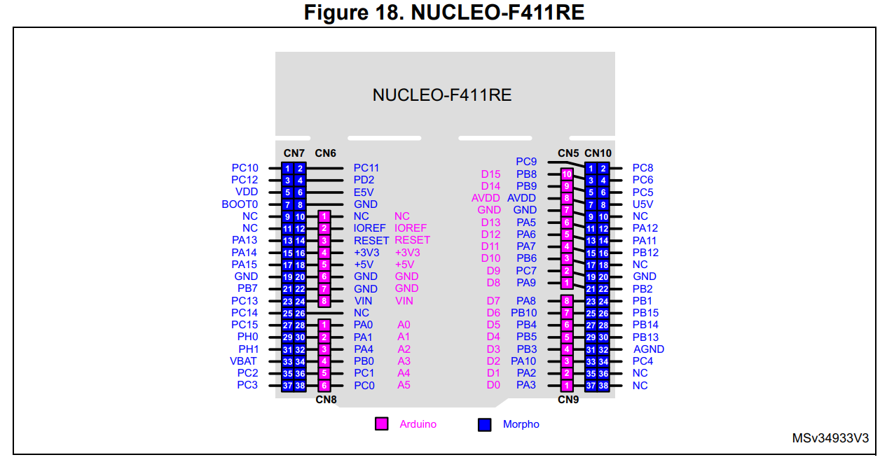
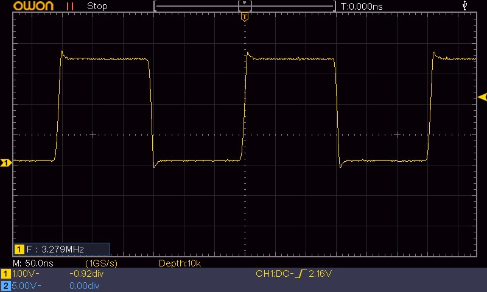
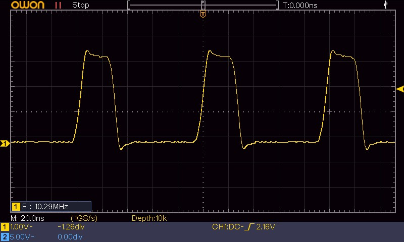
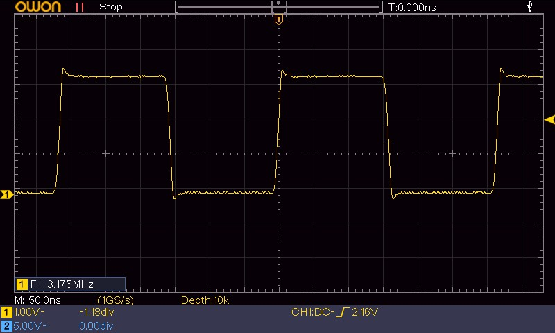
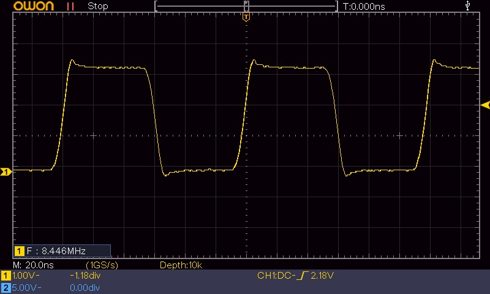
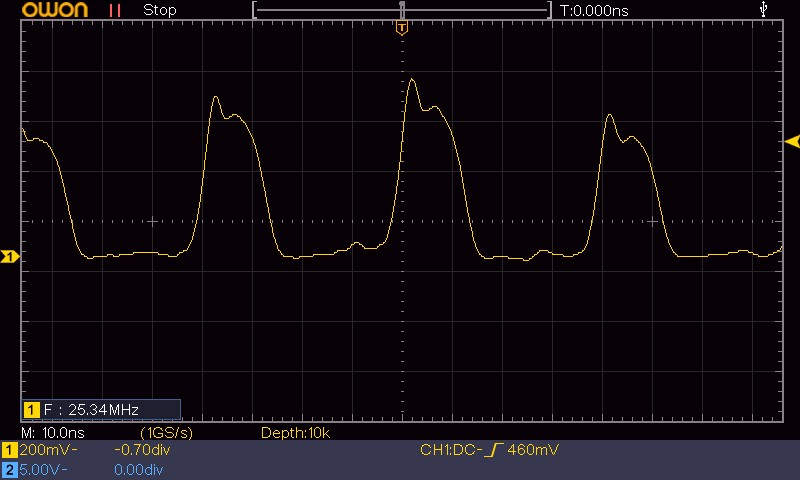

+++
title = 'F1 vs F4: GPIO-Toggle bei maximalem Systemtakt'
date = 2026-05-06T00:00:00+02:00
description = 'Erster Post der Serie „F1 vs F4": Drei Toggle-Methoden (HAL, ODR-XOR, BSRR) im direkten Vergleich zwischen Nucleo-F103RB (72 MHz) und Nucleo-F411RE (100 MHz). Ein bewusst unfairer Plattformvergleich — um reale Unterschiede sichtbar zu machen.'
tags = ['stm32', 'f1-vs-f4', 'gpio', 'performance', 'hal', 'cmsis', 'bsrr', 'embedded', 'c']
+++

Die [bisherigen Beiträge]() dieser Serie haben untersucht, wie , -XOR und  auf dem STM32F103 bei 8 MHz  performen, wie viel  nach dem Toggle bleibt, wie die  im /-Register die Signalqualität beeinflussen und wie Compiler-Optimierungen den generierten Code verändern.

Alles auf dem **STM32F103** — einem  bei 8 MHz HSI.

Jetzt kommt der F ins Spiel.

<!--more-->

> **Dieser Vergleich ist bewusst unfair — und genau das macht ihn didaktisch interessant.** Der STM32F103RB (Cortex-M3, 72 MHz max) und der STM32F411RE (F, 100 MHz max) spielen in unterschiedlichen Ligen. Der F411 hat einen höheren Maximaltakt, Cortex-M4F-Erweiterungen wie  und DSP-Instruktionen sowie den  für Flash-Zugriffe. Der F103 ist dagegen ein klassischer Cortex-M3 ohne FPU und ohne ART Accelerator. Genau deshalb ist der Vergleich didaktisch interessant.
>
> Ziel dieser Serie ist es nicht, einen „Gewinner" zu küren. Es geht darum, die Unterschiede, die man sonst nur aus dem Datenblatt kennt, **auf dem Oszilloskop sichtbar zu machen** und in konkrete Zahlen zu fassen.

Die F1-vs-F4-Serie ist kein Ersatz für die F103-Grundlagenreihe, sondern die nächste Ebene: Zuerst wurden die Prinzipien auf dem F103 sichtbar gemacht, jetzt wird geprüft, welche Effekte beim Wechsel auf eine Cortex-M4F-Plattform zusätzlich auftreten.

Dieser erste Beitrag der Serie „F1 vs F4" vergleicht beide MCUs bei ihrer **maximalen Systemtaktfrequenz** mit den drei bekannten Toggle-Methoden: `HAL_GPIO_TogglePin()`, `GPIOB->ODR ^= ...` und `GPIOB->BSRR = ...`.

**Wichtig:** Das ist bewusst kein isolierter Core-Vergleich. Verglichen werden zwei reale STM32-Plattformen in einer typischen Maximalkonfiguration. Ein späterer Beitrag mit identischem Systemtakt kann den reinen Takteffekt von Architektur-, Flash- und Bus-Effekten trennen.

## Testaufbau

| Board | Mikrocontroller | Kern | Systemtakt | Taktquelle |
|-------|----------------|------|------------|------------|
| Nucleo-F103RB | STM32F103RB | Cortex-M3 | 72 MHz |  aus 8 MHz  |
| Nucleo-F411RE | STM32F411RE | Cortex-M4F | 100 MHz | PLL aus 8 MHz HSE |

Beide Boards nutzen eine 8-MHz-HSE-Referenz als Eingang für die PLL. Auf den Nucleo-64-Boards kann diese Referenz je nach Boardkonfiguration über den ST-LINK/MCO als HSE-Bypass bereitgestellt werden. Der F103 erzeugt daraus 72 MHz, der F411 100 MHz. Die konkrete PLL-Konfiguration (PLLM, PLLN, PLLP) ist im CubeMX-Projekt dokumentiert.

Gemessen wird auf beiden Boards an **Pin PB8**, der auf den verwendeten Nucleo-64-Boards über den Morpho-Header zugänglich ist. Die Pinbelegung wurde in CubeMX beziehungsweise über die Board-Dokumentation geprüft. Compiler ist `arm-none-eabi-gcc` ohne . Alle drei Methoden wurden mit zwei Optimierungsstufen gemessen: `-O0` (keine Optimierung) und `-O2` (typische Release-Optimierung für performanceorientierten Code).

Die GPIO-Ausgänge wurden in der höchsten Output-Speed-Konfiguration der jeweiligen MCU betrieben. Damit wird vermieden, dass eine absichtlich langsam konfigurierte Ausgangsstufe die Frequenzmessung begrenzt. Die Signalqualität wird separat im Oszilloskopbild bewertet.



Die Pinbelegung beider Nucleo-64-Boards ist im [UM1724](https://www.st.com/resource/en/user_manual/um1724-stm32-nucleo64-boards-mb1136-stmicroelectronics.pdf) dokumentiert. PB8 liegt bei beiden Boards auf CN5 Pin 6 (Morpho, links) und ist über den Morpho-Header direkt zugänglich. Das Pinout des Nucleo-F103RB findet sich im [Beitrag zur Output-Speed-Messung]().

### Messmethode

Das Rechtecksignal wird direkt am Pin (PB8) gegen Masse mit einem passiven Tastkopf und kurzer Massefeder (Ground Spring) gemessen. Die Periodendauer liefert die Toggle-Frequenz, aus der sich die CPU-Zyklen pro Toggle-Zyklus berechnen lassen:

$$ N_{\text{Zyklen}} = \frac{f_{\text{CPU}}}{f_{\text{Toggle}}} $$

mit $f_{\text{CPU}}$ = 72 MHz (F103) bzw. 100 MHz (F411).

In diesem Beitrag bezeichnet ein **Toggle-Zyklus** eine vollständige Rechteckperiode, also High- und Low-Phase zusammen. Eine einzelne Flanke entspricht entsprechend nur einem Zustandswechsel.

Für reine Frequenz- und Periodendauervergleiche kann zusätzlich ein Logic Analyzer genutzt werden. Die analoge Signalform, Flankensteilheit und eventuelles Überschwingen werden jedoch mit dem Oszilloskop bewertet.

### Verwendete Dokumente

| Dokument | MCU | Link |
|----------|-----|------|
| **DS5319** | STM32F103x8/xB Datasheet | [st.com](https://www.st.com/resource/en/datasheet/stm32f103c8.pdf) |
| **RM0008** | STM32F103 Reference Manual | [st.com](https://www.st.com/resource/en/reference_manual/rm0008-stm32f101xx-stm32f102xx-stm32f103xx-stm32f105xx-and-stm32f107xx-advanced-armbased-32bit-mcus-stmicroelectronics.pdf) |
| **DS9716** | STM32F411xC/E Datasheet | [st.com](https://www.st.com/resource/en/datasheet/stm32f411re.pdf) |
| **RM0383** | STM32F411xC/E Reference Manual | [st.com](https://www.st.com/resource/en/reference_manual/rm0383-stm32f411xce-advanced-armbased-32bit-mcus-stmicroelectronics.pdf) |

## Die drei Toggle-Methoden

Der Anwendungscode ist bewusst gleich gehalten: gleiche Toggle-Methoden, gleiche Compiler-Optimierung und gleiche Messlogik. Unterschiede bleiben dennoch im Umfeld bestehen: Device-Header, Startup-Code, Linker-Script, HAL-Treiber für die jeweilige Familie, Clock-Konfiguration und Registermodell.

```c
// 1. HAL
while (1) {
    HAL_GPIO_TogglePin(GPIOB, GPIO_PIN_8);
}
```

```c
// 2. ODR-XOR
// F103: GPIO_ODR_ODR8   |   F411: GPIO_ODR_ODR_8
while (1) {
    GPIOB->ODR ^= GPIO_ODR_ODR8;    // STM32F1-Header (kein Unterstrich vor der Pin-Nr.)
    // bzw.  GPIO_ODR_ODR_8         // STM32F4-Header (Unterstrich vor der Pin-Nr.)
}
```

```c
// 3. BSRR
while (1) {
    GPIOB->BSRR = GPIO_PIN_8;                   // Pin high
    GPIOB->BSRR = ((uint32_t)GPIO_PIN_8 << 16U); // Pin low
}
```

Die ODR-Makros unterscheiden sich zwischen den Device-Headern: Der F1-Header (stm32f1xx.h) verwendet `GPIO_ODR_ODR8` (ohne Unterstrich vor der Pin-Nummer), der F4-Header (stm32f4xx.h) verwendet `GPIO_ODR_ODR_8` (mit Unterstrich). Die portable BSRR-Schreibweise mit `GPIO_PIN_8` und `<< 16U` funktioniert dagegen zuverlässig auf beiden STM32-Familien, weil das BSRR-Register in den unteren 16 Bit die Set-Bits und in den oberen 16 Bit die Reset-Bits verwendet. Die Makros `GPIO_BSRR_BS8`/`GPIO_BSRR_BR8` können je nach Device-Header vorhanden sein oder anders heißen — die gezeigte Schreibweise vermeidet diese Abhängigkeit.

Alle drei Varianten wurden in eigenen Builds kompiliert und separat auf beiden Boards gemessen — jeweils mit `-O0` und `-O2`.

## Messergebnisse: STM32F103 @ 72 MHz

| Methode | -O0 Frequenz | -O0 Zyklen | -O2 Frequenz | -O2 Zyklen | -O2 vs -O0 |
|---------|-------------|-----------|-------------|-----------|------------|
| HAL | 561 kHz | 128 | 1.126 MHz | 64 | 2,01× |
| ODR-XOR | 1.502 MHz | 48 | 3.279 MHz | 22 | 2,18× |
| BSRR | 2.778 MHz | 26 | 10.29 MHz | 7 | 3,70× |

Die Zyklenzahlen berechnen sich aus $72\,\text{MHz} / f_{\text{Toggle}}$, gerundet auf ganze Zyklen.

### HAL — 561 kHz (-O0) / 1.126 MHz (-O2)


Ohne Optimierung benötigt `HAL_GPIO_TogglePin()` 128 CPU-Zyklen pro Toggle — der Overhead des HAL-Treibers dominiert bei 72 MHz deutlich: Funktionsaufruf, HAL-interne Toggle-Logik, Registerzugriffe und je nach Konfiguration zusätzliche Prüfpfade kosten wesentlich mehr Zyklen als der direkte Registerzugriff. Mit `-O2` halbiert sich die Zyklenzahl auf etwa 64. Der Compiler optimiert den erzeugten Code deutlich: redundante Ladeoperationen können entfallen, Register werden effizienter genutzt, und der HAL-Funktionskörper selbst wird kompakter übersetzt. Ob `HAL_GPIO_TogglePin()` tatsächlich in `main()` geinlined wurde, muss über `objdump` geprüft werden — ohne LTO bleibt ein HAL-Aufruf aus einer separaten Übersetzungseinheit typischerweise als `BL` sichtbar.

Zum Vergleich: Bei 8 MHz HSI (-O2) wurden 200 kHz mit 40 Zyklen gemessen. Der 9-fache Takt bringt bei -O2 nur 5,6× mehr Frequenz — die Flash-Waitstates dämpfen die Taktskalierung (siehe Analyse).

### ODR-XOR — 1.502 MHz (-O0) / 3.279 MHz (-O2)



Der Read-Modify-Write-Zyklus auf das ODR-Register kostet ohne Optimierung 48 Zyklen. `-O2` reduziert auf 22 Zyklen — eine Verbesserung um den Faktor 2,18×. Der Compiler eliminiert den Umweg über den Stack für das XOR-Ergebnis und führt die Load-Store-Sequenz direkt auf das GPIO-Register aus. Die 3.279 MHz liegen dennoch deutlich unter einer idealisierten Taktskalierung. Eine plausible Ursache ist der Flash-Pfad des F103 bei 72 MHz: Flash-Latenz, Prefetch-Verhalten, Branches und Buszugriffe beeinflussen die reale Schleifenlaufzeit.

### BSRR — 2.778 MHz (-O0) / 10.29 MHz (-O2)



BSRR profitiert mit einem Faktor 3,70× am stärksten von `-O2`. Ohne Optimierung werden 26 Zyklen benötigt — Stack-basierte Adressierung, keine Registerallokation über Schleifeniterationen hinweg. Mit `-O2` sind es nur noch 7 Zyklen: Die GPIO-Port-Adresse liegt in einem Register, die beiden Store-Instruktionen (`STR`) und der Branch (`B`) bilden eine kompakte 3-Instruktionen-Schleife. Die 10.29 MHz sind das Maximum, das der F103 bei 72 MHz aus dem BSRR-Register herausholen kann.

Allerdings hat die Signalqualität bei dieser Grenzfrequenz gelitten: Das Rechtecksignal ist bei -O2 und 10.29 MHz **deutlich ungleichmäßiger** als bei -O0 (2.778 MHz). Die Periodendauer variiert sichtbar von Zyklus zu Zyklus. Eine plausible Ursache ist das Zusammenspiel aus Flash-Latenz, Prefetch-Verhalten, Branches und Messgrenzen bei sehr kurzen Perioden. Ohne Trace/Disassembly sollte diese Beobachtung nicht eindeutig einem einzelnen Mechanismus zugeschrieben werden. Bei -O0 ist die längere Instruktionskette robuster gegenüber solchen Schwankungen, weil Latenzeffekte einen kleineren relativen Anteil an der Gesamtzykluszeit ausmachen.

Zum Vergleich: Bei 8 MHz HSI (-O2) waren es 1,6 MHz mit 5 Zyklen. Der Takt ist 9× höher, die Frequenz 6,4× — die Zyklenzahl steigt von 5 auf 7, ein moderater Anstieg durch die 2 Flash-Waitstates.

## Messergebnisse: STM32F411 @ 100 MHz

| Methode | -O0 Frequenz | -O0 Zyklen | -O2 Frequenz | -O2 Zyklen | -O2 vs -O0 |
|---------|-------------|-----------|-------------|-----------|------------|
| HAL | 1.149 MHz | 87 | 3.175 MHz | 32 | 2,76× |
| ODR-XOR | 5.068 MHz | 20 | 8.446 MHz | 12 | 1,67× |
| BSRR | 8.460 MHz | 12 | 25.34 MHz | 4 | 3,00× |

Die Zyklenzahlen berechnen sich aus $100\,\text{MHz} / f_{\text{Toggle}}$, gerundet auf ganze Zyklen.

### HAL — 1.149 MHz (-O0) / 3.175 MHz (-O2)



87 Zyklen ohne Optimierung — der HAL-Overhead ist substanziell, aber die absolute Frequenz von 1.149 MHz liegt bereits über dem -O2-Wert des F103 (1.126 MHz). Mit `-O2` springt die Frequenz auf 3.175 MHz (≈32 Zyklen). Optimierungen wie bessere Registerallokation, Dead-Code-Elimination und kompakterer Funktionscode greifen deutlich. Ob zusätzlich Inlining stattfindet, muss über die Disassembly geprüft werden. Der Faktor 2,76× ist der höchste -O0→-O2-Speedup auf dem F411 — HAL-Code enthält grundsätzlich mehr Codepfade und Hilfslogik als direkte Registerzugriffe, sodass `-O2` hier besonders viel Wirkung zeigen kann.

### ODR-XOR — 5.068 MHz (-O0) / 8.446 MHz (-O2)



20 Zyklen (-O0) reduzieren sich auf 12 (-O2). Der Speedup von 1,67× ist moderat, weil die ODR-XOR-Sequenz auch ohne Optimierung bereits relativ kompakt ist. Entscheidend ist der Plattformvergleich: Mit 8.446 MHz bei -O2 erreicht der F411 eine ODR-Toggle-Frequenz, die 2,58-mal so hoch ist wie die des F103 bei -O2 (3.279 MHz) — und das bei nur 1,39× Taktvorteil.

### BSRR — 8.460 MHz (-O0) / 25.34 MHz (-O2)



25.34 MHz — die höchste in dieser gesamten Blogserie gemessene Toggle-Frequenz. Nur 4 CPU-Zyklen pro Toggle-Zyklus bei -O2: zwei `STR`-Instruktionen für Set und Reset sowie ein Branch. Das ist **weniger als die 5 Zyklen des F103 bei 8 MHz (0 Waitstates)**. Der ART Accelerator in Kombination mit `-O2` bringt den F411 in einen Bereich, in dem Flash-Latenzen für diesen engen Instruktionsstrom offenbar sehr gut verdeckt werden. Die gemessenen ≈4 Zyklen deuten darauf hin, dass hier die kompakte Instruktionsfolge, der effiziente Flash-/ART-Pfad und der erzeugte Maschinencode sehr gut zusammenspielen.

**Achtung Signalqualität:** Bei 25.34 MHz Toggle-Frequenz kann von einem sauberen Rechtecksignal kaum noch gesprochen werden. Die Flankensteilheit der GPIO-Treiber, die PCB-Impedanz des Nucleo-Boards und die Bandbreite des passiven Tastkopfs stoßen an ihre Grenzen. Das Oszilloskop-Bild zeigt eher einen stark gedämpften, trapezförmigen Verlauf als ein ideales Rechteck. Für eine grobe Frequenzbestimmung bleibt die Periodendauer noch bestimmbar. Die Messung sollte aber als digitale Timing-Messung interpretiert werden, nicht als Nachweis eines sauberen, belastbaren Rechtecksignals mit voller Pegelqualität. Für Anwendungen, die ein sauberes Rechteck benötigen, ist diese Konfiguration ungeeignet. Der [Beitrag zur Output-Speed-Konfiguration]() zeigt, wie die GPIO-Treiberstärke die Signalqualität beeinflusst — bei 25 MHz Toggle sind selbst mit maximalem Output Speed physikalische Grenzen erreicht.

Ohne Optimierung (-O0) sind es 12 Zyklen — Stack-basierte Adressierung kostet auch auf dem F411 Zyklen, selbst wenn der ART Accelerator die Flash-Zugriffe beschleunigt.

## Gegenüberstellung: F103 vs F411

| Methode | F103 -O0 | F103 -O2 | F411 -O0 | F411 -O2 | Speedup -O0 | Speedup -O2 |
|---------|----------|----------|----------|----------|-------------|-------------|
| HAL | 561 kHz (128 Z.) | 1.126 MHz (64 Z.) | 1.149 MHz (87 Z.) | 3.175 MHz (32 Z.) | **2,05×** | **2,82×** |
| ODR-XOR | 1.502 MHz (48 Z.) | 3.279 MHz (22 Z.) | 5.068 MHz (20 Z.) | 8.446 MHz (12 Z.) | **3,37×** | **2,58×** |
| BSRR | 2.778 MHz (26 Z.) | 10.29 MHz (7 Z.) | 8.460 MHz (12 Z.) | 25.34 MHz (4 Z.) | **3,04×** | **2,46×** |

Das reine Taktverhältnis beträgt 100/72 ≈ **1,39×**. Alle drei Methoden liegen bei beiden Optimierungsstufen **deutlich darüber** — zwischen 2,05× und 3,37×. Der F411 ist nicht nur schneller, weil er höher taktet. Die deutlich niedrigeren Zyklenzahlen zeigen, dass der F411 diesen Takt in diesem Test effektiver nutzbar macht — sehr wahrscheinlich durch den moderneren Flash-Pfad mit ART Accelerator, zusätzlich beeinflusst durch erzeugten Maschinencode, Buszugriffe und HAL-/CMSIS-Unterschiede.

Interessant: Die Speedup-Faktoren bei -O2 sind mit 2,46–2,82× enger beieinander als bei -O0 (2,05–3,37×). Der Compiler normalisiert einen Teil der Codequalitätsunterschiede, sodass der verbleibende Unterschied stärker die Plattform-Unterschiede (Flash-System, Bus-Architektur) widerspiegelt.

## Analyse: Takt, Flash-Waitstates, ART Accelerator — und der Compiler

Die Messwerte zeigen ein klares Bild. Vier Faktoren spielen eine Rolle:

### 1. Taktvorteil (×1,39 Grundskalierung)

Der F411 läuft mit 100 MHz, der F103 mit 72 MHz. Allein daraus ergäbe sich ein Faktor von 1,39× — wenn beide MCUs ihren Code gleich effizient aus dem Flash holen könnten. Tun sie nicht.

### 2. Flash-Waitstates: Der F103-Flaschenhals

Ein wesentlicher Unterschied liegt im Flash-Zugriff. Der STM32F103 benötigt bei 72 MHz **2 Waitstates** pro Flash-Zugriff (RM0008, Kapitel 3). Der Prefetch Buffer kann sequentielle Instruktionsströme beschleunigen, aber enge Schleifen mit Rücksprung profitieren nicht beliebig ideal von einer reinen Taktskalierung. Sprünge können den Nutzen des Prefetch-Buffers reduzieren, weil der Instruktionsstrom nicht mehr rein linear ist. Wie stark dieser Effekt ist, hängt vom konkreten Maschinencode und der Flash-/Prefetch-Implementierung ab.

Um den reinen Waitstate-Effekt zu isolieren, werden hier beide Messungen bei gleicher Optimierung (-O2) verglichen:

| Methode | F103 @ 8 MHz -O2 (0 WS) | F103 @ 72 MHz -O2 (2 WS) | Zyklen-Faktor |
|---------|--------------------------|---------------------------|---------------|
| HAL | 200 kHz (40 Zyklen) | 1.126 MHz (64 Zyklen) | **1,6×** |
| ODR-XOR | 445 kHz (18 Zyklen) | 3.279 MHz (22 Zyklen) | **1,2×** |
| BSRR | 1,6 MHz (5 Zyklen) | 10.29 MHz (7 Zyklen) | **1,4×** |

Der F103 führt bei 72 MHz denselben Anwendungscode aus wie bei 8 MHz. Ob der erzeugte Maschinencode vollständig identisch ist, sollte über `objdump` geprüft werden. Die gemessene Zyklenzahl pro Toggle steigt jedoch deutlich um den Faktor 1,2 bis 1,6. Der Taktgewinn wird durch Waitstates teilweise wieder aufgezehrt. Am härtesten trifft es HAL: Die längere Instruktionskette potenziert die Waitstate-Effekte (64 statt 40 Zyklen). BSRR mit nur 5→7 Zyklen zeigt, dass sehr kurze Schleifen die Waitstates durch den Prefetch Buffer noch am ehesten abfedern können.

Ohne Optimierung (-O0) ist der Effekt dramatischer, weil die längere Instruktionssequenz mehr Flash-Zugriffe erzeugt — aber dort mischt sich der Compiler-Effekt mit dem Waitstate-Effekt (siehe Abschnitt 4).

### 3. ART Accelerator: Warum der F411 davonläuft

Der **** des F411 (RM0383, Kapitel 3) besteht aus einem 128-Bit-Prefetch-Buffer und einem 64×128-Bit-Instruktions-Cache. Er kann die Flash-Latenz für typische Instruktionsströme effektiv verdecken — ST bewirbt 0-wait-state-Ausführung bei 100 MHz.

Die Messwerte bei -O2 bestätigen das eindrucksvoll:

| Referenz | Zyklen (BSRR) | Taktverhältnis zu 8 MHz | Zyklenverhältnis zu 5 |
|----------|---------------|------------------------|----------------------|
| F103 @ 8 MHz -O2 (Baseline) | 5 | 1,0× | 1,0× |
| F103 @ 72 MHz -O2 (2 WS) | 7 | 9,0× | 1,4× |
| F411 @ 100 MHz -O2 (ART) | **4** | 12,5× | **0,8×** |

Der F411 benötigt bei 12,5-fachem Takt nur 4 Zyklen — **weniger als die 5-Zyklen-Baseline des F103 bei 8 MHz ohne Waitstates**. Das ist das stärkste Ergebnis dieser Messung: Die BSRR-Toggle-Schleife läuft auf dem F411@100 MHz in weniger absoluten CPU-Zyklen als auf dem F103@8 MHz. Der ART Accelerator scheint die Flash-Latenz für diesen sehr kleinen, engen Instruktionsstrom so gut zu verdecken, dass sie in der gemessenen BSRR-Schleife nicht mehr der dominierende Faktor ist.

Welche Methode profitiert am stärksten? Bei -O2 ist es HAL mit einem Speedup von 2,82×. Der Grund: Die längere HAL-Instruktionskette beinhaltet viele Flash-Zugriffe. Auf dem F103 können Flash-Latenzen, Prefetch-Verhalten und Branches bei instruktionsreichen Pfaden stärker sichtbar werden. Auf dem F411 kann der ART Accelerator diese Latenzen für geeignete Instruktionsströme deutlich besser verdecken.

Bei -O0 profitiert ODR-XOR mit 3,37× am stärksten. Ein plausibler Grund ist, dass der Read-Modify-Write-Zugriff eine längere Instruktionskette erzeugt, bei der Flash-Pfad, Prefetch-Verhalten und Branches stärker sichtbar werden. Der F411 kann diesen Instruktionsstrom mit ART-Unterstützung deutlich effizienter bedienen (20 statt 48 Zyklen).

### 4. Compiler-Effekt: -O0 vs -O2 auf beiden Plattformen

Die Optimierungsstufe hat einen eigenständigen, von der Plattform unabhängigen Effekt — aber das Zusammenspiel mit dem Flash-System ist aufschlussreich:

| Plattform | HAL -O0→-O2 | ODR -O0→-O2 | BSRR -O0→-O2 |
|-----------|-------------|-------------|--------------|
| F103 @ 72 MHz | 2,01× | 2,18× | **3,70×** |
| F411 @ 100 MHz | **2,76×** | 1,67× | 3,00× |

BSRR profitiert auf beiden Plattformen massiv von -O2 (3,00–3,70×), weil die Optimierung eine maximal kompakte Schleife erzeugen kann: zwei Stores, ein Branch, alles in Registern. Ohne Optimierung werden GPIO-Adresse und Pin-Maske in jedem Schleifendurchlauf neu vom Stack geladen.

HAL profitiert auf dem F411 stärker von -O2 (2,76×) als auf dem F103 (2,01×). Ein plausibler Grund ist, dass HAL-Funktionen grundsätzlich mehr Codepfade und Hilfslogik enthalten als direkte Registerzugriffe. Dadurch kann `-O2` mehr Wirkung zeigen als bei sehr kurzen ODR-/BSRR-Schleifen. Ob die F411-HAL in dieser konkreten Messung tatsächlich mehr Optimierungspotenzial bietet als die F103-HAL, sollte über Disassembly und Größenvergleich geprüft werden.

ODR-XOR profitiert auf dem F411 weniger von -O2 (1,67× vs 2,18×), weil die ODR-Sequenz bereits ohne Optimierung vom ART Accelerator profitiert — der Cache liefert die Instruktionen auch bei suboptimalem Code schnell genug, sodass der relative Sprung durch -O2 kleiner ausfällt.

## Fazit

Der F411 ist in diesem GPIO-Test nicht nur wegen des höheren Takts schneller. Die Messwerte deuten stark darauf hin, dass der modernere Flash-Pfad mit ART Accelerator eine zentrale Rolle spielt: Der F411 erreicht bei 100 MHz deutlich niedrigere Zyklenzahlen als der F103 bei 72 MHz. Gleichzeitig bleibt die endgültige Bewertung an Disassembly, Build-Konfiguration und Messaufbau gekoppelt. Der Compiler-Effekt (-O0 → -O2) ist ebenfalls erheblich, aber sekundär — selbst mit -O0 schlägt der F411 den F103 mit -O2 in zwei von drei Methoden.

Die Kernaussagen:

- **BSRR bleibt die schnellste Methode** — auf beiden Plattformen, mit großem Abstand. 25.34 MHz auf dem F411 (-O2) sind das Maximum dieser Blogserie. Mit nur etwa 4 CPU-Zyklen pro Toggle-Zyklus unterbietet der F411 sogar die 5-Zyklen-Baseline des F103 bei 8 MHz. Das ist ein starkes Indiz dafür, dass der ART-gestützte Instruktionspfad und der optimierte Schleifencode hier sehr effektiv zusammenspielen.
- **Der reine Taktvergleich (1,39×) greift zu kurz.** Die realen Speedup-Faktoren liegen bei -O2 zwischen 2,46× und 2,82×, bei -O0 zwischen 2,05× und 3,37×. Wer F1- und F4-Performance nur anhand der MHz-Zahlen vergleicht, unterschätzt in diesem GPIO-Test den F4 deutlich.
- **Der F103 skaliert bei 72 MHz nicht linear, weil Flash-Latenz und Prefetch-Verhalten sichtbar werden.** Selbst mit -O2 steigt die Zyklenzahl gegenüber 8 MHz um 20–60 %. Mit -O0 wird der Effekt durch die längeren Instruktionssequenzen noch verstärkt.
- **Der F411 skaliert in diesem Test deutlich besser als der F103** — und erreicht bei BSRR sogar weniger CPU-Zyklen als die 8-MHz-Baseline des F103.
- **Die Messung passt sehr gut zur Erwartung, dass der ART Accelerator Flash-Latenzen bei geeigneten Instruktionsströmen wirkungsvoll verdecken kann.**
- **Compiler-Optimierung lohnt sich auf beiden Plattformen**, aber der relative Gewinn ist plattformabhängig: BSRR profitiert universell (3,0–3,7×), HAL auf dem F411 besonders (2,76×), ODR auf dem F103 stärker als auf dem F411.

Die Frage „F1 vs F4 — wie groß ist der Unterschied wirklich?" ist damit für den GPIO-Toggle-Fall beantwortet: **deutlich größer, als das Taktverhältnis vermuten lässt — und mit -O2 noch konsistenter als mit -O0.**

**Eine ergänzende Disassembly-Analyse folgt separat.** Sie soll zeigen, ob die `-O2`-Schleifen auf F103 und F411 tatsächlich dieselbe Instruktionsstruktur besitzen oder ob Unterschiede im erzeugten Maschinencode einen Teil der gemessenen Abweichungen erklären.

## Ausblick

Das ist der erste Post der Serie „F1 vs F4". Geplant sind unter anderem:

* **CPU-Headroom-Vergleich**: Wie viel Rechenzeit bleibt beim Toggle mit einer vorgegebenen Frequenz übrig? (analog zum [CPU-Headroom-Post]() für den F103)
* **Compiler-Optimierungen auf dem F411**: Wie verhalten sich `-O0` bis `-Os` auf dem Cortex-M4F?
* **FPU-Vergleich**: Gleitkomma-Operationen — ein Test, bei dem der F411 seine Hardware-FPU ausspielen kann
* **Interrupt-Latenz**: Welcher Controller reagiert schneller?
* **Same-Clock-Vergleich**: Beide MCUs bei identischem Systemtakt — um den reinen Architektureffekt vom Takteffekt zu trennen.
* **-O0 vs -O2 Disassembly-Vergleich**: Welche Instruktionen eliminiert der Compiler im Plattformvergleich?

Die F1-vs-F4-Serie ist kein Ersatz für die F103-Grundlagenreihe, sondern die nächste Ebene: Zuerst wurden die Prinzipien auf dem F103 sichtbar gemacht, jetzt wird geprüft, welche Effekte beim Wechsel auf eine Cortex-M4F-Plattform zusätzlich auftreten.

## Video & Quellen

*TBD — Video und Quellcode folgen, sobald verfügbar.*

### Referenzierte Dokumente

* **UM1724** — STM32 Nucleo-64 Boards User Manual (MB1136): Pinbelegung, Morpho-Header, Schaltplan. [PDF](https://www.st.com/resource/en/user_manual/um1724-stm32-nucleo64-boards-mb1136-stmicroelectronics.pdf)
* **DS5319** — STM32F103x8/xB Datasheet. [PDF](https://www.st.com/resource/en/datasheet/stm32f103c8.pdf)
* **RM0008 Rev 21** — STM32F103xx Reference Manual, insbesondere Kapitel 3 (Flash Waitstates). [PDF](https://www.st.com/resource/en/reference_manual/rm0008-stm32f101xx-stm32f102xx-stm32f103xx-stm32f105xx-and-stm32f107xx-advanced-armbased-32bit-mcus-stmicroelectronics.pdf)
* **DS9716** — STM32F411xC/E Datasheet (die URL verweist auf das konkrete Derivat STM32F411RE, das Datenblatt gilt für die gesamte xC/xE-Familie). [PDF](https://www.st.com/resource/en/datasheet/stm32f411re.pdf)
* **RM0383 Rev 4** — STM32F411xC/E Reference Manual, insbesondere Kapitel 3 (ART Accelerator). [PDF](https://www.st.com/resource/en/reference_manual/rm0383-stm32f411xce-advanced-armbased-32bit-mcus-stmicroelectronics.pdf)
