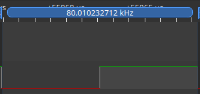
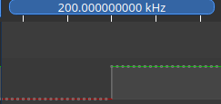
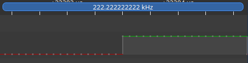

+++
title = 'STM32 GPIO unter der Lupe: Compiler-Optimierungen sichtbar gemacht'
date = 2026-04-29T00:00:00+02:00
description = 'Alle 5 GCC-Optimierungsstufen (-O0, -Og, -O1, -O2, -Os) im Vergleich beim GPIO-Toggle auf dem STM32F103. 15 Messreihen zeigen, welchen Einfluss die Optimierung auf Frequenz und Codegröße hat — mit überraschenden Ergebnissen.'
tags = ['stm32', 'gpio', 'compiler', 'optimization', 'performance', 'embedded', 'c']
draft = false
+++

Die ersten drei Teile dieser Serie haben gezeigt, wie viel CPU-Zeit verschiedene Toggle-Methoden verbrauchen ([ vs CMSIS]()), warum  mehr Reserve für die Anwendung lässt ([CPU-Headroom]()), und wie die  in den /-Registern die Signalqualität beeinflussen ([Output Speed]()).

Dabei wurde bisher mit GCC `-O2` übersetzt — einer typischen Release-Optimierung, wenn Laufzeit wichtiger ist als maximale Debugbarkeit. In Debug-Builds werden dagegen häufig `-O0` oder `-Og` verwendet. Doch was passiert, wenn wir dieselbe C-Quelle mit anderen Optimierungsstufen kompilieren? Wie stark unterscheiden sich `-O0`, `-Og`, `-O1`, `-O2` und `-Os`?

Dieser Beitrag macht den Unterschied sichtbar — nicht nur an der Toggle-Frequenz, sondern vor allem am generierten Maschinencode.

<!--more-->

## Testaufbau

Der Aufbau ist identisch zu den vorherigen Beiträgen:

| Board         | Mikrocontroller | Takt                        |
| ------------- | --------------- | --------------------------- |
| Nucleo-F103RB | STM32F103RB     | 8 MHz () |
| Bluepill      | STM32F103C6T    | 8 MHz (HSI)                 |

Getestet werden alle drei Toggle-Methoden (HAL, -XOR, BSRR) — jeweils kompiliert mit `-O0`, `-Og`, `-O1`, `-O2` und `-Os`. Der Compiler ist `arm-none-eabi-gcc`, die Messung erfolgt wie in Teil 1–3 mit einem Oszilloskop direkt am Pin PB8.

## Die Optimierungsstufen

GCC bietet eine Vielzahl von Optimierungsstufen. Für Embedded-Entwickler auf dem STM32 sind vor allem diese relevant:

| Stufe | Bedeutung                       | Charakter                                                                                    |
| :---- | :------------------------------ | :------------------------------------------------------------------------------------------- |
| `-O0` | Keine Optimierung               | Gute Quellcode-Zuordnung, aber sehr langsamer und oft untypischer Code                       |
| `-Og` | Debug-Optimierung               | Praxisnaher Debug-Kompromiss, von GCC für den Edit-Compile-Debug-Zyklus empfohlen            |
| `-O1` | Basisoptimierung                | Deutlich kompakter und schneller als `-O0`, weniger aggressiv als `-O2`                      |
| `-O2` | Optimierung für Geschwindigkeit | Viele Optimierungen aktiv, typische Release-Einstellung für Performance                      |
| `-Os` | Optimierung für Codegröße       | Aktiviert viele `-O2`-Optimierungen, vermeidet aber bestimmte größensteigernde Optimierungen |

Die Unterschiede sind nicht nur graduell — sie können fundamental sein. Ein und derselbe C-Code wird vom Compiler in unterschiedliche Maschinencode-Sequenzen übersetzt, abhängig davon, welche Optimierungsregeln angewendet werden.

## Gemessene Toggle-Frequenzen

Die folgende Tabelle fasst die gemessenen Frequenzen aller 15 Varianten zusammen. Gemessen wurde mit einem Logic Analyzer direkt am Pin PB8 bei 8 MHz Systemtakt (HSI).

| Methode     |    `-O0`   |    `-Og`   |   `-O1`   |   `-O2`   |    `-Os`   |
| :---------- | :--------: | :--------: | :-------: | :-------: | :--------: |
| **HAL**     |  80,01 kHz | 190,47 kHz | 222,2 kHz | 200,0 kHz | 210,52 kHz |
| **ODR-XOR** |  307,7 kHz | 363,63 kHz | 444,4 kHz | 444,4 kHz |  444,4 kHz |
| **BSRR**    | 615,38 kHz |  888,8 kHz |  1,6 MHz  |  1,6 MHz  |   2,0 MHz  |

Die Messwerte zeigen einen klaren Trend: HAL bei `-O0` erreicht nur 80,01 kHz — weniger als die Hälfte des `-O2`-Werts von 200 kHz. Die Ursache liegt nicht im GPIO-Peripheral, sondern im Code, den der Compiler erzeugt.

<figure style="text-align: center">
  
  <figcaption>HAL_GPIO_TogglePin() bei <code>-O0</code>: 80,01 kHz</figcaption>
</figure>

Bereits auf den ersten Blick wird der Unterschied zwischen `-O0` und `-O2` bei HAL sichtbar:

<figure style="text-align: center">
  
  <figcaption>HAL_GPIO_TogglePin() bei <code>-O2</code>: 200,0 kHz</figcaption>
</figure>

Besonders interessant ist der Vergleich von `-O1` (222,2 kHz) und `-O2` (200,0 kHz): Die höhere Optimierungsstufe erzielt hier **nicht** die höhere Frequenz. Das ist ein wichtiges Beispiel dafür, dass Optimierung kein linearer Prozess ist — manchmal erzeugt `-O1` für einen konkreten Messfall günstigeren Code als `-O2`.

<figure style="text-align: center">
  
  <figcaption>HAL_GPIO_TogglePin() bei <code>-O1</code>: 222,2 kHz — schneller als <code>-O2</code></figcaption>
</figure>

Auffällig ist auch der Flash-Verbrauch, der parallel zu den Frequenzen erfasst wurde:

| Methode     |  `-O0` |  `-Og` |  `-O1` |  `-O2` |  `-Os` |
| :---------- | :----: | :----: | :----: | :----: | :----: |
| **HAL**     | 4576 B | 3344 B | 3332 B | 3172 B | 2840 B |
| **ODR-XOR** | 4528 B | 3324 B | 3308 B | 3152 B | 2824 B |
| **BSRR**    | 4532 B | 3328 B | 3812 B | 3156 B | 2824 B |

Die Codegröße nimmt mit steigender Optimierung grundsätzlich ab — mit einer interessanten Ausnahme im optimierten Bereich: BSRR bei `-O1` (3812 B) ist deutlich größer als bei `-Og`, `-O2` und `-Os`, bleibt aber immer noch kleiner als bei `-O0` (4532 B). Das zeigt: Die kleinste Codegröße entsteht nicht automatisch bei der „mittleren“ Optimierungsstufe. In dieser Messreihe liefert `-Os` bei allen drei Methoden den kleinsten Flash-Verbrauch.

## Disassembly-Vergleich: `arm-none-eabi-objdump -d -S`

Der Blick auf die tatsächlich generierten ARM-Thumb-Instruktionen erklärt die Frequenzunterschiede sehr gut. Die folgenden Auszüge zeigen die `while(1)`-Schleife jeder Variante — aus dem realen `objdump`-Output extrahiert.

### 1. HAL — `HAL_GPIO_TogglePin()`

`HAL_GPIO_TogglePin()` ist im STM32CubeF1-Paket definiert. Die Funktion liest den aktuellen ODR-Zustand ein und erzeugt daraus eine BSRR-Maske zum Setzen bzw. Rücksetzen der gewünschten Pins.

**Bei `-O0`:** Die HAL-Funktion wird **nicht** geinlined. Die `while(1)`-Schleife besteht aus vier Instruktionen — Parameter laden, Funktionsaufruf und Rücksprung:

```text
 800015c:   mov.w   r1, #256          @ 0x100 = GPIO_PIN_8
 8000160:   ldr     r0, [pc, #4]      @ GPIOB = 0x40010C00
 8000162:   bl      HAL_GPIO_TogglePin
 8000166:   b.n     800015c           @ Rücksprung zur Schleife
```

Die Funktion selbst durchläuft zusätzlich Prologue, eigentliche Toggle-Logik und Epilogue. Bei `-O0` werden lokale Zwischenergebnisse deutlich häufiger über den Stack geführt, und der erzeugte Code ist wesentlich länger. Falls `USE_FULL_ASSERT` aktiviert ist, können zusätzlich die HAL-Parameterprüfungen Code erzeugen; ohne dieses Makro ist `assert_param()` typischerweise ein leeres Makro.

**Bei `-O2`:** Auch bei `-O2` wird `HAL_GPIO_TogglePin()` in dieser Messung **nicht geinlined** — die Funktion liegt in einer separaten Übersetzungseinheit (`stm32f1xx_hal_gpio.c`), und  (`-flto`) war nicht aktiviert. Der `bl`-Aufruf bleibt erhalten. Die Schleife selbst ist strukturell identisch zu `-O0`:

```text id="42x7z4"
 80001fc:   mov.w   r1, #256          @ GPIO_PIN_8
 8000200:   ldr     r0, [pc, #8]      @ GPIOB
 8000202:   bl      HAL_GPIO_TogglePin
 8000206:   b.n     80001fc           @ loop
```

Der Unterschied liegt **innerhalb** der HAL-Funktion: Bei `-O0` wird typischer Debug-Code mit Frame-Pointer und vielen Stack-Zugriffen erzeugt. Bei `-O2` ist die Registerallokation effizienter, der Funktionskörper kompakter, und unnötige Speicherzugriffe verschwinden. Deshalb steigt die Frequenz von 80 kHz auf 200 kHz, obwohl der `bl`-Aufruf in beiden Fällen sichtbar bleibt.

Zusätzlicher Hinweis aus der `objdump`-Analyse: Bei `-O2` wurde `MX_GPIO_Init()` **in** `main()` geinlined — aber `HAL_GPIO_TogglePin()` aus einer anderen `.c`-Datei nicht. Das ist ein guter Hinweis darauf, dass  über Übersetzungseinheiten hinweg erst mit  (`-flto`) realistisch wird.

### 2. ODR-XOR — `GPIOB->ODR ^= GPIO_ODR_ODR8`

Die ODR--Sequenz ist der einfachste Fall: kein Funktionsaufruf, nur Lade-, XOR- und Speicherbefehle. Trotzdem zeigen sich Unterschiede in der Registerallokation.

**Bei `-O0`:** Sechs Instruktionen pro Schleifendurchlauf. Die GPIOB-Adresse wird **zweimal** aus dem  geladen — einmal für den Lesezugriff (r3), einmal für den Schreibzugriff (r2):

```text id="eq0ih7"
 800015c:   ldr     r3, [pc, #12]     @ r3 = &GPIOB
 800015e:   ldr     r3, [r3, #12]     @ r3 = GPIOB->ODR
 8000160:   ldr     r2, [pc, #8]      @ r2 = &GPIOB  ← redundant
 8000162:   eor.w   r3, r3, #256      @ r3 ^= 0x100 (toggle)
 8000166:   str     r3, [r2, #12]     @ GPIOB->ODR = r3
 8000168:   b.n     800015c           @ loop
```

Der Compiler erzeugt hier bewusst kaum optimierten Code. Das hilft beim Debugging, kostet aber Laufzeit.

**Bei `-O2`:** Fünf Instruktionen pro Durchlauf. Die GPIOB-Adresse wird **einmal** geladen und sowohl für LDR als auch STR verwendet:

```text id="2dikk0"
 80001fc:   ldr     r2, [pc, #12]     @ r2 = &GPIOB  (1× laden)
 80001fe:   ldr     r3, [r2, #12]     @ r3 = GPIOB->ODR
 8000200:   eor.w   r3, r3, #256      @ r3 ^= 0x100 (toggle)
 8000204:   str     r3, [r2, #12]     @ GPIOB->ODR = r3
 8000206:   b.n     80001fe           @ loop
```

Die eingesparte Instruktion — das redundante Laden der GPIOB-Adresse — erklärt den Frequenzsprung von 307,7 kHz auf 444,4 kHz. Eine einzige überflüssige Instruktion reduziert die Toggle-Rate in dieser engen Schleife deutlich.

Wichtig bleibt: ODR-XOR ist ein -Zugriff. In einer isolierten Messschleife ist das unkritisch. In produktivem Code mit Interrupts oder parallelen Zugriffen auf denselben GPIO-Port kann BSRR robuster sein, weil Setzen und Rücksetzen einzelner Pins atomar über Schreibzugriffe erfolgen.

### 3. BSRR — `GPIOB->BSRR = GPIO_BSRR_BS8; GPIOB->BSRR = GPIO_BSRR_BR8`

Der BSRR-Zugriff kommt dem idealen Minimalcode am nächsten: zwei Store-Instruktionen, kein Lesen, keine XOR-Operation. Die Optimierung wirkt hier besonders deutlich.

**Bei `-O0`:** Acht Instruktionen pro Schleifendurchlauf. Neben der redundanten GPIOB-Adresse (zweimal geladen) findet sich ein `nop` — für die eigentliche GPIO-Funktion ohne Nutzen:

```text id="de43ae"
 800015c:   ldr     r3, [pc, #16]     @ r3 = &GPIOB
 800015e:   mov.w   r2, #256          @ r2 = 0x100 (SET)
 8000162:   str     r2, [r3, #16]     @ BSRR = 0x100 → PIN HIGH
 8000164:   ldr     r3, [pc, #8]      @ r3 = &GPIOB ← redundant
 8000166:   mov.w   r2, #16777216     @ r2 = 0x1000000 (RESET)
 800016a:   str     r2, [r3, #16]     @ BSRR = 0x1000000 → PIN LOW
 800016c:   nop                       @ für die GPIO-Funktion ohne Nutzen
 800016e:   b.n     800015c           @ loop
```

**Bei `-O2`:** Drei Instruktionen im Schleifenkörper. Alle Konstanten (GPIOB-Adresse, SET-Wert, RESET-Wert) werden **einmal vor der Schleife** geladen. Der eigentliche Schleifenkörper enthält nur noch die beiden Store-Instruktionen und den Rücksprung:

```assembly id="pnxw7i"
; Konstanten (1× vor der Schleife):
 80001fc:   mov.w   r1, #256          @ r1 = 0x100 (SET)
 8000200:   mov.w   r2, #16777216     @ r2 = 0x1000000 (RESET)
 8000204:   ldr     r3, [pc, #8]      @ r3 = &GPIOB

; while(1):
 8000206:   str     r1, [r3, #16]     @ BSRR = 0x100 → PIN HIGH
 8000208:   str     r2, [r3, #16]     @ BSRR = 0x1000000 → PIN LOW
 800020a:   b.n     8000206           @ loop
```

Der Unterschied könnte kaum größer sein: **8 vs. 3 Instruktionen** pro High-Low-Schleifendurchlauf. Das erklärt den Sprung von 615 kHz auf 1,6 MHz. Der Compiler hat hier mehrere Optimierungen gleichzeitig angewendet: ** (Konstanten aus der Schleife gezogen), bessere *Register Allocation* (Adresse nur einmal geladen) und das Wegfallen von Code, der für die eigentliche GPIO-Ausgabe keinen Nutzen hat.

## Analyse: Die Stellhebel des Compilers

Die `objdump`-Ausgabe macht die Mechanismen sichtbar, mit denen der Compiler die Performance beeinflusst.

### 

 ist einer der größten Hebel, aber mit einer wichtigen Einschränkung: GCC aktiviert `-finline-functions` bei `-O2`, `-O3` und `-Os`. Der Compiler entscheidet dabei heuristisch, welche Funktionen sich lohnen. Ohne  sieht GCC beim Kompilieren einer `.c`-Datei aber nicht automatisch den Funktionskörper aus einer anderen Übersetzungseinheit.

Die `objdump`-Analyse bestätigt genau das: `MX_GPIO_Init()` aus `main.c` wurde bei `-O2` in `main()` geinlined, aber `HAL_GPIO_TogglePin()` aus `stm32f1xx_hal_gpio.c` nicht — es gibt keinen LTO-Build. Ohne **** (`-flto`) bleibt der Funktionsaufruf (`BL`) erhalten.

### 

Der deutlichste Unterschied zwischen `-O0` und `-O2` zeigt sich bei BSRR: Bei `-O0` werden die Konstanten (GPIOB-Adresse, 0x100, 0x1000000) bei **jedem** Schleifendurchlauf neu aus dem  geladen oder mit `mov.w` gesetzt. Bei `-O2` werden sie **einmal vor der Schleife** in Registern bereitgestellt — der Schleifenkörper schrumpft von 8 auf 3 Instruktionen.

### Registerallokation

Bei `-O0` werden Register nicht optimal zugewiesen. Der Compiler lädt die GPIOB-Adresse mehrfach (ODR: 2×, BSRR: 2×), obwohl derselbe Wert wiederverwendet werden könnte. Bei `-O2` wird die Adresse einmal geladen und für alle Zugriffe im Schleifenkörper wiederverwendet.

### Konfigurationsabhängige Codepfade

Ob `assert_param()`-Prüfungen im kompilierten Code landen, hängt nicht direkt von der Optimierungsstufe ab, sondern vom Präprozessor-Makro `USE_FULL_ASSERT`. Ist es nicht definiert, ist `assert_param()` ein leeres Makro und erzeugt keinen Code — unabhängig von `-O0` oder `-O2`. In HAL-Debug-Konfigurationen kann `USE_FULL_ASSERT` gesetzt sein, in Release-Konfigurationen ist es typischerweise deaktiviert.

## Vergleichstabelle: Instruktionen im Schleifenkörper

Die `objdump`-Analyse erlaubt einen direkten Vergleich der Instruktionsanzahl im heißen Pfad. Gemeint ist hier der wiederholte Schleifenteil, also der Code, der für jeden High-Low-Zyklus erneut ausgeführt wird. Einmalige Initialisierung vor der Schleife wird nicht mitgezählt.

| Methode |        `-O0`        |              `-O2`              | Reduktion |
| :------ | :-----------------: | :-----------------------------: | :-------: |
| HAL     | 4 + Funktionskörper | 4 + kompakterer Funktionskörper |  deutlich |
| ODR-XOR |          6          |                5                |    17 %   |
| BSRR    |          8          |              **3**              |  **63 %** |

Drei Beobachtungen stechen hervor:

1. **BSRR profitiert am meisten** von der Optimierung: von 8 auf 3 Instruktionen im Schleifenkörper (–63 %). Der Compiler hoisted die Konstanten aus der Schleife, verwendet Register besser und entfernt unnötigen Code. Das erklärt den Frequenzsprung von 615 kHz auf 1,6 MHz.

2. **ODR-XOR profitiert moderat**: von 6 auf 5 Instruktionen (–17 %). Die eingesparte Instruktion ist das redundante Laden der GPIOB-Adresse. Das reicht für einen Sprung von 307,7 kHz auf 444,4 kHz.

3. **HAL zeigt, dass die Schleife nicht alles ist**: Die `while(1)`-Schleife enthält bei `-O0` und `-O2` weiterhin Parameterübergabe, `BL` und Rücksprung. Die Frequenz steigt trotzdem von 80 auf 200 kHz, weil die Optimierung **innerhalb** der HAL-Funktion wirkt — kürzerer Prologue/Epilogue, bessere Registerallokation und weniger Stack-Zugriffe.

## Fazit

Die Messungen bestätigen: Die Compiler-Optimierungsstufe ist kein „Turbo-Knopf“, der alles gleichmäßig beschleunigt. Die Ergebnisse sind oft überraschend:

* **HAL profitiert stark**, aber nicht linear: `-O1` (222,2 kHz) schlägt `-O2` (200,0 kHz). Wer HAL verwendet, sollte verschiedene Stufen messen — die formal höhere Optimierungsstufe ist nicht automatisch die schnellste.
* **ODR-XOR sättigt bei `-O1`** (444,4 kHz) — höhere Stufen bringen in dieser Messung keinen Mehrwert. Der Code ist bereits so einfach, dass der Compiler kaum noch Optimierungspotenzial findet.
* **BSRR liefert die Spitzenwerte**, allen voran `-Os` mit 2,0 MHz. Die Größenoptimierung erzeugt hier den effizientesten Schleifencode — ein Paradebeispiel dafür, dass Codegröße und Geschwindigkeit nicht immer im Widerspruch stehen.

Die Praxisempfehlungen:

* **`-O2`** — typische Release-Einstellung für performance-orientierten Code. Gute erste Wahl, wenn Laufzeit wichtig ist.
* **`-Os`** — erste Wahl bei knappem Flash (z. B. STM32F103C6 mit 32 KB). In dieser Messung sogar die schnellste Variante für BSRR.
* **`-Og`** — von GCC für den Edit-Compile-Debug-Zyklus empfohlen. Liefert hier bereits praxistaugliche Performance bei deutlich besserer Debugbarkeit als aggressive Release-Optimierung.
* **`-O1`** — ein oft übersehener Kandidat. Bei HAL sogar schneller als `-O2`, bei ODR-XOR und BSRR sehr stark. Für kleine Embedded-Projekte lohnt sich ein Test.
* **`-O0`** — sinnvoll für die frühe Debug-Phase, aber ungeeignet für Performance-Bewertungen. Der generierte Code ist langsam und repräsentiert nicht das spätere Release-Verhalten.

Die wichtigste Erkenntnis: **Wer Performance-Probleme hat, sollte zuerst die Optimierungsstufe und die Build-Konfiguration prüfen — nicht blind die Toggle-Methode wechseln.**

## Ausblick

In den nächsten Beiträgen dieser Serie könnten folgende Themen behandelt werden:

* **Interrupt-Latenz beim GPIO-Toggle**: Was passiert, wenn ein Interrupt die Toggle-Schleife unterbricht?
* **GPIO-Lesegeschwindigkeit**: Wie schnell kann der STM32F103 einen Pin einlesen (IDR)?
* **LTO auf dem STM32F103**: Was passiert, wenn `-flto` aktiviert wird und HAL-Funktionen über Übersetzungseinheiten hinweg optimiert werden können?
* **Zusammenfassung und Leitfaden**: Welche Methode für welchen Anwendungsfall?

## Video & Quellen

*TBD — Video und Quellcode folgen, sobald verfügbar.*

### Referenzierte Dokumente

* **GCC Optimize Options** — GCC-Dokumentation zu `-O0`, `-Og`, `-O1`, `-O2`, `-O3`, `-Os`, `-finline-functions` und weiteren Optimierungen. [Online](https://gcc.gnu.org/onlinedocs/gcc/Optimize-Options.html)
* **GCC Link Time Optimization (LTO)** — GCC-Dokumentation zur Link-Time Optimization und Optimierung über Übersetzungseinheiten hinweg. [Online](https://gcc.gnu.org/onlinedocs/gccint/LTO.html)
* **GNU Binutils / objdump** — Dokumentation zu den GNU Binary Utilities, darunter `objdump`, `objcopy` und `size`. [Online](https://sourceware.org/binutils/docs/binutils/)
* **STM32CubeF1** — Offizielles STM32Cube-Paket für die STM32F1-Serie mit HAL/LL-Treibern, CMSIS und Beispielprojekten. [GitHub](https://github.com/STMicroelectronics/STM32CubeF1)
* **RM0008 Rev 21** — STM32F101xx, STM32F102xx, STM32F103xx, STM32F105xx, STM32F107xx Referenzhandbuch. [PDF](https://www.st.com/resource/en/reference_manual/rm0008-stm32f101xx-stm32f102xx-stm32f103xx-stm32f105xx-and-stm32f107xx-advanced-arm-based-32-bit-mcus-stmicroelectronics.pdf)
