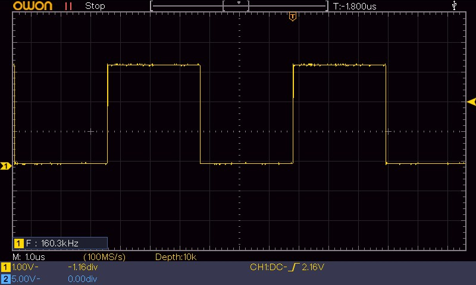
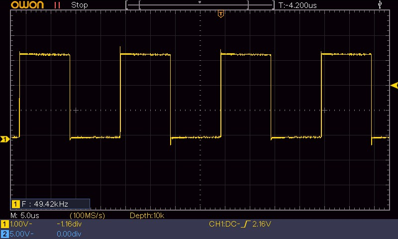
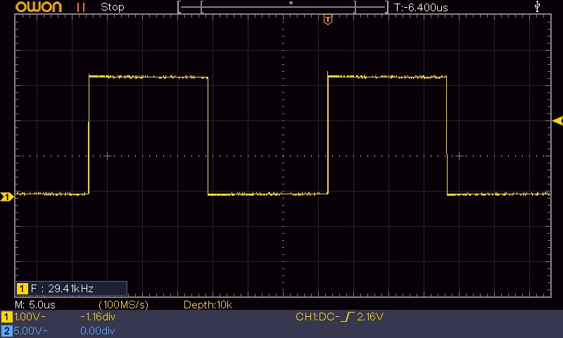
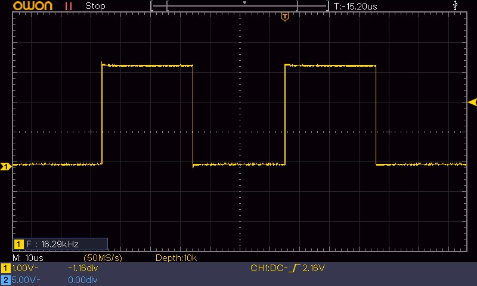
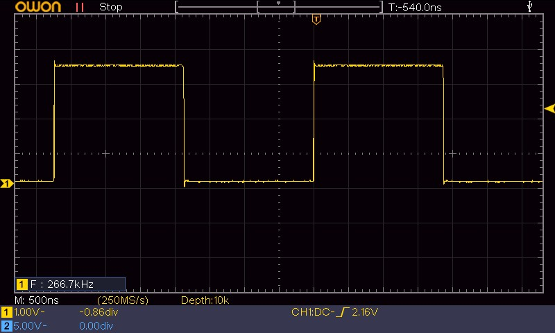
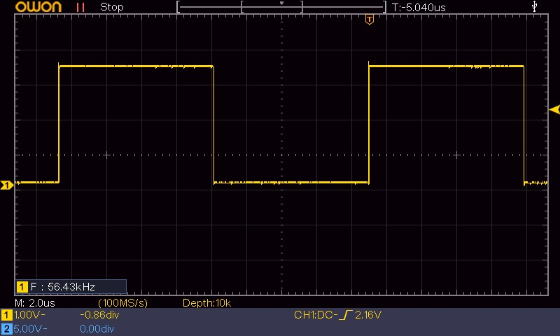
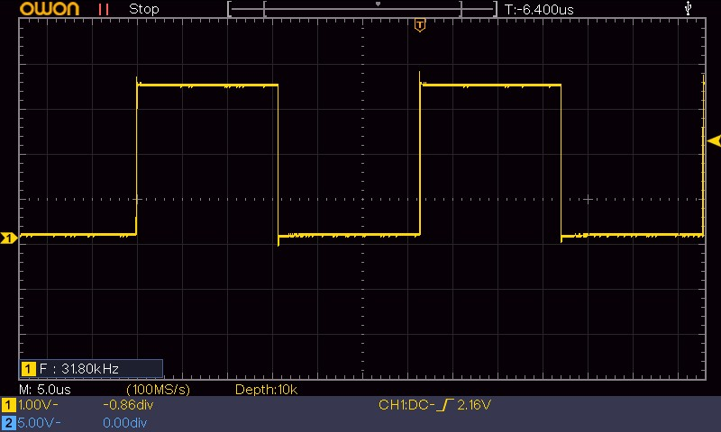
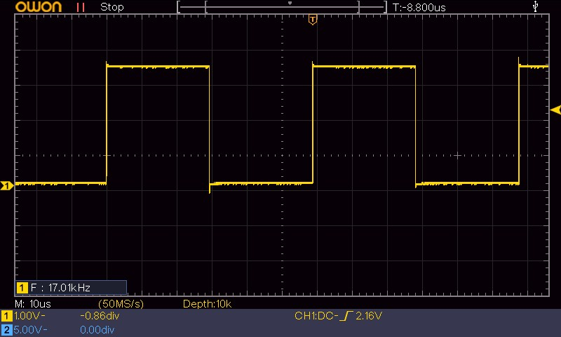

+++
title = 'STM32 GPIO unter der Lupe: Warum BSRR mehr CPU-Zeit für Ihre Anwendung bedeutet'
date = 2026-04-27T00:00:00+02:00
description = 'Der Performance-Vergleich zwischen HAL, CMSIS-ODR und BSRR geht über die reine Toggle-Frequenz hinaus: Im Fokus steht, wie viel Rechenzeit nach dem Pin-Toggle für echte Aufgaben übrig bleibt.'
tags = ['stm32', 'gpio', 'hal', 'cmsis', 'bsrr', 'performance', 'embedded', 'cpu-utilization']
+++

 (Hardware Abstraction Layer) und direkte Registerzugriffe über  sind die beiden dominanten Programmiermodelle für STM32-Mikrocontroller. Die Diskussion bleibt oft bei der Frage nach der maximalen Toggle-Frequenz stehen — so auch im [ersten Teil dieser Serie]().

<!--more-->

Doch in der Praxis stellt sich eine viel wichtigere Frage: **Wie viel CPU-Zeit bleibt mir nach dem Pin-Umschalten für meine eigentliche Anwendung?**

Dieser Beitrag quantifiziert diesen Freiraum anhand eines reproduzierbaren Beispiels — eines einfachen -Toggles auf dem STM32F103 bei 8 MHz -Takt. Die Oszilloskop-Messungen zeigen nicht nur die erreichbaren Frequenzen, sondern vor allem die minimalen CPU-Zyklen, die für einen einzigen Zustandswechsel investiert werden müssen. Daraus lässt sich ableiten, wie viele Zyklen bei einer vorgegebenen Signalfrequenz für Verarbeitungslogik übrig bleiben.

> ⚠️ **Hinweis:** Diese Betrachtung gilt für softwaregetriebenes GPIO-Toggling in einer `while(1)`-Schleife. Für präzise Signalerzeugung sind Timer,  oder  die bessere Lösung. Der Benchmark zeigt nicht, wie man ein perfektes 200-kHz-Signal erzeugt, sondern wie viel CPU-Budget unterschiedliche Implementierungen im reinen Toggle-Vorgang verbrauchen.

## Testaufbau

Die Messungen erfolgten auf zwei weit verbreiteten Boards, um die Unabhängigkeit von der Peripherie zu demonstrieren:

| Board | Mikrocontroller | Systemtakt |
|-------|----------------|-------------|
| Nucleo-F103RB | STM32F103RB | 8 MHz (HSI) |
| Bluepill | STM32F103C6T6 | 8 MHz (HSI) |

Beide Systeme laufen ausschließlich vom internen 8-MHz-RC-Oszillator (HSI), ohne PLL. Der gesamte Testcode besteht aus einer `while(1)`-Schleife, die den Pin PB8 umschaltet — ohne Interrupts, Timer oder andere Nebenläufigkeiten. Compiliert wurde mit GCC und der Optimierungsstufe `-O2`. Die genauen Messwerte der drei Implementierungen sind dem [ersten Beitrag]() zu entnehmen.

> **Hinweis:** Alle hier gezeigten Ergebnisse basieren auf denselben Messungen wie in Teil 1. Toggle-Frequenzen und CPU-Zyklen pro Toggle-Zyklus sind identisch. Dieser Beitrag interpretiert diese Zahlen neu im Hinblick auf CPU-Auslastung und freie Rechenkapazität.

### Toolchain & Versionen

| Komponente | Version |
|------------|---------|
| `arm-none-eabi-gcc` | 14.3.1 (GNU Tools for STM32 14.3.rel1.20251027) |
| `arm-none-eabi-size` | 2.44.0.20250616 (GNU Tools for STM32) |
| `arm-none-eabi-objdump` | 2.44.0.20250616 (GNU Tools for STM32) |
| CMake | 3.28.3 |
| CubeMX | 6.17.0 |
| CubeIDE | 2.1.0 |
| STM32CubeF1 HAL | Firmware Package V1.8.7 |

### Clock-Konfiguration (NucF1_00_GPIO_Toggle)

**Oszillatoren (HSI / HSE / PLL):**
- HSI: Aktiviert (Interner 8 MHz RC-Oszillator)
- HSE: Deaktiviert
- PLL: Aktiviert (Quelle: HSI_DIV2 → 4 MHz, Multiplikator: ×2 → 8 MHz)

**Taktraten:**
- SYSCLK: 8 MHz (Quelle: PLLCLK)
- AHB-Prescaler: /1 → HCLK = 8 MHz
- APB1-Prescaler: /1 → PCLK1 = 8 MHz
- APB2-Prescaler: /1 → PCLK2 = 8 MHz

**Flash-Einstellungen:**
- Flash-Latency (Waitstates): 0 Waitstates (`FLASH_LATENCY_0`, da Takt ≤ 24 MHz)
- Prefetch-Buffer: Standardmäßig von der HAL bei 8 MHz deaktiviert bzw. nicht zwingend benötigt
- ART Accelerator: Nicht relevant (STM32F1 besitzt keinen ART Accelerator)

**Registerauszug (aus `Core/Src/main.c`):**
```c
RCC_OscInitStruct.OscillatorType = RCC_OSCILLATORTYPE_HSI;
RCC_OscInitStruct.HSIState = RCC_HSI_ON;
RCC_OscInitStruct.PLL.PLLState = RCC_PLL_ON;
RCC_OscInitStruct.PLL.PLLSource = RCC_PLLSOURCE_HSI_DIV2;
RCC_OscInitStruct.PLL.PLLMUL = RCC_PLL_MUL2;

RCC_ClkInitStruct.SYSCLKSource = RCC_SYSCLKSOURCE_PLLCLK;
RCC_ClkInitStruct.AHBCLKDivider = RCC_SYSCLK_DIV1;
RCC_ClkInitStruct.APB1CLKDivider = RCC_HCLK_DIV2;
RCC_ClkInitStruct.APB2CLKDivider = RCC_HCLK_DIV1;

HAL_RCC_ClockConfig(&RCC_ClkInitStruct, FLASH_LATENCY_0);
```

### Messmethode

Das Rechtecksignal wird direkt am GPIO-Pin (PB8) gegen Masse mit einem passiven Tastkopf und kurzer Massefeder (Ground Spring) abgegriffen. Die Feder vermeidet die bei höheren Frequenzen störende Schleifeninduktivität einer 10 cm langen Masseleitung. Die Periodendauer des Signals liefert die gesuchte Toggle-Frequenz, aus der sich mit dem bekannten CPU-Takt von 8 MHz die benötigten Taktzyklen pro vollständigem Toggle-Zyklus (Low → High → Low) berechnen lassen:

$$ N_{\text{Zyklen}} = \frac{f_{\text{CPU}}}{f_{\text{Toggle}}} $$

Diese Zyklenzahl ist das zentrale Maß für den „CPU-Verbrauch" der jeweiligen Implementierung.

## Der Perspektivwechsel: Nicht die Spitze, sondern die Reserve zählt

Die maximalen Toggle-Frequenzen sind beeindruckend, aber für die Praxis relevanter ist die Frage: **Wie viel CPU-Zeit bleibt bei einer gegebenen Ausgangsfrequenz für andere Aufgaben?** Genau hier liegt der oft übersehene Vorteil von BSRR.

Nehmen wir eine typische Aufgabenstellung: Ein 200 kHz Rechtecksignal soll erzeugt werden. Mit der HAL-Funktion läuft der Mikrocontroller bereits an seiner Grenze — bei 200 kHz sind 100 % der Schleifenzeit mit dem Toggle-Vorgang belegt. Jeder zusätzliche Rechenbefehl würde die Frequenz sofort einbrechen lassen.

Mit ODR-XOR wird für den reinen Toggle nur ein Teil der Zyklen benötigt. Die restliche Zeit kann für Berechnungen genutzt werden. Und mit BSRR bleibt der Großteil der Zyklen frei.

Die folgende Tabelle quantifiziert diesen Effekt für eine Ziel-Frequenz von 200 kHz (Halbperiode = 2,5 µs = 20 CPU-Zyklen bei 8 MHz):

| Methode | Zyklen für Toggle<br>pro Halbperiode | Freie Zyklen<br>pro Halbperiode | CPU-Auslastung<br>durch Toggle |
|:--------|:--------:|:--------:|:--------:|
| **HAL**     | ≈20 (100 %) | 0     | 100 %  |
| **ODR-XOR** | ≈9          | 11    | 45 %   |
| **BSRR**    | ≈2,5        | 17,5  | 12,5 % |

Die Zahl der freien Zyklen ist der Spielraum, der für einfache Zustandslogik, Bitmanipulationen oder kleine zeitkritische Operationen zur Verfügung steht. BSRR vergrößert diesen Spielraum gegenüber HAL um fast das **Achtfache**.

### Herleitung

Die Prozentwerte in der Tabelle leiten sich aus den gemessenen Toggle-Frequenzen aus dem [ersten Beitrag]() ab.

**Grundlage:**
- Ziel-Frequenz: 200 kHz → Periodendauer $T = \frac{1}{200\;\text{kHz}} = 5\;\mu\text{s}$
- Halbperiode (Low oder High): $\frac{T}{2} = 2{,}5\;\mu\text{s}$
- CPU-Takt: 8 MHz → 1 Taktzyklus $= \frac{1}{8\;\text{MHz}} = 125\;\text{ns}$
- Verfügbare CPU-Zyklen pro Halbperiode: $\frac{2{,}5\;\mu\text{s}}{125\;\text{ns}} = \mathbf{20}$

**HAL:** Gemessene Toggle-Frequenz = 200 kHz → 40 Zyklen pro vollem High-Low-High-Zyklus → pro Halbperiode: $40 / 2 = 20$ Zyklen.
Auslastung: $\frac{20}{20} = 100\ \%$

**ODR-XOR:** Gemessene Toggle-Frequenz = 445 kHz → 18 Zyklen pro vollem Zyklus → pro Halbperiode: $18 / 2 = 9$ Zyklen.
Auslastung: $\frac{9}{20} = 45\ \%$

**BSRR:** Gemessene Toggle-Frequenz = 1,6 MHz → 5 Zyklen pro vollem Zyklus → pro Halbperiode: $5 / 2 = 2{,}5$ Zyklen.
Auslastung: $\frac{2{,}5}{20} = 12{,}5\ \%$

Der Toggle-Vorgang beansprucht bei BSRR also nur 12,5 % der verfügbaren CPU-Zeit — die restlichen 87,5 % stehen für die eigentliche Anwendung zur Verfügung.

> **Anmerkung zur Asymmetrie:** Die 2,5 Zyklen pro Halbperiode sind ein mathematischer Mittelwert über viele Perioden. Tatsächlich ist das Signal asymmetrisch: Die Set→Reset-Flanke ist sehr kurz (nur die beiden BSRR-Schreibzugriffe), während die Pause bis zum nächsten Set den Schleifenrücksprung (Branch) enthält. Für die CPU-Betrachtung ist der Mittelwert ausreichend; bei der Signalanalyse auf dem Oszilloskop zeigt sich jedoch eine leichte Unsymmetrie.

## Praktische Veranschaulichung: Variable Last zwischen den Flanken

Der Gewinn wird noch greifbarer, wenn wir zwischen den beiden BSRR-Zugriffen eine künstliche Arbeitslast einbauen:

```c
static inline void do_some_work(volatile uint32_t n) {
    for (volatile uint32_t i = 0; i < n; ++i) {
        __NOP();   // eine CPU-No-Operation
    }
}

while (1) {
    GPIOB->BSRR = GPIO_BSRR_BS8;   // Pin high
    do_some_work(N);                // variable Last
    GPIOB->BSRR = GPIO_BSRR_BR8;   // Pin low
    do_some_work(N);                // variable Last
}
```

Für `N = 0` erhalten wir die maximale Frequenz von 1,6 MHz. Mit steigendem `N` sinkt die Frequenz, aber selbst bei beachtlichen Werten bleibt eine hohe Ausgangsfrequenz erhalten.

Um die Verzögerung präzise kontrollieren zu können, sollte man die Last **ohne Schleifen-Overhead** aufbauen — z. B. durch direkt aufgerufene `__NOP()`-Instruktionen ( steht für No Operation — eine Instruktion, die einen Taktzyklus verbraucht, ohne einen Effekt zu haben):

```c
while (1) {
    GPIOB->BSRR = GPIO_BSRR_BS8;   // Pin high
    __NOP(); __NOP(); __NOP();     // exakt 3 Zyklen Verzögerung
    GPIOB->BSRR = GPIO_BSRR_BR8;   // Pin low
    __NOP(); __NOP(); __NOP();     // exakt 3 Zyklen Verzögerung
}
```

> **Hinweis zur `do_some_work`-Schleife:** Die `for(volatile uint32_t i = 0; i < n; ++i)`-Schleife erzeugt nicht nur `n` NOPs. Jeder Durchlauf bringt zusätzlichen Overhead mit sich: Laden und Speichern der Zählvariablen, Vergleich und bedingter Sprung. Der Parameter `n` ist daher kein direkter Zykluswert — die tatsächliche Verzögerung muss gemessen werden und hängt von der Compiler-Optimierung ab.

Das Experiment zeigt eindrucksvoll: **BSRR reduziert die Fixkosten des Pin-Umschaltens deutlich. Dadurch bleibt bei gleicher Ziel-Frequenz mehr CPU-Zeit für weitere Operationen.**

Die folgenden Oszilloskop-Aufnahmen zeigen, wie HAL und ODR-XOR mit steigender NOP-Last einbrechen:

**HAL — `do_some_work(N)`:**
| N | Frequenz |
|:--|:---------|
| 0 | 160,0 kHz |
| 5 |  49,5 kHz |
| 10|  29,4 kHz |
| 20|  16,3 kHz |



*N=0: Bereits der leere Funktionsaufruf kostet Zyklen. Die Frequenz liegt bei 160 kHz — deutlich unter den theoretisch möglichen 200 kHz.*



*N=5: Sobald die Schleife fünf Durchläufe absolviert, bricht die Frequenz auf unter 50 kHz ein. Die Toggle-Zeit ist nun massiv von der Arbeitslast bestimmt.*



*N=10: Die Periodendauer wächst weiter. Der HAL-Overhead macht nur noch einen kleinen Teil der Gesamtzeit aus.*



*N=20: Die CPU ist fast ausschließlich mit der `do_some_work`-Schleife beschäftigt. Die Toggle-Frequenz spiegelt die reine Rechenleistung wider.*

**ODR-XOR — `do_some_work(N)`:**
| N | Frequenz |
|:--|:---------|
| 0 | 266,7 kHz |
| 5 |  56,4 kHz |
| 10|  31,9 kHz |
| 20|  17,0 kHz |



*N=0: Der direkte Registerzugriff zahlt sich aus — 267 kHz ohne Last, fast das Doppelte von HAL.*



*N=5: Auch ODR verliert dramatisch an Frequenz, sobald die Schleife Arbeit verrichtet. Der Vorsprung gegenüber HAL ist aber noch deutlich sichtbar.*



*N=10: Die Kurven von HAL und ODR nähern sich an. Der Arbeitsanteil dominiert zunehmend.*



*N=20: Bei maximaler Last sind HAL und ODR nahezu gleich schnell — der Engpass ist die CPU, nicht die Toggle-Methode.*

Bereits bei N=0 (reiner Funktionsaufruf ohne innere NOPs) fällt HAL von 200 kHz auf 160 kHz — der Aufruf-Overhead der `do_some_work`-Schleife kostet Zyklen. Bei N=5 liegt HAL unter 50 kHz. Zum Vergleich: BSRR erreicht ohne Last 1,6 MHz — wie viel bei N=5 übrig bleibt, wird in einer ergänzenden Messung gezeigt.

## Atomizität: Der stille Vorteil

Neben der reinen Geschwindigkeit bringt der BSRR-Zugriff einen entscheidenden Sicherheitsgewinn: Das Setzen und Rücksetzen erfolgt über unabhängige Speicherzugriffe. Es gibt keine -Phase, die von Interrupts unterbrochen werden könnte.

In Systemen, in denen mehrere Codepfade denselben GPIO-Port manipulieren (z. B. eine ISR und der Hauptcode), vermeidet BSRR subtile s ohne den Zusatzaufwand von s.

Der ODR-XOR-Zugriff aus Teil 1 ist dagegen nicht atomar:

```c
// Nicht atomar: Lesen, XOR, Schreiben
GPIOB->ODR ^= GPIO_ODR_ODR8;
```

Unterbricht ein Interrupt zwischen dem Lesen (`LDR`) und dem Schreiben (`STR`), und modifiziert ebenfalls das ODR-Register, so geht die Änderung des unterbrochenen Codes durch den späteren Schreibbefehl verloren.

## Fazit

Die Leistungsfähigkeit eines Mikrocontrollers bemisst sich nicht allein daran, wie schnell er einen Pin umschalten kann, sondern wie viel Rechenleistung nach der Toggle-Operation noch für die eigentliche Aufgabe übrig bleibt.

Der vorliegende Vergleich zeigt, dass **BSRR den CPU-Anteil für die reine GPIO-Umschaltung bei einer 200-kHz-Zielfrequenz gegenüber HAL um etwa Faktor 8 reduziert**. Die gewonnene Zyklenzahl kann den Unterschied ausmachen zwischen „das System ist ausgelastet" und „es gibt noch reichlich Reserven für komplexe Algorithmen".

Die Beschäftigung mit den unterschiedlichen Abstraktionsebenen ist kein Selbstzweck — sie ermöglicht es, die Ressourcen eines STM32 optimal zu nutzen. Die Entscheidung für oder gegen eine Methode sollte stets auf Basis der konkreten Timing-Anforderungen und des benötigten CPU-Budgets getroffen werden.

## Ausblick

Im [folgenden Beitrag]() untersuchen wir den Einfluss der GPIO-Output-Speed-Konfiguration (MODE-Bits in den CRL/CRH-Registern) auf die Signalqualität — Flankensteilheit, Überschwingen und EMV-Verhalten. Dieser Parameter wird oft mit der Toggle-Frequenz verwechselt, hat aber unmittelbare Auswirkungen auf die Signalintegrität.

## Video & Quellen

*TBD — Video und Quellcode folgen sobald verfügbar.*
