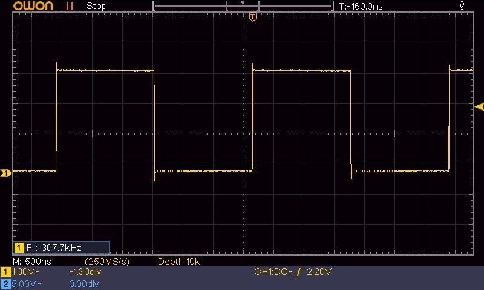

+++
title = 'STM32 GPIO unter der Lupe: LTO — wenn der Linker optimiert'
date = 2026-05-09T00:00:00+02:00
description = 'LTO (Link-Time Optimization) auf dem STM32F103: Was bringt -flto beim GPIO-Toggle? Die Messung zeigt: HAL profitiert massiv (+54 %), ODR und BSRR bleiben unverändert. Die Disassembly-Analyse erklärt, warum.'
tags = ['stm32', 'gpio', 'compiler', 'lto', 'optimization', 'performance', 'embedded', 'c']
draft = false
+++

Der [vorherige Beitrag dieser Serie]() hat gezeigt, wie stark die Wahl der GCC-Optimierungsstufe die Toggle-Frequenz beeinflusst — von 80 kHz (HAL `-O0`) bis 2,0 MHz (BSRR `-Os`). Eine entscheidende Einschränkung blieb dabei bestehen: `HAL_GPIO_TogglePin()` liegt in einer separaten Übersetzungseinheit (`stm32f1xx_hal_gpio.c`), und ohne  kann der Compiler nicht über Dateigrenzen hinweg optimieren. Der `bl`-Aufruf bleibt in jedem Fall erhalten — selbst bei `-O2`.

Dieser Beitrag schließt diese Lücke. Derselbe Testcode, dieselbe Hardware, aber diesmal mit **Link-Time Optimization** (`-flto`) kompiliert. Was passiert, wenn der Linker die gesamte Codebasis auf einmal sieht?

<!--more-->

## Testaufbau

Der Aufbau ist identisch zu allen vorherigen Beiträgen dieser Serie:

| Board         | Mikrocontroller | Takt                        |
| ------------- | --------------- | --------------------------- |
| Nucleo-F103RB | STM32F103RB     | 8 MHz () |
| Bluepill      | STM32F103C6T    | 8 MHz (HSI)                 |

Getestet werden alle drei Toggle-Methoden (HAL, -XOR, ) bei `-O2` — jeweils ohne und mit `-flto`. Die Messung erfolgt mit einem Logic Analyzer direkt am Pin PB8.

### Toolchain & Versionen

| Komponente | Version |
|------------|---------|
| `arm-none-eabi-gcc` | 14.3.1 (GNU Tools for STM32 14.3.rel1.20251027) |
| `arm-none-eabi-size` | 2.44.0.20250616 (GNU Tools for STM32) |
| `arm-none-eabi-objdump` | 2.44.0.20250616 (GNU Tools for STM32) |
| CMake | 3.28.3 |
| CubeMX | 6.17.0 |
| CubeIDE | 2.1.0 |
| STM32CubeF1 HAL | Firmware Package V1.8.7 |

### Clock-Konfiguration (NucF1_00_GPIO_Toggle)

Die vollständige Clock-Konfiguration (HSI, PLL, Taktraten, Flash-Latency) ist im [ersten Beitrag dieser Serie]() dokumentiert. Kurzfassung: SYSCLK = 8 MHz via PLL (HSI_DIV2 × 2), Flash-Latency 0 Waitstates.

### Build-Konfiguration

| Flag | Ohne LTO | Mit LTO |
|------|----------|---------|
| `-O2` | ✓ | ✓ |
| `-flto` | — | ✓ |
| `-ffunction-sections` | ✓ | ✓ |
| `-fdata-sections` | ✓ | ✓ |
| `--gc-sections` (Linker) | ✓ | ✓ |

## Messergebnisse: LTO vs kein LTO

| Methode | `-O2` ohne LTO | `-O2` mit LTO | Änderung |
| :------ | :------------: | :-----------: | :------: |
| **HAL** | 200,0 kHz | **307,7 kHz** | **+54 %** |
| **ODR-XOR** | 444,4 kHz | 444,4 kHz | ≈ 0 % |
| **BSRR** | 1,6 MHz | 1,6 MHz | ≈ 0 % |

Auf den ersten Blick ein klares Bild: LTO bringt nur bei HAL etwas. Bei ODR und BSRR ändert sich nichts — die Toggle-Frequenz bleibt identisch. Die `objdump`-Analyse zeigt, warum.

<figure style="text-align: center">
  
  <figcaption>HAL_GPIO_TogglePin() bei <code>-O2</code> mit LTO: 307,7 kHz — statt 200 kHz ohne LTO</figcaption>
</figure>

## Disassembly-Analyse: Was LTO mit dem Code macht

### HAL — der einzige Profiteur

**Ohne LTO** besteht die `while(1)`-Schleife aus vier Instruktionen: Parameter laden, GPIOB-Adresse laden, Funktionsaufruf per `bl` und Rücksprung:

```text
  mov.w   r1, #256          @ GPIO_PIN_8
  ldr     r0, [pc, #8]      @ GPIOB = 0x40010C00
  bl      HAL_GPIO_TogglePin
  b.n     loop               @ Rücksprung
```

Der `bl`-Aufruf kostet Zyklen: Prologue, Epilogue, Sprungziel-Auflösung. Vor allem aber kann GCC den Funktionskörper nicht in die Optimierung einbeziehen — er liegt in einer anderen `.c`-Datei und ist zum Compile-Zeitpunkt unsichtbar.

**Mit LTO** bekommt der Linker Zugriff auf den gesamten Funktionskörper von `HAL_GPIO_TogglePin()`. GCC kann die Funktion jetzt in `main()` inlinen und die entstehende Codesequenz weiter optimieren. Der `bl`-Aufruf entfällt, und der Compiler kann die Toggle-Logik direkt in die Schleife integrieren.

> 💡 **Erkenntnis:** LTO ist kein pauschaler Beschleuniger — es hilft nur dort, wo Code aus verschiedenen Übersetzungseinheiten zusammengeführt wird. Die 54 % Toggle-Gewinn bei HAL entstehen allein dadurch, dass der Linker den Funktionskörper von `HAL_GPIO_TogglePin()` endlich „sehen" und inlinen kann.

### ODR-XOR — kein Funktionsaufruf, kein Gewinn

Die ODR-Schleife enthält von vornherein keinen Funktionsaufruf — nur direkte Registerzugriffe. LTO findet hier nichts zu inlinen:

```text
  ldr     r2, [pc, #12]     @ r2 = &GPIOB
  ldr     r3, [r2, #12]     @ r3 = GPIOB->ODR
  eor.w   r3, r3, #256      @ r3 ^= 0x100 (toggle)
  str     r3, [r2, #12]     @ GPIOB->ODR = r3
  b.n     loop
```

Die fünf Instruktionen sind mit und ohne LTO identisch. Die Frequenz bleibt bei 444,4 kHz — der Compiler hatte bereits bei `-O1` das Optimum für diese Codesequenz gefunden.

### BSRR — das Optimum war schon erreicht

Auch BSRR profitiert nicht von LTO. Die Drei-Instruktionen-Schleife ist bereits die kürzestmögliche Form des GPIO-Toggles:

```text
  str     r1, [r3, #16]     @ BSRR = 0x100 → PIN HIGH
  str     r2, [r3, #16]     @ BSRR = 0x1000000 → PIN LOW
  b.n     loop
```

Kein Funktionsaufruf, keine Parameterübergabe, keine XOR-Operation — nur zwei Store-Instruktionen und ein Branch. LTO kann hier nichts optimieren, weil nichts zu optimieren ist. Die Frequenz bleibt bei 1,6 MHz.

## Flash-Verbrauch: LTO im Größenvergleich

Neben der Laufzeit wurde auch der Flash-Verbrauch mit `arm-none-eabi-size` erfasst:

| Methode | `-O2` ohne LTO | `-O2` mit LTO | Änderung |
| :------ | :------------: | :-----------: | :------: |
| **HAL** | 3172 B | **3468 B** | **+9,3 %** |
| **ODR-XOR** | 3152 B | 3420 B | +8,5 % |
| **BSRR** | 3156 B | 3424 B | +8,5 % |

Interessant: Der Flash-Verbrauch steigt mit LTO bei allen drei Methoden leicht an — um etwa 270 Byte. Das ist der Preis für die zusätzlichen Metadaten, die LTO für die linkzeitige Optimierung benötigt (GIMPLE-Bytecode in den `.o`-Dateien). Bei HAL steigt der Flash-Verbrauch mit +296 B etwas stärker als bei ODR (+268 B) und BSRR (+268 B) — ein Teil des Mehraufwands entfällt auf den jetzt geinlinten und optimierten HAL-Code.

> ⚠️ **Kosten-Nutzen:** LTO kostet hier ~270 Byte Flash zusätzlich. Der Toggle-Gewinn von +54 % betrifft nur HAL — bei ODR und BSRR gibt es keinen Laufzeitvorteil. Ob sich LTO lohnt, hängt vom Projekt ab: Bei HAL-dominiertem Code mit vielen cross-TU-Funktionsaufrufen ist LTO ein klarer Gewinn. Bei registernahem CMSIS-Code ohne Funktionsaufrufe über Dateigrenzen hinweg bringt LTO keinen Laufzeitvorteil und kostet nur Flash.

## Was LTO wirklich macht — und was nicht

Die Ergebnisse dieser Messung räumen mit zwei häufigen Missverständnissen auf:

**1. „LTO macht alles schneller."** — Falsch. LTO beschleunigt nur Code, der über Übersetzungseinheiten hinweg optimiert werden kann. Reine Registerzugriffe wie ODR und BSRR sehen keinen Unterschied. LTO ist kein zweiter `-O2`-Boost, sondern eine Ergänzung, die dort wirkt, wo die normale Optimierung an Dateigrenzen scheitert.

**2. „Mit LTO wird HAL genauso schnell wie CMSIS."** — Falsch. Selbst mit LTO erreicht HAL 307,7 kHz — weniger als ODR (444 kHz) und weit weniger als BSRR (1,6 MHz). Der `bl`-Overhead ist nur ein Teil des HAL-Overheads. Auch nach dem Inlining bleiben die Toggle-Logik (ODR Lesen → BSRR-Maske berechnen → BSRR schreiben) und die GPIO-Strukturzugriffe erhalten. LTO verkleinert den Abstand, schließt ihn aber nicht.

## Fazit

LTO auf dem STM32F103 ist ein gezieltes Werkzeug — kein Allheilmittel:

- **HAL profitiert deutlich (+54 %)** von LTO, weil `HAL_GPIO_TogglePin()` aus einer anderen `.c`-Datei endlich geinlined werden kann.
- **ODR und BSRR profitieren nicht**, weil sie keinen cross-TU-Funktionsaufruf enthalten. Die erzeugte Codesequenz ist mit und ohne LTO identisch.
- **Der Flash-Verbrauch steigt moderat** (~270 Byte), unabhängig von der Toggle-Methode.

Die Praxisempfehlung: LTO (`-flto`) ist eine sinnvolle Ergänzung zu `-O2`, wenn das Projekt viele Funktionsaufrufe über Übersetzungseinheiten hinweg enthält — typischerweise bei HAL-basiertem Code. Für reinen CMSIS-Code mit direkten Registerzugriffen bringt LTO keinen Laufzeitvorteil, kostet aber Flash. Die Entscheidung sollte auf Basis der eigenen Codebasis und des Flash-Budgets getroffen werden.

## Ausblick

In den nächsten Beiträgen dieser Serie könnten folgende Themen behandelt werden:

- **Interrupt-Latenz beim GPIO-Toggle**: Was passiert, wenn ein Interrupt die Toggle-Schleife unterbricht?
- **GPIO-Lesegeschwindigkeit**: Wie schnell kann der STM32F103 einen Pin einlesen (IDR)?
- **Zusammenfassung und Leitfaden**: Welche Methode für welchen Anwendungsfall?

## Video & Quellen

*TBD — Video und Quellcode folgen, sobald verfügbar.*

### Referenzierte Dokumente

- **GCC Optimize Options** — GCC-Dokumentation zu `-O0`, `-O1`, `-O2`, `-O3`, `-Os`, `-flto` und weiteren Optimierungen. [Online](https://gcc.gnu.org/onlinedocs/gcc/Optimize-Options.html)
- **GCC Link Time Optimization (LTO)** — GCC-Dokumentation zur Link-Time Optimization und Optimierung über Übersetzungseinheiten hinweg. [Online](https://gcc.gnu.org/onlinedocs/gccint/LTO.html)
- **GNU Binutils / objdump** — Dokumentation zu den GNU Binary Utilities, darunter `objdump`, `objcopy` und `size`. [Online](https://sourceware.org/binutils/docs/binutils/)
- **STM32CubeF1** — Offizielles STM32Cube-Paket für die STM32F1-Serie mit HAL/LL-Treibern, CMSIS und Beispielprojekten. [GitHub](https://github.com/STMicroelectronics/STM32CubeF1)
- **RM0008 Rev 21** — STM32F101xx, STM32F102xx, STM32F103xx, STM32F105xx, STM32F107xx Referenzhandbuch. [PDF](https://www.st.com/resource/en/reference_manual/rm0008-stm32f101xx-stm32f102xx-stm32f103xx-stm32f105xx-and-stm32f107xx-advanced-arm-based-32-bit-mcus-stmicroelectronics.pdf)
