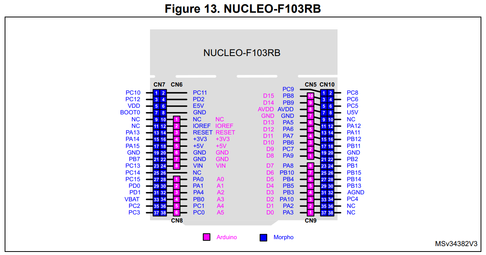
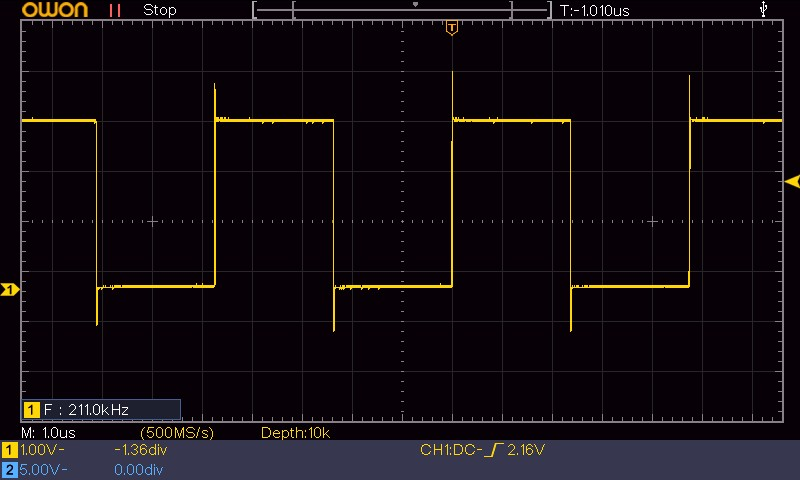
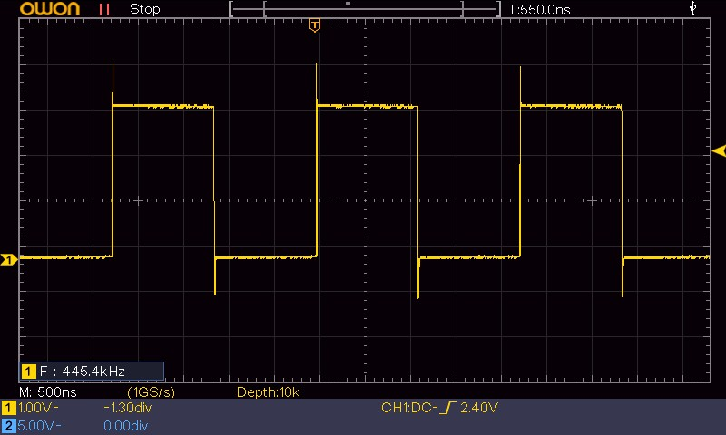
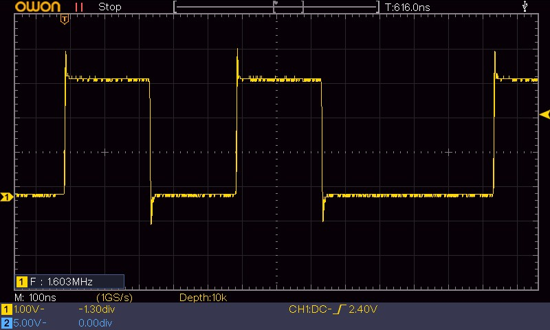
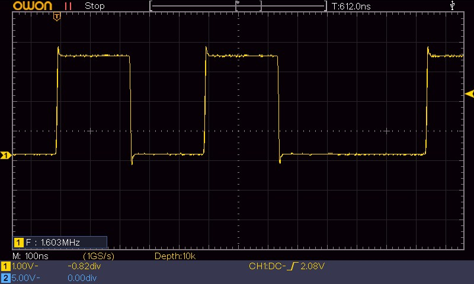
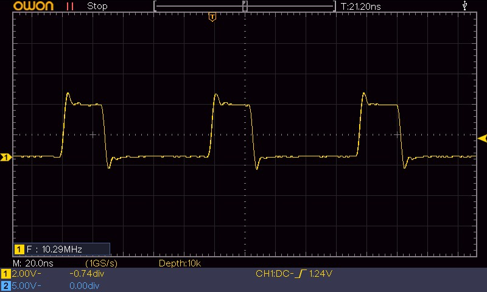

+++
title = 'STM32 GPIO Output Speed: Was die MODE-Bits wirklich bewirken'
date = 2026-04-29T00:00:00+02:00
description = 'Die GPIO-Output-Speed-Einstellung (MODE-Bits in den CRL/CRH-Registern) wird oft mit der Software-Toggle-Frequenz verwechselt. Dieser Beitrag zeigt: Die MODE-Bits beeinflussen vor allem Flankenform, Signalqualität und EMV-Verhalten — und warum zu schnell eingestellt mehr schaden als nützen kann.'
tags = ['stm32', 'gpio', 'output-speed', 'signal-integrity', 'emc', 'embedded', 'performance']
+++

Die ersten beiden Teile dieser Serie haben gezeigt, wie viel CPU-Zeit verschiedene Toggle-Methoden verbrauchen ([ vs CMSIS]()) und warum  mehr Reserve für die Anwendung lässt ([CPU-Headroom]()).

Dabei ging es immer um die **Software-Seite**: Welche Instruktionen erzeugt der Compiler? Wie viele Zyklen kostet ein Funktionsaufruf?

Jetzt richten wir den Blick auf die **Hardware-Seite**: Die  in den /-Registern legen fest, mit welcher Flankensteilheit der -Pin seinen Zustand ändert. Eine Einstellung, die oft mit der maximalen Toggle-Frequenz verwechselt wird — zu Unrecht, wie die Messung zeigt.

<!--more-->

## Testaufbau

Der Aufbau ist identisch zu den vorherigen Beiträgen:

| Board | Mikrocontroller | Takt |
|-------|----------------|------|
| Nucleo-F103RB | STM32F103RB | 8 MHz () |
| Bluepill | STM32F103C6T | 8 MHz (HSI) |

Die Pinbelegung des Nucleo-F103RB ist im [UM1724](https://www.st.com/resource/en/user_manual/um1724-stm32-nucleo64-boards-mb1136-stmicroelectronics.pdf) dokumentiert. Die Morpho-Header CN5, CN6, CN8 und CN9 führen alle MCU-Pins nach außen. Gemessen wird an **Pin PB8**, der auf CN5 Pin 6 (Morpho, links) liegt und über den Morpho-Header direkt zugänglich ist — kein Arduino-Header, kein Lötpad.

Getestet werden alle drei Toggle-Methoden (HAL, -XOR, BSRR) jeweils mit den drei Output-Speed-Einstellungen, die der STM32F103 über die MODE-Bits in den CRL/CRH-Registern bietet:

| Bezeichnung | MODE-Bits | Datenblatt-Angabe | Typische Wirkung |
|-------------|-----------|-------------------|------------------|
| Low Speed   | `10`      | max. output speed 2 MHz | langsamere Flanken |
| Medium Speed| `01`      | max. output speed 10 MHz | mittlere Flanken |
| High Speed  | `11`      | max. output speed bis 50 MHz* | schnellere Flanken |

*Abhängig von Lastkapazität und Versorgungsspannung. Siehe STM32F103x8/xB Datenblatt, I/O AC Characteristics ([PDF](https://www.st.com/resource/en/datasheet/stm32f103c8.pdf)).

> **Anmerkung zur Nomenklatur:** Auf dem STM32F103 heißen die MODE-Bits offiziell "Output mode, max speed X MHz". Die Werte beschreiben die **spezifizierte AC-Fähigkeit des Ausgangspads unter definierten Last- und Versorgungsbedingungen** — sie geben nicht vor, wie schnell eine Software-Schleife den Pin toggeln kann. Das Datenblatt (STM32F103x8/xB, I/O AC Characteristics) bezeichnet diese Größe als `fmax(IO)out` und verknüpft sie mit Lastkapazität `CL`, Versorgungsspannung `VDD` sowie Rise/Fall-Time. Die Beschreibung der CRL/CRH-Register und der MODE-Bits findet sich im Referenzhandbuch [RM0008 Rev 21, Kapitel 9.2](https://www.st.com/resource/en/reference_manual/rm0008-stm32f101xx-stm32f102xx-stm32f103xx-stm32f105xx-and-stm32f107xx-advanced-arm-based-32-bit-mcus-stmicroelectronics.pdf).

## Die Überraschung: Output Speed ändert die Frequenz nicht

Das zentrale Ergebnis in diesem Messaufbau: **Die Toggle-Frequenz bleibt über alle Speed-Einstellungen hinweg praktisch unverändert.**

| Methode | Low Speed | Medium Speed | High Speed |
|---------|-----------|-------------|------------|
| HAL (-O2) | ~200 kHz | ~200 kHz | ~200 kHz |
| ODR-XOR (-O2) | ~445 kHz | ~445 kHz | ~445 kHz |
| BSRR (-O2) | ~1,6 MHz | ~1,6 MHz | ~1,6 MHz |

Der Grund ist einfach: Die Software ist der Engpass. Die `while(1)`-Schleife bestimmt, wie schnell der Pin umgeschaltet wird — nicht der Ausgangstreiber, solange dieser innerhalb seiner spezifizierten AC-Grenzen betrieben wird. Die gemessene BSRR-Frequenz (~1,6 MHz) liegt in der Größenordnung der Low-Speed-Datenblattangabe (max. 2 MHz). Da das softwareerzeugte Signal jedoch kein ideales 50/50-Rechteck ist und die reale Lastkapazität vom Messaufbau abhängt, ist dieser Vergleich als **Plausibilitätscheck** zu verstehen — nicht als formale Grenzwertprüfung.

Das Gleiche gilt in diesem Messaufbau für den Vergleich der Optimierungsstufen:

| Optimierung | HAL (High Speed) | HAL (Low Speed) |
|-------------|-----------------|-----------------|
| `-O0` | ~80 kHz | ~80 kHz |
| `-O2` | ~200 kHz | ~200 kHz |

Auch hier: Die Compiler-Optimierung bestimmt die Frequenz, nicht die Output-Speed-Einstellung — vorausgesetzt, der Ausgangstreiber wird innerhalb seiner spezifizierten AC-Grenzen betrieben. Wer auf die Schnellsidee kommt, "ich stell mal alle Pins auf High Speed, dann läuft's schneller" — der wird enttäuscht. Die MODE-Bits sind kein Turbo-Schalter für die Software.

## Was Output Speed stattdessen bewirkt: Die Flanke

Wenn die Frequenz gleich bleibt — was ändert sich dann? Die **Flankenform**.

Die MODE-Bits steuern, wie schnell der Ausgangstreiber zwischen High- und Low-Pegel wechselt. Eine höhere Einstellung bedeutet:

* **Steilere Anstiegs- und Abfallzeiten** ()
* **Höherer transienter Strom** beim Schalten
* **Stärkere Überschwinger** () an den Flanken
* **Mehr hochfrequente Anteile im Spektrum** → höhere -Abstrahlung

Das ist auf dem Oszilloskop deutlich sichtbar:

**Low Speed:** Sanftere, abgerundete Flanken. In diesem Messaufbau sind keine relevanten Überschwinger sichtbar. Das Signal erreicht den High-Pegel sauber, ohne zu überschwingen oder nachzuklingen.

**Medium Speed:** Steilere Flanken. Kleine Überschwinger werden sichtbar — der Pin erreicht kurz einen höheren Spannungspegel als die Versorgungsspannung, bevor er sich stabilisiert.

**High Speed:** Sehr steile Flanken mit deutlichen Überschwingern. Je nach Leitungslänge und Abschluss können die Überschwinger mehrere hundert Millivolt betragen und sogar zu  (Einschwingen) führen.

> **Wichtig:** Bei gleicher Output-Speed-Einstellung nutzt jede Methode denselben Ausgangstreiber. Einzelne Flanken haben daher grundsätzlich denselben Treibercharakter. Unterschiede im Oszilloskopbild können dennoch entstehen, weil HAL (~200 kHz), ODR-XOR (~445 kHz) und BSRR (~1,6 MHz) unterschiedliche Wiederholfrequenzen erzeugen und das Signal dadurch unterschiedlich viel Zeit zum Einschwingen hat.

## Bilder der Messreihe

Die folgenden Oszilloskop-Aufnahmen zeigen den Effekt der Output-Speed-Einstellung bei 8 MHz Systemtakt:

**High Speed — Vergleich der drei Methoden:**

*HAL bei High Speed: In diesem Messaufbau sind Überschwinger an den Flanken sichtbar.*

*ODR-XOR bei High Speed: Der einzelne Flankencharakter ist vergleichbar, da derselbe Ausgangstreiber verwendet wird.*

*BSRR bei High Speed: Durch die höhere Wiederholfrequenz bleibt weniger Zeit zum Einschwingen zwischen zwei Flanken.*

**Medium Speed:**

*BSRR bei Medium Speed: In diesem Messaufbau sind die Überschwinger geringer, die Flanke ist sanfter.*

**BSRR bei 72 MHz (Systemtakt) — High Speed:**

*Erhöht man den Systemtakt auf 72 MHz (), folgen die Flanken schneller aufeinander. Dadurch bleibt weniger Zeit, bis das Signal nach Überschwingen und Ringing wieder vollständig eingeschwungen ist. Im Oszilloskopbild wirken Überschwinger und Nachschwingen deshalb deutlich dominanter.*

## Wann welche Einstellung sinnvoll ist

Die Wahl der Output Speed ist ein Optimierungsproblem zwischen Signalqualität und EMV.

> **Wichtig für den STM32F103:** Die MODE-Bits in den CRL/CRH-Registern gelten sowohl für **GPIO-Ausgänge** (softwaregetoggelt) als auch für **-Ausgänge** (peripheriegetrieben wie SPI-SCK, UART-TX, Timer-). In beiden Fällen steuern dieselben Bits die Flankensteilheit. Die folgende Tabelle bezieht sich auf **reine GPIO-Ausgänge**, wie sie in dieser Serie softwaregetoggelt werden. Für Alternate Functions gelten andere Kriterien, die hier nicht Gegenstand sind.

| Anwendung | Empfohlene Speed | Begründung |
|-----------|-----------------|------------|
| LED-Ansteuerung, Statusanzeigen | **Low** | Flanke irrelevant, minimale EMV |
| Langsame Logiksignale (Relais, Optokoppler) | **Low** | Keine hohen Anforderungen |
| Bitbanging (< 100 kHz) | **Low–Medium** | Ausreichend, solange die Flanke im Toleranzfenster liegt |
| Software- (> 1 kHz) | **Medium** | Saubere Flanken ohne übermäßige EMV |
| Timer-basierte Signale (HF) | **Medium–High** | Je nach gewünschter Flankensteilheit |

### Praxistipp: Gezielt konfigurieren, nicht global

Ein häufiger Fehler in CubeMX-Projekten: Alle GPIO-Pins werden auf High Speed gestellt, "weil es ja nicht schaden kann". Das tut es doch:

* Jeder Pin mit High Speed wird zu einer potenziellen Störquelle
* Die Überschwinger können benachbarte Pins kapazitiv beeinflussen ()
* In EMV-geprüften Produkten können zu steile Flanken den Grenzwert überschreiten

**Faustregel:** Nur die Pins auf High Speed stellen, die es wirklich brauchen — in der Regel sind das Alternate-Function-Schnittstellen mit hohen Taktraten (SPI-SCK > 1 MHz, Timer-PWM) oder Pins, an denen eine besonders steile Flanke gefordert ist. Alle anderen Pins auf Medium oder Low belassen.

## EMV-Auswirkungen

Die Flankensteilheit ist einer der wichtigsten Stellhebel für das EMV-Verhalten eines Mikrocontrollers:

* Eine steile Flanke enthält **hohe Frequenzanteile** — je steiler, desto weiter reicht das Störspektrum
* Diese Anteile koppeln über **Leiterbahnen, Kabel und Gehäuse** ab
* Besonders kritisch sind **längere Leitungen, Kabel und große Stromschleifen**, weil sie hochfrequente Anteile besser abstrahlen können

Konkret: Ein Pin in der 50-MHz-Output-Speed-Konfiguration (High) erzeugt steilere Flanken und damit mehr hochfrequente Signalanteile als derselbe Pin in der 2-MHz-Konfiguration (Low).

**EMV-Tipp:** Wer ein Produkt durch die EMV-Prüfung bringen muss, beginnt mit Low Speed für alle Pins und erhöht nur dort, wo die Anwendung es erzwingt. ST empfiehlt in [AN4899](https://www.st.com/resource/en/application_note/an4899-stm32-microcontroller-gpio-hardware-settings-and-lowpower-consumption-stmicroelectronics.pdf) im Auswahlfluss für digitale Push-Pull-Ausgänge mit externer digitaler Last unter anderem die Low-Speed-Einstellung. Jeder Pin, der auf High Speed gestellt wird, sollte dokumentiert und begründet sein.

## Fazit

Die GPIO-Output-Speed-Einstellung ist kein "Turbo-Modus" für die Toggle-Frequenz. Die MODE-Bits in den CRL/CRH-Registern bestimmen die **Flankensteilheit**, nicht die maximale Software-Toggle-Rate.

* **Die Frequenz bleibt gleich** — die Software ist der Engpass, nicht der Ausgangstreiber
* **Die Flankenform ändert sich** — höhere Speed = steilere Flanken + Überschwinger
* **Die EMV leidet** — steile Flanken erzeugen ein breites Störspektrum

Die Messung widerlegt die intuitive Annahme "höhere Speed = schnellere Frequenz". Richtig eingesetzt ist die Output-Speed-Konfiguration ein Werkzeug, um Signalqualität und EMV gezielt zu optimieren — nicht, um die Performance zu steigern.

## Ausblick

Im nächsten Beitrag werfen wir einen Blick auf Compiler-Optimierungen — wie stark verändern `-O0`, `-O1`, `-O2` und `-Os` den erzeugten Maschinencode, und was bedeutet das für die Laufzeit?

## Video & Quellen

*TBD — Video und Quellcode folgen, sobald verfügbar.*

### Referenzierte Dokumente

* **UM1724** — STM32 Nucleo-64 Boards User Manual (MB1136): Pinbelegung, Morpho-Header, Schaltplan. [PDF](https://www.st.com/resource/en/user_manual/um1724-stm32-nucleo64-boards-mb1136-stmicroelectronics.pdf)
* **RM0008 Rev 21** — STM32F101xx, STM32F102xx, STM32F103xx, STM32F105xx, STM32F107xx Referenzhandbuch, Kapitel 9.2 (GPIOx_CRL/CRH Register). [PDF](https://www.st.com/resource/en/reference_manual/rm0008-stm32f101xx-stm32f102xx-stm32f103xx-stm32f105xx-and-stm32f107xx-advanced-arm-based-32-bit-mcus-stmicroelectronics.pdf)
* **STM32F103x8/xB Datenblatt** — I/O AC Characteristics, `fmax(IO)out`, Rise/Fall-Time. [PDF](https://www.st.com/resource/en/datasheet/stm32f103c8.pdf)
* **AN4899** — STM32 Microcontroller GPIO Hardware Settings and Low-Power Consumption. [PDF](https://www.st.com/resource/en/application_note/an4899-stm32-microcontroller-gpio-hardware-settings-and-lowpower-consumption-stmicroelectronics.pdf)
