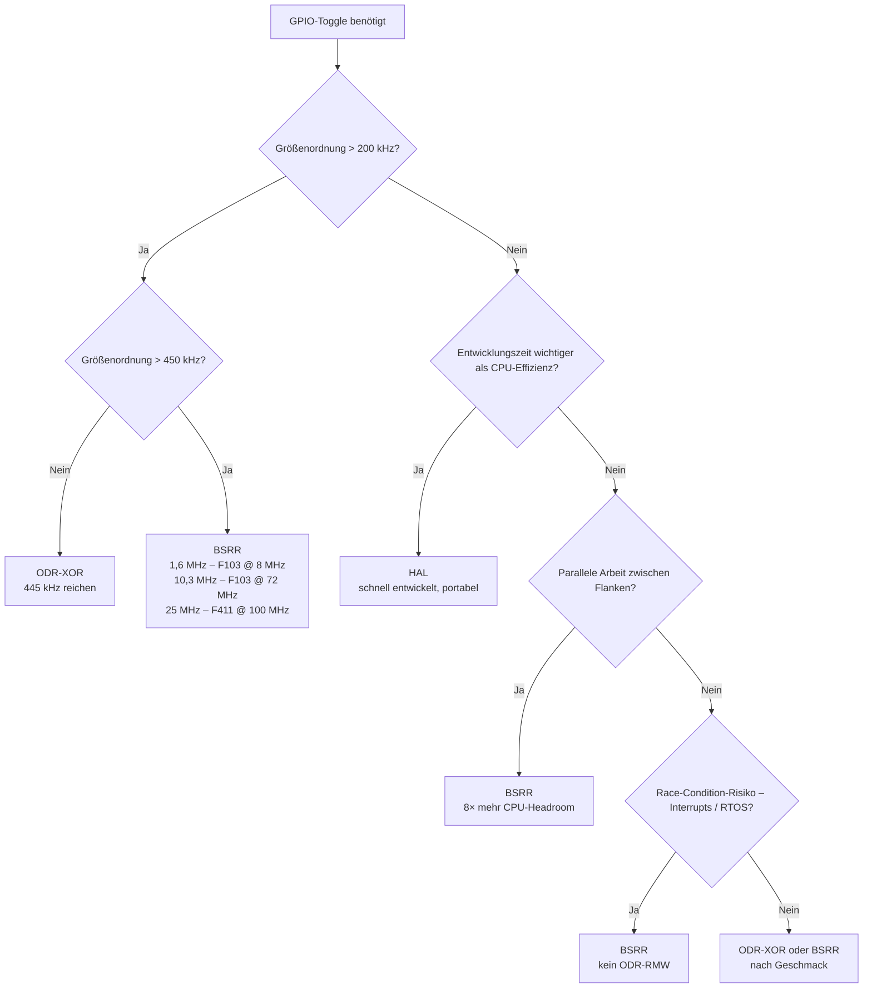

+++
title = 'Zusammenfassung und Leitfaden: Welche GPIO-Methode für welchen Anwendungsfall?'
date = 2026-05-11T00:00:00+02:00
lastmod = 2026-05-11T00:00:00+02:00
description = 'Entscheidungsmatrix für STM32-GPIO-Toggle: HAL, ODR-XOR oder BSRR? Mit Compiler-Einstellungen, Plattform-Wahl und Build-System-Entscheidungen. Alle Messwerte der 8-teiligen Benchmark-Serie auf einen Blick.'
tags = ['stm32', 'gpio', 'hal', 'cmsis', 'performance', 'leitfaden', 'entscheidungsmatrix', 'embedded']
draft = false
mermaid = true
+++

Die GPIO-Toggle-Messreihe auf diesem Blog umfasst acht Artikel — vom [Vergleich HAL vs. CMSIS]() über [Compiler-Optimierungen]() und [LTO]() bis zum [Plattformvergleich F1 vs. F4]() und zur [FPU-Leistung](). Die Spannweite der Ergebnisse ist enorm: von **80 kHz** (HAL, `-O0`) bis **25,34 MHz** (BSRR, F411, `-O2`) — Faktor 317×. Dieser Faktor kombiniert allerdings mehrere Effekte gleichzeitig: Methode, Optimierung, Plattform und Takt. Zwischen 4 und 128 CPU-Zyklen pro vollständigem Toggle-Zyklus liegen Welten.

Dieser Leitfaden verdichtet alle acht Beiträge auf eine Lesezeit von etwa zehn Minuten. Er liefert **konkrete Entscheidungshilfen**: Welche Toggle-Methode passt zu deinem Anwendungsfall? Welche Compiler-Einstellung in welcher Projektphase? Wann lohnt sich der Wechsel von F103 auf F411? Und was kostet der CubeMX-Komfort an Flash?

Jede Empfehlung ist mit den Messwerten aus der Serie belegt und verlinkt auf den jeweiligen Detailbeitrag — für alle, die tiefer einsteigen wollen.

<!--more-->

---

## 1. Die drei Toggle-Methoden — Kurzportrait

Bevor es an die Entscheidungsmatrix geht, ein kompakter Überblick über die drei Varianten, die in der gesamten Messreihe verglichen werden. Die Unterschiede im Code sind minimal — die Unterschiede im generierten Maschinencode und in der Laufzeit maximal.

```c
#define PB8 (1U << 8)

// HAL — Funktionsaufruf mit Port-Pointer und Pin-Maske
HAL_GPIO_TogglePin(GPIOB, GPIO_PIN_8);

// ODR-XOR — direkter Registerzugriff, Read-Modify-Write
GPIOB->ODR ^= PB8;

// BSRR — atomare Einzel-Schreibzugriffe zum Setzen/Rücksetzen einzelner Bits
GPIOB->BSRR = PB8;          // Pin HIGH
GPIOB->BSRR = (PB8 << 16U); // Pin LOW
```

| Eigenschaft | HAL | ODR-XOR | BSRR |
|-------------|-----|---------|------|
| Zyklen pro Toggle (`-O2`, F103 @ 8 MHz) | ~40 | ~18 | **~5** |
| Max-Frequenz F103 @ 72 MHz | 1,13 MHz | 3,28 MHz | **10,3 MHz** |
| RMW-frei im Toggle-Pfad? | Nein (ODR-Lesen vor BSRR) | Nein | **Ja** |
| Race-Risiko bei Portzugriffen | Mittel | Hoch | **Geringer** |
| Flash CMSIS-Minimal | — | ~824 B | ~824 B |
| Flash CubeMX | ~2,9 KB | — | ~2,9 KB |
| Portabilität | Hoch (jeder STM32) | STM32-spezifisch | STM32-spezifisch |
| Lesbarkeit | Hoch | Mittel | Niedrig |

**HAL** — komfortabel, portabel, langsam. Für 90 % aller GPIO-Anwendungen völlig ausreichend. Der Overhead kommt von Funktionsaufruf, optionaler `assert_param()`-Prüfung und Abstraktionsschicht — nicht vom GPIO-Peripheral selbst.

**ODR-XOR** — der Mittelweg. Doppelt so schnell wie HAL, aber nicht atomar: Der -Zugriff kann unter Interrupts eine  auslösen. ODR-XOR eignet sich vor allem dann, wenn der gesamte Portzugriff kontrolliert ist und keine anderen Codepfade denselben Port parallel verändern.

**BSRR** — das Performance-Maximum. 8× schneller als HAL, RMW-frei und atomar auf Ebene des einzelnen Set/Reset-Schreibzugriffs. Ein vollständiger High-Low-Toggle besteht trotzdem aus zwei Schreibzugriffen — zwischen Set und Reset kann also ein Interrupt liegen. Der Preis: Man muss die Set- und Reset-Hälfte des Registers kennen.

---

## 2. Entscheidungsbaum — Welche Methode für welchen Use-Case?

Die zentrale Frage dieses Leitfadens: **Welche der drei Methoden soll ich in meinem Projekt verwenden?** Die Antwort hängt von mehreren Faktoren ab — der folgende Entscheidungsbaum führt in vier Fragen zur passenden Methode.

### 2.1 Entscheidungsbaum



Die Schwellen im Entscheidungsbaum orientieren sich an den Messwerten des F103 bei 8 MHz. Bei 72 MHz, auf dem F411 oder mit anderer Toolchain verschieben sich die Grenzen — die Tabelle darunter gibt die gemessenen Referenzpunkte.

### 2.2 Entscheidungstabelle — Use-Case → Empfehlung

| Anwendungsfall | Empfehlung | Begründung | Siehe |
|---------------|-----------|------------|-------|
| LED-Blinken, einfache Statusausgabe | **HAL** | Entwicklungsgeschwindigkeit, Lesbarkeit | [#1]() |
| Echtes SPI-Protokoll | **Hardware-SPI** | Definierte Takte, weniger CPU-Last, zuverlässiger als Bit-Banging | — |
| Soft-SPI / Bit-Banging-Demo ≤ 200 kHz | **HAL + LTO** | Nur für unkritische, einfache Demos; 308 kHz mit `-flto` | [#5]() |
| Soft-SPI / Bit-Banging 200–500 kHz | **ODR-XOR oder BSRR** | ODR reicht in der Messung; BSRR ist robuster gegen parallele Portzugriffe | [#1]() |
| Soft-SPI / Bit-Banging > 500 kHz | **BSRR** | 1,6 MHz (F103 @ 8 MHz), 10,3 MHz (F103 @ 72 MHz), 25 MHz (F411 @ 100 MHz); Hardware-SPI bleibt vorzuziehen | [#1](), [#6]() |
| Software-PWM (niedrige Frequenz / wenige Kanäle) | **BSRR** | Kürzeste Zyklusdauer → höchste Software-Auflösung | [#2]() |
| Stabile PWM / mehrere Kanäle | **Timer-PWM** | Hardware-Timer liefern reproduzierbare Flanken ohne CPU-Jitter | — |
| GPIO im Interrupt-Handler setzen/rücksetzen | **BSRR** | Kein ODR-RMW in der ; ISR kurz halten | [#2]() |
| Zeitkritisch mit Hintergrundarbeit | **BSRR** | 8× mehr CPU-Reserve als HAL | [#2]() |
| Batteriebetrieb (CPU soll schlafen) | **BSRR im Hot-Path** | Kann Wachzeit minimieren; entscheidend bleiben Sleep-Mode, Takt, Wakeup-Intervall und Leckströme | [#2]() |
| Multi-Tasking / RTOS | **BSRR** | Vermeidet ODR-RMW-Lost-Updates; gleiche Pins trotzdem koordinieren | [#2]() |
| Rapid Prototyping | **HAL** | Schnellste Entwicklung, einfache Fehlersuche | [#1]() |
| Flash-kritisch (< 2 KB frei) | **CMSIS-Minimal** (ODR/BSRR) | 824 B statt 2,9 KB | [#8]() |

---

## 3. Compiler-Einstellungen — Wann welche Optimierungsstufe?

Der Compiler ist der größte kostenlose Performance-Hebel im Embedded-Bereich — ein Flag-Wechsel von `-O0` auf `-Os` vervielfacht die Toggle-Frequenz, ohne eine Codezeile zu ändern. Aber die Wahl der richtigen Stufe hängt von der Projektphase ab.

| Projektphase / Ziel | Stufe | Frequenz (HAL / ODR / BSRR) | Warum? | Siehe |
|--------------------|-------|----------------------------|--------|-------|
| Entwicklung / Debugging | **`-O0`** | 80 / 308 / 615 kHz | Deterministisch, Breakpoints zuverlässig | [#4]() |
| Entwicklungs-Build, bessere Perf. | **`-Og`** | 190 / 364 / 889 kHz | Debug-freundlich, moderate Optimierung | [#4]() |
| Release (Standard) | **`-O2`** | 200 / 444 / 1,6 MHz | Bewährter Allrounder | [#4]() |
| Release + HAL optimieren | **`-O1`** (prüfen) | 222 / 444 / 1,6 MHz | HAL 222 kHz mit `-O1` vs. 200 kHz mit `-O2` | [#4]() |
| Flash-sparend | **`-Os`** | 211 / 444 / **2,0 MHz** | BSRR-Maximum; kleinster Code | [#4]() |
| Cross-TU-Inlining nötig | **`-O2` + `-flto`** | 308 / 444 / 1,6 MHz | HAL +54 %; ODR/BSRR unverändert | [#5]() |

> **Drei Dinge, die man über Compiler-Optimierung wissen sollte:**
>
> * **`-O1` schlägt `-O2` bei HAL** — 222 kHz vs. 200 kHz. Optimierung ist kein linearer Prozess; höhere Stufen können durch aggressiveres Inlining oder Register-Spilling kontraproduktiv sein.
> * **`-flto` muss in CFLAGS UND LDFLAGS** stehen. Nur im Compile-Schritt bewirkt es nichts — der Linker muss den GIMPLE-Zwischencode ebenfalls auswerten.
> * **`-Os` erreicht das BSRR-Maximum von 2,0 MHz** auf dem F103 — schneller als `-O2` (1,6 MHz) und mit kleinerem Code.

---

## 4. Hardware-Konfiguration — Output Speed (MODE-Bits)

Die  in den GPIO-Registern / werden oft mit einem Turbo-Schalter verwechselt. Die Messung in Beitrag #3 zeigt eindeutig: **Sie ändern die Toggle-Frequenz nicht.** Die Frequenz bleibt über alle drei Einstellungen (Low, Medium, High) identisch.

Was die MODE-Bits stattdessen steuern, ist die **Flankensteilheit** des Ausgangstreibers — und damit die Signalqualität,  und -Abstrahlung.

| Anforderung | Einstellung | Begründung | Siehe |
|-------------|------------|------------|-------|
| Labortest, Prototyping | **Low** | Sauberstes Signal, geringste EMV | [#3]() |
| Lange Leitungen (> 10 cm) | **Low oder Medium** | Weniger Überschwinger, weniger  | [#3]() |
| Kurze PCB-Leitungen, saubere Flanken nötig | **High** | Kürzere Anstiegszeit | [#3]() |
| EMV-kritische Umgebung | **Low** | Geringste Störabstrahlung | [#3]() |
| Alle Pins einer Port-Gruppe | **Nicht global auf High!** | Gezielt pro Pin konfigurieren — nur wo nötig | [#3]() |

> **Key Takeaway:** Output Speed ist kein Software-Turbo. Es steuert die Flankensteilheit des Ausgangstreibers — und die Default-Einstellung „Low“ ist für die meisten Anwendungen die bessere Wahl (saubereres Signal, weniger EMV).

---

## 5. Plattform-Wahl — Wann F1, wann F4?

Der naive Taktvergleich (100 MHz / 72 MHz = 1,39×) greift viel zu kurz. In der Praxis erreicht der STM32F411 gegenüber dem STM32F103 **Speedup-Faktoren von 2,46× bis 3,37×** — je nach Methode und Optimierung. In der Messreihe erreicht der F411 mit aktiviertem ART-/Flash-Pfad und `-O2` beim BSRR-Test ca. 4 Zyklen pro Toggle-Zyklus und liegt damit unter der 5-Zyklen-Baseline des F103 bei 8 MHz. Die Messung spricht dafür, dass Flash-/ART-Pfad, Buszugriffe und erzeugter Maschinencode hier sehr günstig zusammenspielen.

| Anforderung | Empfehlung | Begründung | Siehe |
|-------------|-----------|------------|-------|
| GPIO-Toggle ≤ 10 MHz | **F103** | 10,3 MHz BSRR @ 72 MHz reicht | [#6]() |
| GPIO-Toggle > 10 MHz | **F411** (oder neuer) | 25,34 MHz BSRR @ 100 MHz | [#6]() |
| Keine Float-Berechnungen | **F103 oder kleinere STM32-Familie** | Ausreichend für viele Integer-Workloads; Auswahl hängt von Peripherie, Verfügbarkeit, Kosten und Stromverbrauch ab | [#6](), [#7]() |
| Float-Berechnungen (Filter, PID, Sensorfusion) | **F4 mit ** | 21,3× schneller als F103 bei 72 MHz; bis 29,5× im Max-Vergleich | [#7]() |
| Maximale Performance pro MHz | **F4** | ART Accelerator, linearere Skalierung | [#6]() |
| Kostensensitiv, kein Float | **F103 oder kleinere STM32-Familie** | Preis, Verfügbarkeit, Langzeitstrategie und Peripherie entscheiden | [#6](), [#7]() |

> **Wichtigster Einzelwert:** F411 BSRR `-O2` @ 100 MHz erreicht **25,34 MHz** — Software-Bit-Banging im zweistelligen MHz-Bereich. Zum Vergleich: Der F103 erreicht mit derselben Methode 10,3 MHz. Die Signalqualität muss bei diesen Grenzwerten aber separat geprüft werden.

---

## 6. Build-System — CubeMX/HAL oder Minimal-CMSIS?

Die GPIO-Methode selbst macht kaum einen Unterschied im Flash-Verbrauch (HAL vs. BSRR innerhalb desselben CubeMX-Projekts: 16 Byte Differenz). Der entscheidende Faktor ist der **„Sockelbetrag“** des CubeMX/HAL-Frameworks: Startup-Code, Vektortabelle, HAL-Init, Clock-Konfiguration und SysTick-Infrastruktur.

**Flash-Verbrauch auf STM32F103RB (`arm-none-eabi-size`):**

| Konfiguration | Flash | vs. CMSIS-Minimal `-Os` | Siehe |
|---------------|-------|------------------------|-------|
| CubeMX-HAL `-O0` | 4620 B | 5,6× | [#8]() |
| CubeMX-HAL `-Os` | 2888 B | 3,5× | [#8]() |
| CubeMX-BSRR `-Os` | 2872 B | 3,5× | [#8]() |
| **CMSIS-Minimal `-Os`** | **824 B** | Referenz | [#8]() |

| Anforderung | Ansatz | Flash | Siehe |
|-------------|--------|-------|-------|
| Schnelle Entwicklung, CubeMX-Ökosystem | **CubeMX + HAL** | ~2,9 KB | [#8]() |
| Großzügiges Flash-Budget / schnelle Inbetriebnahme | **CubeMX + HAL** (komfortabel) | ~2,9 KB | [#8]() |
| Flash-Budget < 2 KB | **Minimal-CMSIS** | 824 B | [#8]() |
| Hybrid: HAL-Init + direkte Register im Hot-Path | **CubeMX + CMSIS-Registerzugriffe** | ~2,9 KB | [#1](), [#8]() |

> **Key Takeaway:** Der ~2 KB „Sockelbetrag“ des CubeMX-Frameworks lohnt sich, wenn man CubeMX-Features wie grafische Pin-Konfiguration, Clock-Tree und HAL-Treiber nutzt. Für ein Projekt, das nur einen Pin toggeln soll, ist er überdimensioniert.

> **Methodik-Hinweis:** Der Minimal-CMSIS-Wert von 824 B ist ein bewusst reduzierter Minimalfall ohne HAL, ohne PLL-Konfiguration und ohne HAL-Tick-Infrastruktur. Er zeigt den unteren Sockelbetrag, ist aber nicht funktionsäquivalent zum CubeMX-72-MHz-Projekt.

---

## 7. Kombinierte Rezepte — „Das optimale Setup für…“

Die folgenden vier Rezepte kombinieren alle bisher diskutierten Dimensionen — Toggle-Methode, Compiler-Einstellung, Build-System und Plattform — zu konkreten, kopierfertigen Konfigurationen.

### Rezept 1: Maximale Toggle-Performance auf F103

```c
// main.c — Minimal-CMSIS, kein CubeMX
#define PB8 (1U << 8)

while (1) {
    GPIOB->BSRR = PB8;           // Pin PB8 HIGH
    GPIOB->BSRR = (PB8 << 16U);  // Pin PB8 LOW
}
```

* **Build:** `arm-none-eabi-gcc -Os` (kein LTO nötig — BSRR hat keinen Funktionsaufruf)
* **Flash:** ~824 B
* **Ergebnis:** 2,0 MHz, gemessen ca. 4 CPU-Zyklen pro vollständiger Rechteckperiode
* **Einsatz:** Bit-Banging, Software-PWM, maximale GPIO-Frequenz

### Rezept 2: Schnelle Entwicklung mit Reserven

```c
// main.c — CubeMX-Projekt, HAL-Init bleibt für Clock/Peripherie
#define PB8 (1U << 8)

while (1) {
    // Kritischer Pfad: BSRR statt HAL
    GPIOB->BSRR = PB8;
    GPIOB->BSRR = (PB8 << 16U);
}
```

* **Build:** `arm-none-eabi-gcc -O2` oder projektabhängig `-O1`/`-Os` (in dieser Messreihe war HAL bei `-O1` etwas schneller; BSRR sättigte bereits ab `-O1`)
* **Flash:** ~2,9 KB (CubeMX-Sockelbetrag)
* **Ergebnis:** CubeMX-Komfort für Init und Clock, BSRR-Performance im zeitkritischen Pfad
* **Einsatz:** Projekte mit komplexer Peripherie-Initialisierung und zeitkritischen GPIO-Pfaden

### Rezept 3: Batterie-Schoner

```c
// main.c — Minimal-CMSIS
#define PB8 (1U << 8)

volatile uint8_t event_pending;

while (1) {
    if (event_pending) {
        event_pending = 0;
        GPIOB->BSRR = PB8;           // kurzer Mess-/Statuspuls
        GPIOB->BSRR = (PB8 << 16U);
    }

    __WFI();  // Wakeup z. B. durch Timer, EXTI oder RTC
}
```

* **Build:** `arm-none-eabi-gcc -Os`
* **Flash:** ~824 B
* **Wakeup:** Timer, EXTI oder RTC setzt `event_pending`
* **Ergebnis:** Minimale Wachzeit im GPIO-Pfad; der tatsächliche Sleep-Anteil hängt vom Ereignisintervall, Wakeup-Pfad und restlichen Anwendungscode ab
* **Einsatz:** Batteriebetriebene Sensorknoten, Energy Harvesting

### Rezept 4: Float-Intensiv auf F4

```c
// main.c — CubeMX-Projekt für STM32F411
#define PB8 (1U << 8)

float pid_output;
while (1) {
    pid_output = pid_compute(sensor_read());  // FPU-beschleunigt
    if (pid_output > threshold) {
        GPIOB->BSRR = PB8;
    } else {
        GPIOB->BSRR = (PB8 << 16U);
    }
}
```

* **Build:** `arm-none-eabi-gcc -O2 -mfpu=fpv4-sp-d16 -mfloat-abi=hard`
* **Plattform:** STM32F411 (Cortex-M4F)
* **Flash:** ~2,9 KB (CubeMX)
* **Ergebnis:** 9,67 ms für den Float-Benchmark (103,41 Hz); BSRR bleibt der schnelle GPIO-Ausgang im Entscheidungszweig
* **Einsatz:** Signalverarbeitung, PID-Regler, Sensorfusion

---

## 8. Quick-Reference-Tabelle — Alle Messwerte auf einen Blick

Die folgende Master-Tabelle enthält alle relevanten Messwerte aus den acht Beiträgen der Serie. Keine Erklärungen — die stehen in den jeweiligen Detailbeiträgen.

| Methode | Plattform | Takt | Opt | LTO | Frequenz | Zyklen | Beitrag |
|---------|-----------|------|-----|-----|----------|:------:|---------|
| HAL | F103 | 8 MHz | `-O0` | nein | 80 kHz | ~100 | [#1](), [#4]() |
| HAL | F103 | 8 MHz | `-Og` | nein | 190 kHz | ~42 | [#4]() |
| HAL | F103 | 8 MHz | `-O1` | nein | 222 kHz | ~36 | [#4]() |
| HAL | F103 | 8 MHz | `-O2` | nein | 200 kHz | ~40 | [#1](), [#4]() |
| HAL | F103 | 8 MHz | `-Os` | nein | 211 kHz | ~38 | [#4]() |
| HAL | F103 | 8 MHz | `-O2` | **ja** | **308 kHz** | ~26 | [#5]() |
| ODR | F103 | 8 MHz | `-O0` | nein | 308 kHz | ~26 | [#4]() |
| ODR | F103 | 8 MHz | `-Og` | nein | 364 kHz | ~22 | [#4]() |
| ODR | F103 | 8 MHz | `-O1` | nein | 444 kHz | ~18 | [#4]() |
| ODR | F103 | 8 MHz | `-O2` | nein/ja gleich | 445 kHz | ~18 | [#1](), [#4](), [#5]() |
| ODR | F103 | 8 MHz | `-Os` | nein | 444 kHz | ~18 | [#4]() |
| BSRR | F103 | 8 MHz | `-O0` | nein | 615 kHz | ~13 | [#4]() |
| BSRR | F103 | 8 MHz | `-Og` | nein | 889 kHz | ~9 | [#4]() |
| BSRR | F103 | 8 MHz | `-O1` | nein | 1,6 MHz | ~5 | [#4]() |
| BSRR | F103 | 8 MHz | `-O2` | nein/ja gleich | 1,6 MHz | ~5 | [#1](), [#4](), [#5]() |
| BSRR | F103 | 8 MHz | `-Os` | nein | **2,0 MHz** | ~4 | [#4]() |
| HAL | F103 | 72 MHz | `-O0` | nein | 561 kHz | ~128 | [#6]() |
| HAL | F103 | 72 MHz | `-O2` | nein | 1,13 MHz | ~64 | [#6]() |
| ODR | F103 | 72 MHz | `-O0` | nein | 1,50 MHz | ~48 | [#6]() |
| ODR | F103 | 72 MHz | `-O2` | nein | 3,28 MHz | ~22 | [#6]() |
| BSRR | F103 | 72 MHz | `-O0` | nein | 2,78 MHz | ~26 | [#6]() |
| BSRR | F103 | 72 MHz | `-O2` | nein | 10,3 MHz | ~7 | [#6]() |
| HAL | F411 | 100 MHz | `-O0` | nein | 1,15 MHz | ~87 | [#6]() |
| HAL | F411 | 100 MHz | `-O2` | nein | 3,18 MHz | ~32 | [#6]() |
| ODR | F411 | 100 MHz | `-O0` | nein | 5,07 MHz | ~20 | [#6]() |
| ODR | F411 | 100 MHz | `-O2` | nein | 8,45 MHz | ~12 | [#6]() |
| BSRR | F411 | 100 MHz | `-O0` | nein | 8,46 MHz | ~12 | [#6]() |
| BSRR | F411 | 100 MHz | `-O2` | nein | **25,34 MHz** | ~4 | [#6]() |

**Flash-Verbrauch (F103, `arm-none-eabi-size`):**

| Konfiguration | Flash | Beitrag |
|---------------|-------|---------|
| CubeMX-HAL `-O0` | 4620 B | [#8]() |
| CubeMX-HAL `-Os` | 2888 B | [#8]() |
| CubeMX-BSRR `-Os` | 2872 B | [#8]() |
| **CMSIS-Minimal `-Os`** | **824 B** | [#8]() |

**FPU-Leistung (20.000 Iterationen im Float-Benchmark):**

| Konfiguration | Laufzeit | Durchsatz | Beitrag |
|---------------|----------|-----------|---------|
| F103 @ 72 MHz `-O2` (kein FPU) | 396,9 ms | 2,52 Hz | [#7]() |
| F411 @ 72 MHz `-O2` (Soft-Float) | 246,2 ms | 4,06 Hz | [#7]() |
| F411 @ 72 MHz `-O0` (HW-Float) | 29,2 ms | 34,25 Hz | [#7]() |
| F411 @ 72 MHz `-O2` (HW-Float) | 13,45 ms | 74,34 Hz | [#7]() |
| **F411 @ 100 MHz `-O2` (HW-Float)** | **9,67 ms** | **103,41 Hz** | [#7]() |

---

## 9. Fazit — Die drei wichtigsten Erkenntnisse

**1. BSRR ist im zeitkritischen GPIO-Hot-Path meistens die stärkste Methode.** Es ist schnell, RMW-frei und sehr kompakt. Für allgemeine Initialisierung, Prototyping und portablen Anwendungscode bleibt HAL trotzdem oft die pragmatischere Wahl.

**2. Der Compiler ist ein mächtiger Hebel — besonders bei HAL und unoptimierten Builds.** ODR und BSRR sättigen ab `-O1` sehr schnell; LTO bringt ihnen in dieser Messung keinen Laufzeitgewinn. HAL dagegen profitiert massiv: `-O1` bringt +11 % gegenüber `-O2`, und `-flto` liefert +54 % durch Cross-TU-Inlining.

**3. Die Plattform-Wahl (F1 vs. F4) hat größeren Einfluss auf Float als auf GPIO.** Im BSRR-`-O2`-Vergleich bei maximalem Systemtakt togglet der F411 etwa 2,46× schneller als der F103. Je nach Methode und Optimierung lagen die GPIO-Speedups in der Messreihe zwischen etwa 2,05× und 3,37×. Bei Float-Berechnungen beträgt der Spread dagegen bis zu **29,5×**. Wer `float` verwendet, sollte die FPU-Entscheidung nicht dem Zufall überlassen.

---

## 10. Weiterführende Links

* [Beitrag #1: HAL vs CMSIS GPIO-Toggle]() — Grundlagen der drei Methoden
* [Beitrag #2: CPU-Headroom]() — Warum BSRR mehr CPU-Zeit übrig lässt
* [Beitrag #3: Output Speed]() — Was die MODE-Bits wirklich bewirken
* [Beitrag #4: Compiler-Optimierungen]() — 5 Optimierungsstufen im Detail
* [Beitrag #5: LTO]() — Wenn der Compiler über Dateigrenzen optimiert
* [Beitrag #6: F1 vs F4 GPIO]() — Plattformvergleich GPIO-Toggle
* [Beitrag #7: F1 vs F4 FPU]() — Gleitkomma-Leistung im Vergleich
* [Beitrag #8: Flash-Verbrauch]() — CubeMX/HAL vs. Minimal-CMSIS
* [Projektseite: STM32 GPIO & Performance Benchmark Series]() — Übersicht über die gesamte Messreihe
