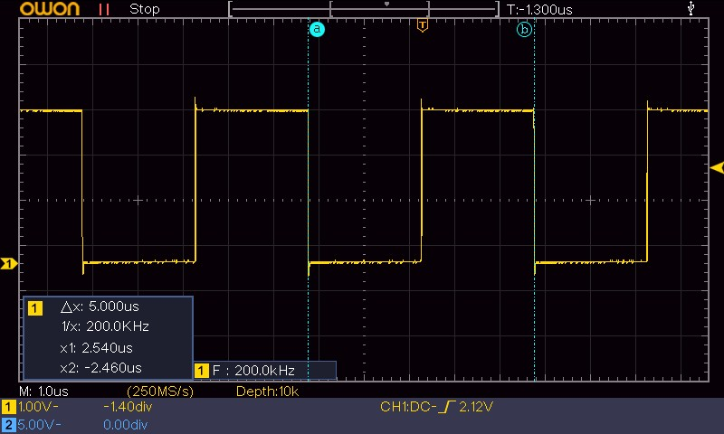
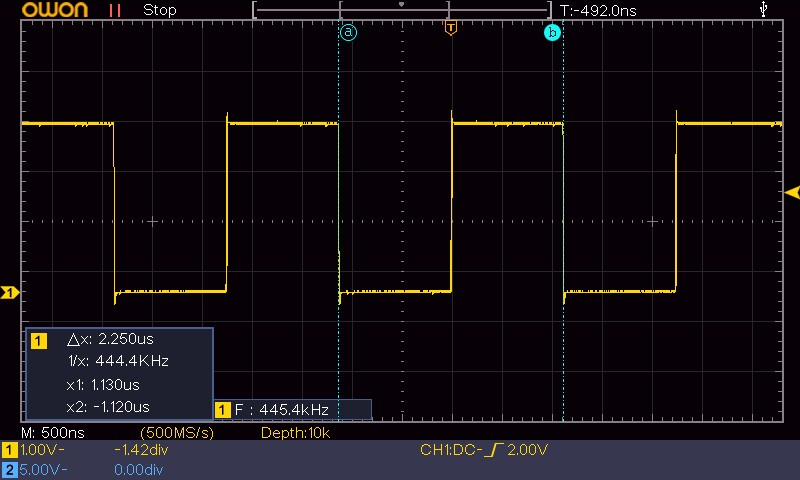
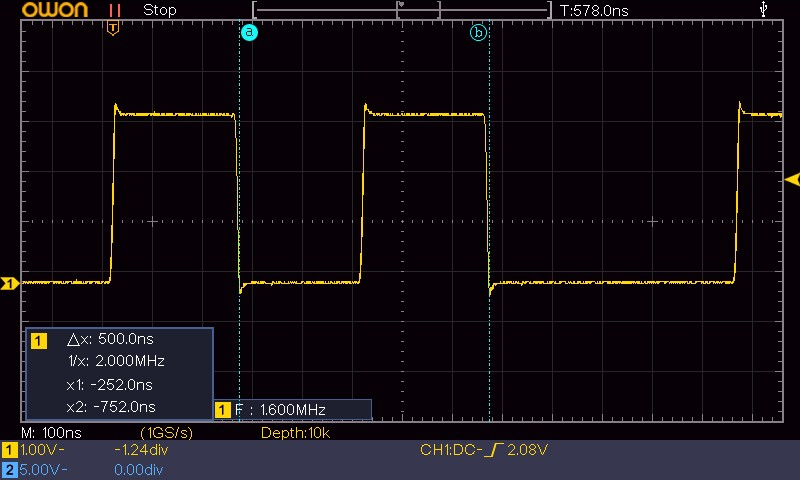

+++
title = 'STM32 HAL vs CMSIS – GPIO-Toggle unter der Lupe'
date = 2026-04-26
description = 'Ein oszilloskopgestützter Performance-Vergleich zwischen HAL_GPIO_TogglePin, CMSIS-Registerzugriff und BSRR-Operation auf dem STM32F103 bei 8 MHz.'
tags = ['stm32', 'gpio', 'hal', 'cmsis', 'performance', 'embedded', 'c']
+++

HAL (Hardware Abstraction Layer) und CMSIS (Cortex Microcontroller Software Interface Standard) sind die beiden dominierenden Abstraktionsebenen in der STM32-Entwicklung. Während HAL auf maximale Portabilität und einfache Bedienbarkeit ausgelegt ist, erlaubt CMSIS direkten Registerzugriff mit minimalem Overhead.

Dieser Beitrag quantifiziert den Unterschied anhand eines reproduzierbaren Tests: Ein einzelner GPIO-Pin wird in einer Endlosschleife getoggelt, und die resultierende Signalfrequenz wird mit einem Oszilloskop gemessen. Alle Ergebnisse basieren auf direkten Oszilloskopmessungen und nicht auf theoretischen Abschätzungen.

## Testaufbau

Für die Messung kommen zwei Boards zum Einsatz:

| Board | Mikrocontroller | Takt |
|-------|----------------|------|
| Nucleo-F103RB | STM32F103RB | 8 MHz (HSI) |
| Bluepill | STM32F103C6T | 8 MHz (HSI) |

Beide Systeme laufen mit 8 MHz Systemtakt, synchronisiert über den internen RC-Oszillator (HSI). Die Messungen wurden auf beiden Plattformen durchgeführt und lieferten identische Ergebnisse. Im Folgenden werden daher die gemeinsamen Werte angegeben.

Der Testcode besteht aus einer `while(1)`-Schleife, die einen einzelnen GPIO-Pin (PB8) toggelt. Die Schleife enthält keinerlei weitere Instruktionen, Verzögerungen oder Nebeneffekte.

**Compiler-Optimierung:** Alle drei Implementierungen wurden mit GCC `-O2` übersetzt. Die Optimierungsstufe ist für den Vergleich relevant, da sie bestimmt, wie aggressiv der Compiler Funktionsaufrufe inlining und Registerzugriffe anordnet.

> **Hinweis zur Compiler-Optimierung:** Die gezeigten Ergebnisse wurden mit GCC `-O2` erzeugt. Ohne Optimierung (`-O0`) sind die gemessenen Frequenzen deutlich niedriger, da der Compiler keinen effizienten Code generiert. Die Optimierungsstufe hat somit direkten Einfluss auf die gemessene Performance.

### Messmethode

Das Signal wird direkt am Pin (PB8) gegen Masse gemessen. Zur Vermeidung von Einkopplungen und Masseinduktivitäten kommt eine kurze Massefeder (Ground Spring) am Tastkopf zum Einsatz — die typische 10-cm-Masseleitung eines Tastkopfs würde bei diesen Frequenzen bereits messbare Verfälschungen durch zusätzliche Schleifeninduktivität einführen.

Die gemessene Periodendauer des Rechtecksignals ergibt direkt die Toggle-Frequenz. Ein Toggle-Vorgang umfasst zwei Zustandswechsel (High $\rightarrow$ Low, Low $\rightarrow$ High). Die Anzahl der CPU-Zyklen pro Toggle-Aufruf ergibt sich aus dem Verhältnis von CPU-Takt zu Toggle-Frequenz:

$$ N_{\text{Zyklen}} = \frac{f_{\text{CPU}}}{f_{\text{Toggle}}} $$

mit $f_{\text{CPU}} = 8\;\text{MHz}$.

> **Anmerkung zur Board-Unabhängigkeit:** Die Messung wurde auf zwei unterschiedlichen Boards durchgeführt — Nucleo-F103RB und Bluepill F103C6T — und liefert exakt die gleichen Ergebnisse. Dies zeigt: Gemessen wird nicht das Board, sondern der Mikrocontroller und der Code. Solange Takt und Architektur identisch sind, bleiben die Ergebnisse vergleichbar.

## 1. HAL-Implementierung

Die HAL-Variante verwendet die dafür vorgesehene Bibliotheksfunktion:

```c
while (1)
{
    HAL_GPIO_TogglePin(GPIOB, GPIO_PIN_8);
}
```

Der Vorteil dieser Methode liegt in der einfachen Anwendung und der guten Lesbarkeit. Allerdings entsteht durch die Verwendung der HAL ein gewisser Overhead:

- Funktionsaufruf mit Parameterübergabe
- Parameterprüfungen über `assert_param()`
- Einlesen des ODR-Registers
- Zwei Schreibzugriffe auf das BSRR-Register
- Rückkehr aus der Funktion

Diese zusätzlichen Schritte wirken sich direkt auf die Ausführungsgeschwindigkeit aus.

**Gemessene Toggle-Frequenz:** 200 kHz
**Entspricht:** ≈40 effektive CPU-Zyklen pro vollständigem Toggle-Zyklus (basierend auf Messung)



## 2. CMSIS-Implementierung (ODR)

Beim direkten Registerzugriff wird das Output Data Register verwendet:

```c
while (1)
{
    GPIOB->ODR ^= GPIO_ODR_ODR8;
}
```

Diese eine Zeile wird vom Compiler zu einer Read-Modify-Write-Sequenz übersetzt — bestehend aus einem Ladezugriff (LDR), einer XOR-Verknüpfung (EOR) und einem Schreibzugriff (STR). Drei Instruktionen, kein Funktionsaufruf, keine Prüfung, keine Abstraktion.

Hier wird der Zustand des Pins direkt über das Register verändert, ohne zusätzliche Funktionsaufrufe. Das reduziert den Overhead und führt zu einer höheren Ausführungsgeschwindigkeit.

**Wichtig**: Die ODR-Read-Modify-Write-Sequenz ist **nicht atomar**. Unterbricht ein Interrupt zwischen LDR und STR und modifiziert ebenfalls ODR, so geht die Änderung durch den späteren STR des unterbrochenen Codes verloren — ein klassischer Race-Condition-Fall.

**Gemessene Toggle-Frequenz:** 445 kHz
**Entspricht:** ≈18 effektive CPU-Zyklen pro vollständigem Toggle-Zyklus (basierend auf Messung)



## 3. BSRR-Implementierung

Die schnellste Methode nutzt das Bit Set/Reset Register (BSRR) des GPIO-Peripherals:

```c
while (1)
{
    GPIOB->BSRR = GPIO_BSRR_BS8;   // Bit setzen
    GPIOB->BSRR = GPIO_BSRR_BR8;   // Bit rücksetzen
}
```

Das BSRR-Register hat die Eigenschaft, dass Schreibzugriffe auf die unteren 16 Bit (`BSx`) den entsprechenden Pin setzen und Schreibzugriffe auf die oberen 16 Bit (`BRx`) ihn rücksetzen. Es ist kein vorheriges Lesen des aktuellen Zustands erforderlich — die Operation ist inhärent atomar.

Die Compiler-Ausgabe besteht aus lediglich zwei Store-Instruktionen (STR). Dadurch wird eine atomare Operation ermöglicht und zusätzlicher Overhead vermieden.

Diese Methode ist nicht nur schneller, sondern auch robuster gegenüber konkurrierenden Zugriffen, da keine Read-Modify-Write-Sequenz vorliegt.

Die ~2,0 MHz entsprechen der Zeit zwischen zwei direkten Registerzugriffen (Set → Reset). Die effektive Toggle-Frequenz von ~1,6 MHz wird jedoch durch den Schleifen-Overhead bestimmt — also durch die Zeit, die der Prozessor benötigt, um nach dem Rücksetzen des Pins den nächsten Durchlauf der `while(1)`-Schleife zu beginnen.

**Gemessene Toggle-Frequenz:** 1,6 MHz (mit Schleife); 2,0 MHz (reines BSRR-Signal)
**Entspricht:** ≈5 effektive CPU-Zyklen pro vollständigem Toggle-Zyklus (basierend auf Messung)



> **Anmerkung zur BSRR-Messung:** Die schnellen Flanken im Oszilloskop-Bild zeigen die maximale GPIO-Geschwindigkeit des Mikrocontrollers. Die Pause zwischen den Impulsen ist die Zeit, die der Prozessor benötigt, um vom Ende der Schleife wieder zur ersten Instruktion zurückzuspringen — der reine Schleifen-Overhead, der bei dieser Implementierung den dominanten Anteil der Periodendauer ausmacht.

## Ergebnisübersicht

| Methode | Toggle-Frequenz | Effektive CPU-Zyklen pro Toggle-Zyklus | Atomar |
|---------|----------------|--------------------------------------|--------|
| `HAL_GPIO_TogglePin()` | 200 kHz | ≈40 | Nein (RMW-Sequenz) |
| `GPIOB->ODR ^= ...` | 445 kHz | ≈18 | Nein (RMW-Sequenz) |
| `GPIOB->BSRR = ...` | 1,6 MHz (2,0 MHz Rohsignal) | ≈5 | Ja (Einzelzugriff) |

Beide getesteten Boards (Nucleo-F103RB und Bluepill F103C6T) lieferten identische Messwerte. Die Ergebnisse sind somit plattformunabhängig für den STM32F103 bei 8 MHz HSI und `-O2` gültig.

## Einordnung

Die Ergebnisse bedeuten nicht, dass HAL grundsätzlich zu vermeiden ist. Die Abstraktionsebene sollte bewusst nach Anwendungsfall gewählt werden.

**HAL ist die richtige Wahl, wenn:**
- Entwicklungsgeschwindigkeit und Lesbarkeit im Vordergrund stehen
- Der GPIO-Toggle nicht im zeitkritischen Pfad liegt (z. B. LED-Blinken, Statusanzeigen)
- Das Projekt von einem Team mit unterschiedlichen Erfahrungsstufen bearbeitet wird
- Portabilität zwischen verschiedenen STM32-Serien erhalten bleiben soll

**Direkter Registerzugriff ist geboten, wenn:**
- Harte Echtzeitanforderungen bestehen (Bitbanging, Software-PWM über 100 kHz)
- Maximale CPU-Effizienz gefordert ist
- Das Verhalten exakt kontrolliert werden muss (keine versteckten HAL-Seitenpfade)
- Interrupt-Sicherheit ohne zusätzliche Critical Sections erforderlich ist

In vielen Projekten ist ein hybrider Ansatz sinnvoll: Die Initialisierung erfolgt über HAL (komfortabel und getestet), während zeitkritische Schleifen auf direkten Registerzugriff umgestellt werden.

## Fazit

Der Vergleich zeigt, welchen Einfluss die Wahl der Abstraktionsebene auf die Ausführungsgeschwindigkeit hat. Die gemessenen Frequenzen spiegeln nicht nur die Geschwindigkeit des GPIO-Zugriffs wider, sondern die Anzahl der CPU-Zyklen, die für die jeweilige Implementierung benötigt werden. HAL bietet Komfort, Typsicherheit und Portabilität — erkauft durch zusätzliche Abstraktionsschichten. CMSIS und insbesondere der BSRR-Zugriff erlauben maximale Performance bei minimalem Code-Footprint.

Für das tiefere Verständnis von STM32-Systemen ist die Auseinandersetzung mit beiden Ebenen unerlässlich. Die Entscheidung für oder gegen eine Abstraktion sollte stets auf Basis der konkreten Anforderungen und nicht aus Gewohnheit getroffen werden.

## Ausblick

Im [folgenden Beitrag]() wird der Perspektivwechsel vollzogen: Nicht die maximale Toggle-Frequenz, sondern die nach dem Pin-Umschalten verbleibende CPU-Zeit steht im Fokus. Es wird gezeigt, warum BSRR gegenüber HAL die CPU-Auslastung bei einer gegebenen Signalfrequenz drastisch reduziert und wie viel Rechenleistung für die eigentliche Anwendung übrig bleibt.

In einem weiteren Beitrag wird anschließend der Einfluss der GPIO-Output-Speed-Konfiguration (MODE-Bits in den CRL/CRH-Registern) auf die Signalqualität untersucht — Flankensteilheit, Überschwingen und EMV-Verhalten.

## Video



<!-- Platzhalter: Sobald das Video veröffentlicht ist, VIDEO_ID durch die YouTube-ID ersetzen. -->

## Quellen & Quellcode

Der vollständige Quellcode zu diesem Artikel sowie die CubeMX-Projektdateien sind auf GitHub verfügbar:

[STM32-Guru-Lab / 00\_YT\_General](https://github.com/STM32-Guru-Lab/00_YT_General/tree/main)

- `Core/Src/main.c` — HAL-, ODR- und BSRR-Implementierungen
- CubeMX-Projektkonfiguration (`.ioc`)
- Makefile mit `-O2`-Optimierung
