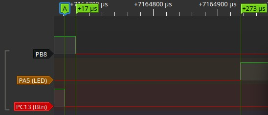

+++
title = 'STM32 STOP-Mode Wakeup-Latenz: 17 µs bis zum ersten GPIO-Zugriff, 273 µs bis zur vollständigen Clock-Recovery'
date = 2026-05-11T00:00:00+02:00
lastmod = 2026-05-11T00:00:00+02:00
description = 'Logic-Analyzer-Messung auf dem Nucleo-F103RB: 17 µs vom EXTI-Wakeup bis zum ersten GPIO-Zugriff (BSRR), 273 µs bis HSE+PLL wieder stehen und die Anwendung mit 72 MHz läuft.'
tags = ['stm32', 'stop-mode', 'wakeup', 'latenz', 'low-power', 'embedded', 'cmsis', 'f103']
draft = false
+++

In batteriebetriebenen -Systemen ist die Wahl des Sleep-Modes ein ständiger Kompromiss: je tiefer der Schlaf, desto geringer der Stromverbrauch — aber desto länger das Aufwachen. Der STM32F103 bietet drei Low-Power-Modi: Sleep, STOP und Standby. Der STOP-Mode ist dabei der interessanteste Kompromiss: Er hält die Spannungsversorgung von  und Peripherie-Registern aufrecht, schaltet aber  und  ab. Nach dem Wakeup läuft die CPU mit dem internen 8-MHz--Oszillator — die volle Performance ist erst nach einer manuellen Clock-Recovery wieder da.

Dieser Beitrag misst, wie lange genau dieser Prozess dauert. Zwei Zahlen stehen im Mittelpunkt:

- **17,125 µs** — die Zeit vom fallenden PC13-Signal bis zum ersten messbaren GPIO-Zugriff nach dem Wakeup, hier dem Zurücksetzen von PB8.
- **273 µs** — die Zeit bis die PLL wieder steht, SysTick passend zum 72-MHz-Systemtakt neu initialisiert ist und die Anwendung wieder mit voller Taktfrequenz läuft.

Die Differenz von 256 µs zeigt, wo die meiste Latenz wirklich steckt — und wie man sie vermeiden kann, wenn 8 MHz für den ersten Code nach dem Wakeup ausreichen.

<!--more-->

## Testaufbau

### Hardware

| Komponente | Detail |
|-----------|--------|
| Board | NUCLEO-F103RB |
|  | STM32F103RB (Cortex-M3) |
| Systemtakt | 72 MHz (HSE 8 MHz → PLL ×9) |
| Wakeup-Quelle | PC13 — User Button B1 ( Line 13, Falling Edge) |
| Logic-Analyzer-Messpin | PB8 — markiert Wakeup-Eintritt (HIGH) und ersten GPIO-Zugriff nach Wakeup (LOW) |
| Wakeup-Indikator | PA5 — LED LD2 (leuchtet nach vollständiger Recovery) |
| Messgerät | Logic Analyzer |

### Software

Das Projekt nutzt einen schlanken -basierten Ansatz ohne  — ähnlich wie im [Minimal-CMSIS-Beitrag](). Die GPIO-Treiber (`drv_gpio_set`/`drv_gpio_clear`) schreiben direkt in das -Register und benötigen nur einen einzigen Store-Befehl pro Pin-Änderung — entscheidend für eine präzise Latenzmessung.

```c
/* Pin assignments (NUCLEO-F103RB) */
#define LED_PORT            GPIOA
#define LED_PIN             5U        /* PA5 = LD2 (green LED) */
#define LA_PORT             GPIOB
#define LA_PIN              8U        /* PB8 = Logic Analyzer measurement pin */
#define BUTTON_PORT         GPIOC
#define BUTTON_PIN          13U       /* PC13 = User Button B1 */
```

### Messablauf

Der Ablauf im `main()`-Code ist darauf ausgelegt, die beiden Latenz-Anteile sauber zu trennen:

1. System-Init bei 72 MHz (HSE + PLL)
2. SysTick initialisieren (1-ms-Tick)
3. GPIO konfigurieren (PA5 Output, PB8 Output, PC13 Input mit Pull-Up)
4.  für PC13 konfigurieren (Falling Edge,  aktiviert)
5. **LED EIN** — das System ist wach
6. 5 Sekunden warten
7. **LED AUS** — Ankündigung: jetzt geht's in den STOP-Mode
8. **PB8 HIGH** — Markierung des Eintritts in die Messphase vor `__WFI()`
9. In den STOP-Mode gehen (`__WFI()`)
10. *(User drückt Button B1 → Wakeup)*
11. **PB8 LOW** — erster GPIO-Zugriff nach Rückkehr aus dem STOP-Wakeup (≈17 µs nach PC13 fallend)
12. HSE und PLL wiederherstellen (SystemClock_Recover)
13. SysTick neu initialisieren
14. **LED EIN (PA5)** — vollständig wach (≈273 µs nach PC13 fallend)
15. Idle-Loop

```c
/* ---- 8. Mark entry into measurement phase before STOP ------ */
drv_gpio_set(LA_PORT, LA_PIN);           /* PB8 HIGH                */

/* ---- 9. Enter STOP mode --------------------------------------------- */
PWR->CR &= ~PWR_CR_PDDS;                 /* PDDS = 0 → STOP mode */
PWR->CR |=  PWR_CR_LPDS;                 /* LPDS = 1 → regulator low-power */
SCB->SCR |= SCB_SCR_SLEEPDEEP_Msk;       /* SLEEPDEEP = 1         */
__WFI();                                 /* Enter STOP mode       */

/* ------- WAKEUP occurred here (User pressed B1) ---------------------- */

SCB->SCR &= ~SCB_SCR_SLEEPDEEP_Msk;

/* ---- 10. First GPIO access after STOP-wakeup ------------------------ */
drv_gpio_clear(LA_PORT, LA_PIN);         /* PB8 LOW                 */

/* ---- 11. Recover clock to 72 MHz ------------------------------------ */
SystemClock_Recover();

/* ---- 12. Re-init SysTick -------------------------------------------- */
drv_systick_init();

/* ---- 13. Turn LED ON — we are awake! -------------------------------- */
drv_gpio_set(LED_PORT, LED_PIN);         /* LED ON — woke up! */
```

### STOP-Mode-Konfiguration im Detail

Der STM32F103 kennt im STOP-Mode zwei Regler-Varianten, gesteuert durch das LPDS-Bit im `PWR_CR`-Register ([RM0008 Rev 21, Section 5.3.5](https://www.st.com/resource/en/reference_manual/rm0008-stm32f103x8-stm32f103xb-advanced-armbased-32bit-mcus-stmicroelectronics.pdf)):

| LPDS | Spannungsregler | Wakeup-Latenz |
|------|-----------------|---------------|
| 0 | Volle Leistung | Kürzer |
| 1 | Low-Power | Länger |

`SLEEPDEEP` (`SCB->SCR`) ist das Cortex-M-Bit, das den Eintritt in einen Deep-Sleep-Zustand ermöglicht — erst dadurch wird STOP (oder Standby) statt normalem Sleep aktiviert. LPDS wählt innerhalb des STOP-Modes den Low-Power-Regulatorbetrieb.

Diese Messung verwendet STOP-Mode mit gesetztem LPDS-Bit. Dadurch läuft der interne Spannungsregler im Low-Power-Modus. Nach dem Wakeup muss der Regler erst wieder hochfahren, bevor die CPU Instruktionen ausführen kann. Genau diese Verzögerung ist Teil der gemessenen 17 µs.

### Messgrenzen: Mechanischer Button

Da B1 ein mechanischer Taster ist, kann das PC13-Signal prellen. Für diese Messung wurde die erste fallende Flanke als Wakeup-Ereignis betrachtet. Der Logic Analyzer misst ab dieser Flanke bis PB8 fallend. Für präzisere Wiederholmessungen wäre ein entprelltes externes Rechtecksignal oder ein Funktionsgenerator als EXTI-Quelle besser geeignet.

## Messergebnisse



| Signal-Übergang | Gemessene Zeit | Was passiert |
|-----------------|---------------|--------------|
| **PC13 fallend → PB8 fallend** | **17,125 µs** | Wakeup-Hardwaresequenz + EXTI-ISR + Rückkehr aus `__WFI()` + erster messbarer GPIO-Zugriff |
| **PB8 fallend → PA5 steigend** | **255,875 µs** | HSE-Start + PLL-Lock + SysTick-Reinit |
| **PC13 fallend → PA5 steigend** | **273 µs** | Gesamte Wakeup-Latenz bis zur vollen Betriebsbereitschaft |

## Die 17 µs: Was bis zum ersten GPIO-Zugriff passiert

Die ersten 17 Mikrosekunden zwischen der fallenden PC13-Flanke und dem Zurücksetzen des Messpins (PB8 fallend) sind eine Abfolge von Hardware- und Software-Schritten. PB8 wird nicht im  gelöscht, sondern nach Rückkehr aus `__WFI()` im `main()`-Kontext — daher misst diese Strecke die vollständige Wakeup-Sequenz inklusive ISR-Durchlauf.

### 1. Hardware-Wakeup-Sequenz

Diese Phase läuft ohne CPU-Instruktionen ab:

1. **EXTI erkennt die fallende Flanke** an PC13. Die -Logik arbeitet asynchron — sie braucht keinen laufenden Takt, um die Flanke zu registrieren.
2. **HSI-Oszillator steht bereit.** Nach dem STOP-Wakeup steht zunächst HSI als Systemtakt zur Verfügung. Dieser Wakeup-Pfad ist deutlich schneller als die spätere Wiederherstellung von HSE und PLL.
3. **Spannungsregler fährt hoch.** Da LPDS = 1 gesetzt war, lief der Regler im Low-Power-Modus. Das Wiederherstellen der vollen Spannung für die CPU-Kernlogik ist der größte Einzelposten in dieser Phase.
4. **CPU-Takt wird auf HSI umgeschaltet** und der Core verlässt den Deep-Sleep-Zustand.
5. **Der Programmzähler springt in den EXTI15_10_IRQHandler** — die CPU beginnt, Instruktionen auszuführen.

Der größte Teil der 17,125 µs entfällt plausibel auf diese Hardware-Wakeup-Sequenz. Die genaue Aufteilung zwischen Regler-Hochlauf, HSI-Start, Interrupt-Eintritt und den ersten Software-Instruktionen wurde in dieser Messung nicht separat aufgelöst — dazu wären zusätzliche GPIO-Messpunkte im ISR-/Main-Pfad oder eine getrennte -Messung nötig.

### 2. Erste Instruktionen (< 2 µs)

Die verbleibende Zeit bis PB8 LOW entfällt auf wenige Maschinenbefehle:

- Der EXTI15_10_IRQHandler löscht das EXTI-Pending-Bit (`EXTI->PR = (1U << 13U)`)
- Rücksprung aus dem Interrupt
- `SCB->SCR &= ~SCB_SCR_SLEEPDEEP_Msk` (DeepSleep deaktivieren)
- `drv_gpio_clear(LA_PORT, LA_PIN)` — ein einziger Store-Befehl auf das -Register

Bei 8 MHz  entspricht jeder Taktzyklus 125 ns. Die gesamte Software-Strecke vom ISR-Eintritt bis PB8 LOW umfasst etwa 15–20 Instruktionen und liegt damit im Bereich von 1–2 µs.

**Wichtig:** `EXTI->PR` ist ein Write-1-to-clear-Register. Der korrekte Zugriff ist eine direkte Zuweisung (`EXTI->PR = (1U << 13U)`), nicht `|=`. Ein Read-Modify-Write mit `|=` würde ein klassisches Embedded-Problem verursachen: Wenn während des Lesevorgangs ein anderes EXTI-Pending-Bit gesetzt ist, wird es unbeabsichtigt mitgelöscht.

### Warum BSRR für die Messung entscheidend ist

Der direkte BSRR-Zugriff (`GPIOB->BSRR = GPIO_BSRR_BR8`) ist ein atomarer Schreibzugriff ohne . Ein ODR-XOR-Zugriff (`GPIOB->ODR ^= GPIO_ODR_ODR8`) würde drei Bus-Transaktionen erfordern (LDR → EOR → STR) und die gemessene Latenz künstlich um einige Zyklen verlängern. Für präzise Zeitmessungen auf GPIO-Ebene ist BSRR die sauberste Wahl — siehe dazu den [CPU-Headroom-Beitrag]().

## Die 256 µs Differenz: Clock Recovery im Detail

Die verbleibenden 256 µs zwischen PB8 LOW und PA5 HIGH werden fast vollständig von der Wiederherstellung des High-Speed-Taktes beansprucht. Die Funktion `SystemClock_Recover()` ruft `SystemClock_Config()` auf — denselben Code, der auch beim Kaltstart läuft:

### Schritt-für-Schritt: SystemClock_Config nach STOP-Wakeup

| Schritt | Operation | Dauer (typisch) |
|---------|-----------|-----------------|
| 1 | HSE einschalten (`RCC->CR |= RCC_CR_HSEON`) | — |
| 2 | Warten auf HSE ready (`while (!(RCC->CR & RCC_CR_HSERDY))`) | ~1–2 ms Timeout, typisch < 100 µs |
| 3 | PLL konfigurieren (×9 Multiplikator) | — |
| 4 | PLL einschalten (`RCC->CR |= RCC_CR_PLLON`) | — |
| 5 | Warten auf PLL ready (`while (!(RCC->CR & RCC_CR_PLLRDY))`) | Max. ~200 µs laut Datenblatt |
| 6 | Flash-Latency setzen (`FLASH->ACR |= FLASH_ACR_LATENCY_2`) | — |
| 7 | Auf PLL als SYSCLK umschalten | — |
| 8 | Warten bis PLL aktiv als SYSCLK | — |
| 9 | SysTick neu initialisieren (`drv_systick_init()`) | — |

Die dominierenden Faktoren sind **HSE-Startup** (Schritt 2) und **PLL-Lock** (Schritt 5). Die in der Tabelle angegebenen Einzelzeiten sind typische Werte laut Datenblatt und wurden in dieser Messung **nicht** separat gemessen — nur die Gesamtzeit von 255,875 µs für die komplette Clock-Recovery inklusive SysTick-Reinit wurde am Logic Analyzer erfasst.

### HSE-Quelle auf dem Nucleo-F103RB

In dieser Messung wurde HSE als **HSE-Bypass** (8 MHz MCO vom ST-LINK) konfiguriert — das ist die Standardeinstellung auf dem Nucleo-F103RB, ein externer Quarz ist nicht bestückt. Bei HSE-Bypass entfällt das klassische Quarz-Anschwingen; die Wartezeiten auf HSERDY und PLLRDY bleiben dennoch Teil der Clock-Recovery. Die genaue Konfiguration ist in `SystemClock_Config()` dokumentiert.

### Die PLL-Lock-Schwelle: Warum 8 MHz sofort verfügbar sind

Der entscheidende architektonische Punkt: Nach dem STOP-Wakeup läuft die CPU **sofort** mit HSI (8 MHz). Alle GPIO-Zugriffe, SRAM-Lesevorgänge und einfache Berechnungen sind ohne jede Verzögerung möglich. Nur wenn die Anwendung mehr als 8 MHz oder einen präzisen Quarz-Takt braucht, muss sie auf die Clock-Recovery warten.

**SysTick nach STOP:** Nach STOP läuft SYSCLK zunächst über HSI. Wenn SysTick vorher auf 72 MHz kalibriert war, ist seine Tickfrequenz nach dem Wakeup falsch, bis die Clock-Recovery und SysTick-Reinitialisierung erfolgt sind. Das erklärt, warum `drv_systick_init()` nach `SystemClock_Recover()` nötig ist.

Das eröffnet eine wichtige Optimierung: **Wakeup-Routine zweistufig gestalten.**

```c
/* Phase 1: Sofort nach Wakeup — GPIO schnell bedienen (HSI 8 MHz) */
drv_gpio_clear(LA_PORT, LA_PIN);    /* Messpin sofort zurücksetzen     */
wake_external_chip();               /* Externen Baustein triggern     */

/* Phase 2: Clock Recovery — erst wenn wirklich nötig */
SystemClock_Recover();
complex_computation();              /* Jetzt mit 72 MHz                */
```

Ob Sensorzugriffe (I²C, SPI, UART) in Phase 1 sofort sinnvoll sind, hängt von deren Bus-Takt, Clock-Abhängigkeiten und der Aufwachzeit der jeweiligen Peripherie ab — GPIO-Aktionen und einfache Trigger-Signale sind dagegen unkritisch.

## Fazit

Die STOP-Mode-Wakeup-Latenz auf dem STM32F103RB teilt sich in dieser Messung in zwei klar sichtbare Anteile:

| Phase | Dauer | Anteil | Charakteristik |
|-------|-------|--------|----------------|
| Wakeup bis erster messbarer GPIO-Zugriff | **17,1 µs** | 6 % | Hardware-Wakeup, ISR, Rückkehr aus `__WFI()` und erster BSRR-Zugriff |
| Clock-Recovery bis Anwendungsmarker PA5 HIGH | **255,9 µs** | 94 % | HSE/PLL-Recovery und SysTick-Reinitialisierung |
| **Gesamt** | **273 µs** | 100 % | |

Die wichtigste Erkenntnis: Nach dem STOP-Wakeup kann die CPU bereits nach wenigen zehn Mikrosekunden wieder einfachen Code ausführen — zunächst mit HSI als Systemtakt. Die 17-µs-Phase ist stark hardware- und modusabhängig (LPDS=0 kann schneller sein, andere Wakeup-Quellen oder Low-Power-Modi können andere Werte liefern). Die deutlich längere Verzögerung entsteht erst, wenn die Anwendung den ursprünglichen High-Speed-Takt über HSE und PLL wiederherstellen möchte.

Für Low-Power-Firmware bedeutet das: Wakeup-Routinen sollten zweistufig gedacht werden. Sofort nach dem Wakeup können einfache GPIO-Aktionen oder externe Wakeup-Trigger erfolgen. Die vollständige Clock-Recovery sollte nur dann sofort ausgeführt werden, wenn die Anwendung tatsächlich 72 MHz, präzisen HSE-Takt oder darauf basierende Peripherie benötigt.

## Ausblick

Der STOP-Mode ist nur einer von drei Low-Power-Modi. Ein Vergleich STOP vs. Standby wäre eine sinnvolle Fortsetzung. Standby reduziert den Stromverbrauch stärker, verliert aber SRAM-Inhalt und führt zu einem resetähnlichen Wiederanlauf. Dadurch verschiebt sich die Frage: Nicht nur die Wakeup-Latenz ist relevant, sondern auch Reinitialisierung, Zustandswiederherstellung und erneute Clock-Konfiguration. Für Anwendungen, die nach dem Wakeup wieder mit PLL laufen sollen, muss auch nach Standby die Systemclock erneut aufgebaut werden.

Auch der Einfluss des Spannungsregler-Modus (LPDS = 0 vs. LPDS = 1) auf die Wakeup-Latenz wäre eine direkte Fortsetzung dieser Messung — mit absehbar kürzeren Wakeup-Zeiten bei LPDS = 0 auf Kosten eines höheren Stop-Stroms.

Auf dem F411 mit seiner anderen Clock- und Flash-Architektur (andere Waitstate-Stufen, ART Accelerator, höhere Taktfrequenzen) würden sich vermutlich andere Verhältnisse zwischen Hardware-Wakeup und Clock-Recovery ergeben. Das bleibt einer späteren Messung vorbehalten.

## Quellen

- [RM0008 Rev 21 — STM32F103xx Reference Manual](https://www.st.com/resource/en/reference_manual/rm0008-stm32f103x8-stm32f103xb-advanced-armbased-32bit-mcus-stmicroelectronics.pdf), Sections 5.3.5–5.3.6 (STOP mode), Section 7.2 (RCC — HSE, PLL)
- [STM32F103x8/xB Datasheet](https://www.st.com/resource/en/datasheet/stm32f103rb.pdf) — Electrical characteristics (HSE startup time, PLL lock time)
- [UM1724 — STM32 Nucleo-64 Boards](https://www.st.com/resource/en/user_manual/um1724-stm32-nucleo64-boards-mb1136-stmicroelectronics.pdf) — Board-Defaults: HSE-Bypass (MCO from ST-LINK)
- Quellcode: `NucF1_02_Wakeup_Latency` (im [GitHub-Repository](https://github.com/STM32-Guru-Lab) der Messkampagne)
